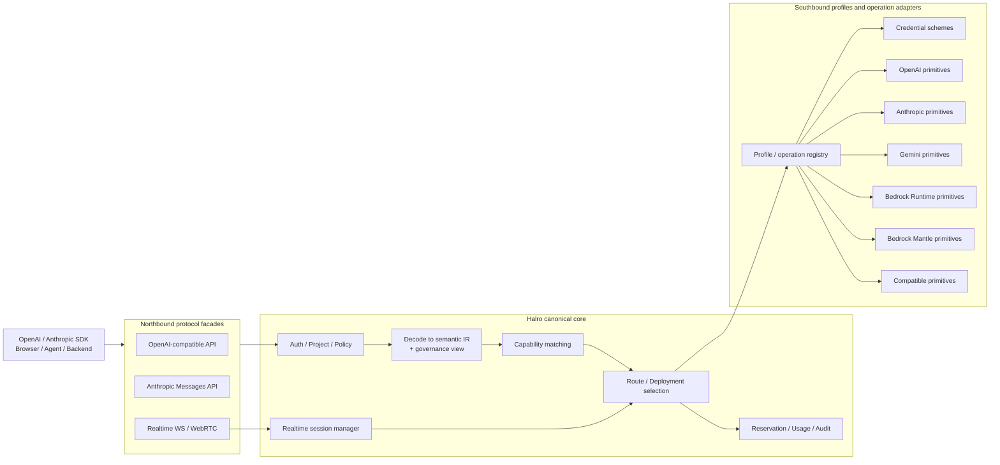
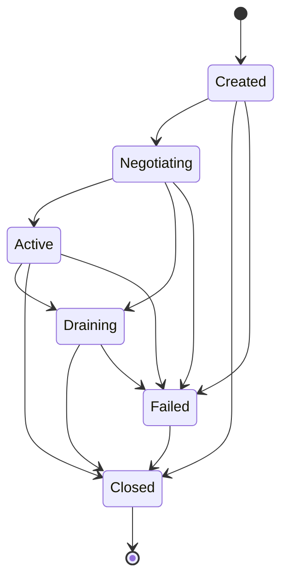

# Halro 多协议 LLM API、Provider 与 Realtime 架构设计

状态：设计提案 v7；Phase 0、Phase 1 与已授权的 Phase 2 范围已实现；Phase 3 及以后仍是需求门控或延期设计，不代表现有能力<br>
最后更新：2026-08-02<br>
适用范围：Gateway 数据面、Provider Adapter、能力协商、实时会话和未来分布式部署

## 1. 背景

Halro 的目标不是成为某一家模型平台的简单反向代理，而是成为 LLM
Gateway 领域中类似 Redis 的基础设施：提供稳定、低延迟、可治理的统一入口，同时允许不同
Provider、模型、协议和部署形态持续演进。

围绕 API 支持范围的讨论暴露了三个核心问题：

1. OpenAI 不只有 Chat Completions 和 Embeddings，还包括 Responses、Images、
   Audio、Files、Batches、Moderations、Realtime 等不同语义和生命周期的 API；
2. 大部分模型平台只是在部分接口上兼容 OpenAI，Anthropic Messages、Gemini
   generateContent/Live 等原生协议不能被无损地伪装成 OpenAI；
3. `/v1/realtime`、WebSocket 和 WebRTC 是有状态、长连接、双向、媒体感知的数据面，
   无法作为普通 HTTP Handler 的一个小扩展来实现。

本文记录讨论过程形成的边界和结论，并给出可以直接拆分为开发 Issue 的目标架构、接口、
安全约束、分布式语义、测试门槛和实施顺序。

## 2. 当前实现基线

截至本文日期，仓库中已注册的公开推理接口是：

- `POST /v1/chat/completions`；
- `POST /v1/embeddings`；
- `POST /v1/responses`（无状态子集）；
- `POST /v1/messages`（Portable 与 Native）；
- `POST /v1/moderations`、`POST /v1/images/generations`；
- `POST /v1/audio/transcriptions`、`POST /v1/audio/speech`；
- Files/Batches 的已发布 Method 子集；
- Halro 扩展的 `POST /v1/rerank` 与 Async Invoke 资源接口。

当前 Provider 层支持请求级 Chat、SSE Streaming、Embeddings，以及已授权 Phase 2 的媒体、审核、
重排和资源生命周期 Adapter，并已接入：

- OpenAI；
- Azure OpenAI；
- DeepSeek；
- 通用 OpenAI-compatible Provider；
- Gemini Beta 文本生成、SSE 和 Embeddings；
- AWS Bedrock Beta Converse/ConverseStream。
- AWS Bedrock Mantle OpenAI Chat、Stateless Responses 与 Anthropic Messages。
- AWS Bedrock Runtime Titan Text Embeddings V2、Titan Image V2 与 Nova Reel Async；
- AWS Bedrock Agent Runtime Cohere Rerank 3.5。

Phase 0A 已在当前代码中增加版本化 Provider Profile、Access Surface、Operation Registry、
Credential Scheme、逐能力证据和 LegacyAdapterBridge。旧记录经原子 Schema Migration 标记为
`legacy`，新建记录标记为 `declared`；Admin API 与界面可查看 Profile、Surface、Scheme 和证据。
Phase 0B 已在网关热路径加入最小 Canonical IR、Provider-neutral Stream Event、版本化
NativeEnvelope/GovernanceView 和字段级 Compatibility Manifest；南向旧 Adapter 仍通过
LegacyAdapterBridge 迁移。Phase 1A/1B/1C 已分别落地 Stateless Responses、Anthropic Messages
与三个隔离的 Bedrock Mantle Profile；Realtime 仍未实现。

当前能力声明包含 Chat、Streaming、Embeddings、Tools、Vision、JSON、Developer Role、Reasoning、
Stream Usage、Token Limits，以及已授权 Phase 2 的 Moderations、Audio、Image Generation、Files、
Batches、Rerank 和 Async Generate。Phase 2 Endpoint/Profile 当前为 **Experimental**：Gateway
契约和 Provider Transport Fixture 已覆盖，但尚未通过第 17.4 节要求的完整官方 SDK、真实 Provider
Smoke、Capacity/SLO 与安全发布门槛。Realtime 及未单独注册的 Provider 原生 API 尚不属于当前公开契约。

因此本文中使用以下术语：

- **Current**：当前代码和测试已经提供；
- **Target**：目标设计，仍需开发；
- **Optional**：只有在产品需求和安全语义明确后才考虑；
- **Out of scope**：不应仅为了宣称“兼容 OpenAI 全部 API”而实现。

## 3. 讨论结论

### 3.1 不承诺“OpenAI 全部 API 自动兼容”

“支持 OpenAI API”必须拆分到具体 Endpoint、请求字段、响应字段、流事件和行为语义。
Halro 不使用一个笼统的 `openai_compatible=true` 代表所有能力。

每个公开协议都必须有独立、可测试的兼容契约。未知或不支持的字段必须显式拒绝，除非
Deployment 声明了经过测试的转换；禁止静默丢弃参数。

### 3.2 不强迫所有 Provider 伪装成 OpenAI

Halro 同时提供两类北向协议：

1. **标准兼容协议**：优先支持广泛使用的 OpenAI 数据面；
2. **Provider 原生协议**：例如 Anthropic Messages，允许使用无法无损映射的原生能力。

南向通过 Provider Adapter 连接 OpenAI、Anthropic、Gemini、Bedrock 等平台。北向协议和
南向 Provider 相互独立，路由器只选择能够满足当前请求能力要求的 Deployment。

### 3.3 只做可证明的无损转换

协议转换分为三类：

- **Lossless**：语义可完整保持，可以自动转换；
- **Declared transform**：存在已知差异，但 Deployment 显式声明并通过契约测试；
- **Unsupported**：不能证明语义等价，调用 Provider 前返回稳定错误。

不能为了提高“支持率”而把 Tool Call、Reasoning、JSON Schema、Audio、Cache Control
或特殊停止原因静默降级成普通文本。

### 3.4 Realtime 是独立数据面

Halro 应明确分成三个数据面：

```text
HTTP Request/Response Data Plane
HTTP SSE Streaming Data Plane
Realtime WebSocket/WebRTC Data Plane
```

Realtime 需要独立的 Session、Transport、事件协议、背压、租约、预算和故障语义；不能复用
只返回一次结果的 `ProviderAdapter` 抽象。

### 3.5 活跃流和实时会话不透明迁移

普通请求可以在 Provider 尚未收到请求或客户端尚未收到有效负载时重试或 Fallback；一旦
SSE 首个语义 Payload 已发出，或 Realtime Session 已进入 Active 状态，就不能无提示切换
Provider。节点故障时首版终止连接，由客户端创建新 Session。

### 3.6 执行范围与明确放弃项

本文同时记录近期实施约束和远期边界，但不代表所有章节都进入当前路线图。执行优先级为：

| 时间范围 | 承诺范围 |
|---|---|
| **Now** | 对现有 Chat/Embeddings 应用无损转换、能力证据、字段隔离、兼容清单和 Fail Closed 纪律 |
| **Next** | 最小三层抽象、Stateless Responses、Anthropic Messages、OpenAI/Anthropic/Gemini Tool 语义矩阵 |
| **Later** | 只有真实产品需求、人员和容量预算成立后才启动 Realtime WebSocket |
| **Deferred** | HA/Cluster Realtime、WebRTC Media Plane、状态型 Responses、录音留存和 Gateway Tool Executor |

当前明确 Non-goals：

- v1 不实现 HA、Cluster、Realtime、WebRTC 或电话信令；
- v1 不宣称支持 OpenAI 全部 API；
- 第一版 Responses 只考虑 Stateless Create/Stream，不承诺 Provider-owned 状态资源；
- 在 Build/Buy ADR 和原型通过前，不承诺自建 WebRTC Media Edge；
- Gateway 默认不执行 Tool，不持久化音频、Transcript 或 Responses 对象；
- 不为尚无需求的能力一次性实现完整分类学；能力 Schema 按已验证用例增量扩展。

第 11 章及 Realtime 后续章节是为了提前固定不能违反的安全和一致性边界，不是当前 HA 或
媒体系统实施计划。

### 3.7 一个 Provider 不等于一个 Adapter

Provider 表示一个平台账户、信任边界和凭证集合，不表示单一 Wire Protocol。一个 Provider
可以同时暴露多个 Access Surface，每个 Surface 又可以包含多个版本化 Profile。例如 AWS
Bedrock 同时存在 `bedrock-runtime` 与 `bedrock-mantle`，前者提供 Converse、Invoke、Async
和双向流，后者提供 OpenAI-compatible 与 Anthropic-compatible 接口。

因此禁止继续假设：

```text
provider_type -> one adapter -> one capability snapshot
```

目标关系必须是：

```text
Provider -> Access Surface -> Profile -> Operation Adapter
                                |
                                +-> Credential Scheme
                                +-> Capability Evidence
```

新增协议必须注册新的不可变 Profile，而不是不断扩大已有 Provider Adapter，或使已有
Deployment 在升级后静默获得新行为。

## 4. 目标总体架构



核心原则是：**协议 Facade 负责 Wire Compatibility，Canonical Core 负责语义和治理，Provider
Primitive Adapter 负责平台实际调用。**

### 4.1 三个正交抽象轴

北向 API 名称、模型语义和南向 Provider API 必须是三个独立概念：

```text
NorthboundProfile
  openai.chat / openai.responses / anthropic.messages
        |
        | decode + derive governance requirements
        v
SemanticOperation
  generate / embed / moderate / transcribe / synthesize / realtime
        |
        | capability match + route
        v
ProviderPrimitive
  openai.responses / anthropic.messages / gemini.generateContent
  bedrock.converse / provider-native realtime
```

- **NorthboundProfile** 定义客户端看到的 HTTP、Header、Body、SSE/Event 和错误协议；
- **SemanticOperation** 定义 Halro 可以治理和跨 Provider 表达的模型行为；
- **ProviderPrimitive** 定义 Adapter 实际调用的 Provider API、版本、模型族和事件协议。

以上是架构轴名称；当前 Go 实现分别落在 `internal/compatibility.NorthboundProfile`、
`internal/semantic.Operation` 与 `internal/provider.Primitive`。示意图中的概念名不表示存在同名 Go
类型，也不得据此把类型放回错误的包。

例如 OpenAI Responses Facade 可以解码为 `generate`，然后路由到经过证明能够无损满足本次
Requirements 的 Anthropic Messages 或 Gemini generateContent Primitive。Provider 不需要实现
名为 `ResponseAdapter` 的 OpenAI 抽象。Renderer 最后按原始 NorthboundProfile 生成响应。

这三个轴不得合并为一个枚举或一个接口，否则 Portable 模式会在类型层重新绑定某一家
Provider。

### 4.2 Access Surface

Access Surface 是 Provider 内具有独立 Endpoint Family、认证服务名、配额、模型可见性和协议集的
数据面。它不是普通 Base URL 字符串。Route 在选择 Deployment 时必须同时固定 Provider、Access
Surface、Profile、Region 和模型标识。

以 AWS 为例：

| Access Surface | 主要协议 | 关键差异 |
|---|---|---|
| `bedrock-runtime` | Converse、Invoke、Async Invoke、CountTokens、Guardrails、Bidirectional Stream | SigV4 服务名 `bedrock`；包含模型原生和媒体接口 |
| `bedrock-mantle` | OpenAI Chat Completions、OpenAI Responses、Anthropic Messages | 独立 Endpoint、配额与授权面；可使用对应开放协议 SDK |
| `bedrock-agent-runtime` | Rerank；以及 Agents、Knowledge Bases、Flows | 仅隔离的 Rerank Profile 进入当前推理面；Provider-owned Agent 状态和生命周期默认不属于核心 Gateway |

不同 Access Surface 即使托管同一模型，也不能默认视为相同 Deployment 或共享限流状态；协议、
配额、Usage、错误和资源归属必须分别验证。

## 5. 北向 API 设计

### 5.1 API 分类

| 类别 | 示例 | 目标定位 | 原因 |
|---|---|---|---|
| 同步推理 | Chat、Responses、Embeddings、Moderations | Gateway 核心数据面 | 请求生命周期短，适合统一路由和治理 |
| SSE 推理 | Chat Stream、Responses Stream | Gateway 核心数据面 | 需要事件级兼容、背压和首 Payload 边界 |
| 媒体生成 | Images、Audio Speech/Transcription | 分阶段支持 | 请求体、文件大小、计费和内容安全不同 |
| 异步任务 | Batches | 条件支持 | 需要持久任务状态、回调/轮询和文件依赖 |
| Provider 资源 | Files、Vector Stores | 条件支持 | 资源 ID 和数据归属通常绑定 Provider |
| 实时会话 | Realtime WebSocket/WebRTC | 独立核心数据面 | 长连接、双向事件、媒体和节点亲和性 |
| 平台管理 | Fine-tuning、Organization、Projects、Billing | 默认不代理 | 属于 Provider 控制面，不是通用推理网关职责 |

### 5.2 OpenAI-compatible Facade

建议按以下顺序扩展，而不是一次宣称覆盖全部 OpenAI API：

| 优先级 | Endpoint/能力 | 状态 |
|---|---|---|
| Tier 0 | `/v1/chat/completions` | Current |
| Tier 0 | `/v1/embeddings` | Current |
| Tier 1 | `/v1/responses` Stateless Create + 文本 SSE | Phase 1A 已实现 |
| Tier 1 | `/v1/models` 的 Gateway 可用模型视图 | Target |
| Tier 2 | `/v1/audio/transcriptions`、`/v1/audio/speech` | Phase 2 Experimental |
| Tier 2 | `/v1/images/generations` | Phase 2 Experimental |
| Tier 2 | `/v1/moderations` | Phase 2 Experimental |
| Tier 3 | `/v1/realtime` WebSocket、`/v1/realtime/calls` WebRTC | Target |
| Tier 3 | Files/Batches 的已发布 Method 子集 | Phase 2 Experimental；资源所有权已定义 |

Responses 不能简单转换成 Chat Completions。它具有不同的输入/输出 Item、Tool、状态和 SSE
事件模型。实现时应建立独立兼容契约，并将可移植部分映射到 Canonical IR。

实现 `/v1/responses` 前必须先批准 Responses Resource Ownership ADR，并发布 Endpoint
Compatibility Manifest，逐项声明：

- Create、Stream、Retrieve、Delete、Cancel 和 Input Items；
- `store`、`background`、`previous_response_id` 和 Conversation；
- Provider Resource ID 的归属、区域、生命周期和后续路由；
- Provider 或 Deployment 变更后的资源访问行为。

首版如果只提供无状态 Create/Stream，必须将其标记为明确的 Stateless Compatibility Tier，
并在 Provider I/O 前拒绝所有状态字段。Provider Resource ID 必须包装或登记其 Provider、
Deployment、Profile、Region 和资源类型；资源创建成功后禁止跨 Provider Fallback。

Phase 1A 实施结果：`openai.responses.stateless.v1` 已发布，只提供严格的
`POST /v1/responses` Create 与文本 SSE。省略 `store` 等价于 `false`；`store:true`、
`previous_response_id`、Conversation、Background、Prompt/Metadata 资源、Hosted Tools、
Reasoning 输出和流式 Function Call 均在 Provider I/O 前拒绝。该 Tier 返回的 `resp_*` 是
不可检索、不可持久化的 Gateway 关联 ID，不是 Provider Resource ID。可移植子集映射到
Canonical `generate` 后复用现有版本化 ProviderPrimitive，因此认证、路由、预算、计费、
脱敏、Retry/歧义边界和模型别名仍由原热路径负责。事件顺序、终止语义与资源所有权见
[ADR 0005](../adr/0005-stateless-responses-facade.md)，逐字段/事件/Profile 契约见
[Endpoint Compatibility Manifest](../compatibility/endpoint-manifests.json)。

### 5.3 Anthropic 原生 Facade

建议提供独立的原生入口：

- `POST /v1/messages`；
- `POST /v1/messages/count_tokens`，仅直连 Anthropic Messages Profile 提供（Bedrock Mantle 该端点未经证实，拒绝）；
- Anthropic 原生 SSE 事件序列。

该 Facade 保留 Anthropic 的消息、Content Block、Tool Use、Tool Result、停止原因、Usage
和版本 Header 语义。它既可以路由到 Anthropic，也可以路由到明确声明兼容能力的其他
Deployment。

原生特性不能无损映射到其他 Provider 时，路由预检必须排除该候选，而不是降级请求。

Phase 1B 实施结果：`anthropic.messages.v1` 已发布严格的 `POST /v1/messages` JSON 与
Anthropic SSE Facade。请求必须携带 `anthropic-version: 2023-06-01`；默认 `portable` 模式只接受
能够进入 Canonical `generate` 的无损子集，并可使用满足 Requirements 的跨 Provider 路由；
`Halro-Route-Mode: native` 则固定 Anthropic Access Surface/Profile，禁用跨 Provider Fallback，
通过 NativeEnvelope 保留 Tool Use/Tool Result、Thinking/Redacted Thinking 以及签名事件的顺序和
不透明值。上游 Header、错误类型、Request ID、Retry-After 与 SSE 生命周期均有独立契约；
OpenAI、Anthropic、Gemini 的 Tool Choice 差异由 Golden Matrix 校验。`count_tokens` 已实现，
仅直连 Anthropic Messages Profile 提供，零成本结算但仍进 ledger 与审计，并有独立 Manifest 条目。执行模式和不支持项见 [ADR 0006](../adr/0006-anthropic-messages-facade.md)。

### 5.4 Portable 与 Native 模式

每个协议请求都应明确落入一种执行模式：

#### Portable 模式

- 只允许 Canonical Capability 中跨 Provider 定义清楚的能力；
- 允许在多个 Provider 之间路由和前置 Fallback；
- 提供稳定的 Gateway 错误、Usage 和审计语义；
- 适合希望减少供应商绑定的应用。

#### Native 模式

- 使用版本化 `NativeEnvelope` 保留指定 Provider 的原生字段和事件；
- Route 必须锁定兼容 Provider/Profile；
- 不承诺跨 Provider Fallback；
- Provider 原生请求和响应仍需经过认证、预算、网络安全和日志脱敏。

模式必须由 Route 或显式请求契约决定，不能由 Adapter 在运行中猜测。

Native 模式不要求把全部 Provider 字段强行塞入 Canonical IR。`NativeEnvelope` 至少包含：

```text
ProfileID + SchemaRevision
经过 allowlist 的协议 Header
强类型 Provider AST 或受限原生 Payload
原生 Response/Event
GovernanceView
```

`GovernanceView` 只包含身份、模型、预算估算、数据分类、能力需求和审计所需字段。Envelope
只能交给完全匹配的 Provider/Profile，禁止跨 Provider 转换；原生载荷仍受 Body/Event 大小、
字段 allowlist、脱敏和禁止持久化约束。Native 响应遇到 Profile 允许的新增字段或未知枚举时，
应保留并标记 `unknown`，不能误映射或静默删除。

## 6. Canonical Intermediate Representation

Canonical IR 不是另一个公开 API，而是 Halro 内部用于表达治理需求和可移植语义的稳定模型。

### 6.1 Semantic Operation

```go
// internal/semantic
type Operation string

const (
    OperationGenerate   Operation = "generate"
    OperationEmbed      Operation = "embed"
    OperationModerate   Operation = "moderate"
    OperationImage      Operation = "image"
    OperationTranscribe Operation = "transcribe"
    OperationSynthesize Operation = "synthesize"
    OperationRealtime   Operation = "realtime"
)
```

Semantic Operation 用于能力匹配、路由、限流、计价和审计。`openai.responses`、
`anthropic.messages` 等属于 NorthboundProfile 或 ProviderPrimitive，不属于 Semantic Operation。

### 6.2 Content Part

建议统一表达：

```text
Text
InputImage
InputAudio
InputFileReference
ToolCall
ToolResult
Reasoning
Refusal
Annotation
ProviderNative
```

`ProviderNative` 仅用于已经完成 Schema 校验的局部原生 Content Part，不能代替完整
`NativeEnvelope`。它只能出现在 Native 模式，并带有 Provider/Profile 和 Schema Revision。
Portable 模式遇到未知 Content Part 必须拒绝。

### 6.3 Canonical Request

至少包含：

- Semantic Operation、NorthboundProfile 和外部协议版本；
- Project ID、Gateway Principal ID、Credential Reference、Route 和 Requested Model；
- Messages/Items/Content Parts；
- Tools、Tool Choice 和并行调用要求；
- 输出模态、格式和 JSON Schema；
- Sampling、Token、Stop 和 Reasoning 配置；
- Stream/Realtime 配置；
- Idempotency Key、Deadline 和客户端取消信号；
- 从真实请求推导的 Capability Requirements。

IR 不应保存 Provider 凭证，也不能被未经脱敏地写入日志、Ledger 或 Audit。
Gateway Principal 和 Credential 字段只能是稳定 ID/Reference，永远不能包含原始 Gateway Key、
Provider Secret 或可直接使用的临时凭证。

### 6.4 Provider 字段隔离

Provider 专有字段不能为了方便而渗透到 Semantic Request。例如 OpenAI
`previous_response_id`、Anthropic `cache_control` 或 Gemini Function Calling 配置必须分别进入：

- NorthboundProfile Decoder 的协议 AST；
- 版本化 NativeEnvelope；或
- 已经通过跨 Provider 语义评审的 Semantic Field。

Phase 0 建立强制边界：

- `internal/semantic` 不得 import `internal/provider/*`、Provider SDK 或协议包；
- Provider/Profile 类型只能在 Facade、Mapping 和 Primitive Adapter 层出现；
- CI 使用依赖方向静态检查和禁止标识符规则阻止越界；
- Golden Test 对每个 Profile 验证 Decode -> Semantic -> Render，并检查 Semantic JSON/Go AST
  中不出现未批准的 Provider 字段；
- 新增 Semantic Field 必须给出至少两个 Provider 的等价映射，或明确证明它是通用治理字段，
  否则保留在 NativeEnvelope。

### 6.5 Canonical Result 与事件

普通结果至少包含：

- Output Items；
- `SemanticTermination`、`NativeTermination` 和 `LifecycleStatus`；
- Provider Request ID；
- Provider 和 Deployment 标识；
- Input/Output/Reasoning/Audio Token Usage；
- Usage 是否由 Provider 报告或本地估算；
- 成本、延迟、Attempt 和未知结果状态；
- `TranslationLoss`（`none`、`declared`、`unsupported`）和 Mapping Revision。

流式事件必须保留：

- 事件类型和顺序；
- Item/Content/Tool Call 标识；
- 增量内容；
- Usage 和结束原因；
- Provider 原始事件与规范事件的可审计映射版本；
- Response、Item、Content、Output、Call 等层级 ID 和 Index；
- 原生 Event Type，以及是否能够被当前 NorthboundProfile 无损渲染。

“标准化 Finish Reason”只能作为治理和统计用的派生字段，不能覆盖 Provider 原始终止状态、
拒绝原因、Incomplete Details 或 Lifecycle。Portable Renderer 只输出 Manifest 声明支持的事件；
Native Renderer 保留经过 Profile 校验的原生事件。

## 7. Provider Adapter 设计

### 7.1 接口分离

不建议继续把所有能力增加到一个越来越大的 Adapter 接口，也不能按 OpenAI Endpoint 名称
创建南向接口。可以按 Semantic Operation 采用小接口组合：

```go
type GenerationAdapter interface {
    Generate(context.Context, CanonicalGenerateRequest) (CanonicalResult, error)
    GenerateStream(context.Context, CanonicalGenerateRequest) (EventStream, error)
}

type EmbeddingAdapter interface {
    Embed(context.Context, CanonicalEmbeddingRequest) (CanonicalEmbeddingResponse, error)
}

type RealtimeAdapter interface {
    Connect(context.Context, RealtimeSessionConfig) (RealtimeConnection, error)
}
```

Profile 通过 Operation Registry 暴露它实际实现的小接口，不要求每个 Provider 实现一个持续
膨胀的总接口：

```go
type ProviderProfile interface {
    Manifest() ProfileManifest
    Operations() OperationRegistry
}

type OperationRegistry interface {
    Resolve(operation SemanticOperation) (OperationAdapter, bool)
}
```

`OperationAdapter` 是受控的小接口联合，只能返回 Manifest 声明的实现。`Resolve` 不允许根据
请求字段临时猜测协议，也不能在运行时把未知操作转发到任意 Provider URL。资源型、异步和
Realtime 操作分别使用自己的生命周期接口，而不是塞入 `GenerationAdapter`。

共同能力由独立接口承载：

```go
type CapabilityReporter interface { Capabilities() Capabilities }
type ErrorClassifier interface { Classify(error) ProviderError }
type ConnectionTester interface { Test(context.Context) error }
type Closeable interface { Close() error }
```

Provider 原生资源生命周期可以使用 Profile-specific Adapter，但不能把 OpenAI Responses 的
Wire API 变成所有 Provider 必须实现的接口。当前依赖 OpenAI 请求/响应类型的 Adapter 通过
`LegacyAdapterBridge` 迁移：

- Legacy Adapter 绑定明确的 legacy compatibility profile；
- 旧 Deployment 迁移时为每项能力记录证据状态，不能把旧默认值直接升级为权威事实；
- 禁止新 Deployment 通过“全部 false”触发 Chat/Streaming/Embeddings 自动授予；
- 管理端展示 `legacy/inferred` 状态和迁移建议；
- Bridge 经过完整现有兼容测试后再逐步移除。

能力证据状态：

```text
verified     通过契约测试和真实 Provider Matrix
declared     管理员显式声明，但未完成真实验证
legacy       来自旧默认值或历史推断
unsupported  明确不支持
```

只有 `verified` 能满足要求严格保证的 Capability。反向探测只能补充证据，不能证明 Tool、JSON、
Reasoning 或流事件的完整语义；无法验证的旧能力保持 `legacy`，由保守 Route 排除或要求管理员
显式迁移。

Probe 必须是 Model/Deployment-aware，Close 必须幂等；新旧接口的转换规则写入 Bridge，不能由
各 Provider Issue 自行解释。

### 7.2 Adapter 责任

Adapter 必须负责：

- 认证方式、Endpoint 和 Provider API Version；
- Canonical Request 到 Provider Request 的转换；
- Provider Response/Event 到 Canonical Result/Event 的转换；
- Provider 错误分类、Retry-After 和未知执行结果判断；
- 取消传播、连接关闭和资源释放；
- Usage、Token、成本输入和 Provider Request ID 提取；
- Capability 上限声明；
- Provider 特有的安全 Header 和 URL 约束。

Adapter 不负责：

- Project 身份认证；
- 最终 Route 决策；
- Budget 权威状态；
- 全局 Retry/Fallback 策略；
- Audit 和日志持久化；
- 在未声明的情况下猜测或丢弃字段。

### 7.3 版本化 Profile

Provider 类型不足以表达协议变化。Deployment 应引用不可变、版本化 Profile Manifest，例如：

```text
openai.responses.v1
openai.realtime.ga.v1
anthropic.messages.2023-06-01
gemini.generate-content.v1beta
gemini.live.v1beta
bedrock.runtime.converse.text.v1
bedrock.runtime.invoke.<model-family>.v1
bedrock.runtime.async-invoke.v1
bedrock.runtime.nova-sonic-bidirectional.v1
bedrock.mantle.chat.v1
bedrock.mantle.openai.chat.v1
bedrock.mantle.responses.v1
bedrock.mantle.openai.responses.v1
bedrock.mantle.anthropic.messages.v1
```

Profile 升级必须经过兼容测试，不能因 Halro 升级而静默改变现有 Deployment 行为。

Profile Manifest 至少包含：

- Halro Profile Revision；
- Provider API Version、必需 Header 和 Beta Feature Set；
- Endpoint Family 和 Provider Primitive；
- Request/Response/Event Schema Digest；
- Mapping Implementation Revision；
- 已验证的 SDK Version Range 和 Golden Corpus Revision；
- Model Family/Revision、Region、Inference Profile 等约束；
- Deprecated、Sunset、Security Override 和 Deployment Migration 策略。

已发布 Manifest 不得原地修改。即使 Provider 固定了 API Version，新增可选字段、Event 或 Enum
也必须按 Profile 的 Forward-compatibility Policy 处理。Anthropic Profile 由稳定版本和规范化
Beta Header Set 共同确定；Bedrock 能力还必须与 Access Surface、模型族、Region、Inference
Profile 和 Guardrail Policy 相交。

### 7.4 Credential Scheme

Credential 获取、轮换和请求签名必须与协议转换器解耦。Profile Manifest 引用明确的
Credential Scheme；Adapter 只能请求经过作用域限制的 Authorizer，不能直接读取宿主机环境、
IMDS 或任意 Secret。

```text
bearer.static
api-key.header
aws.sigv4.explicit-session
aws.sigv4.assume-role
aws.sigv4.workload-identity
aws.bedrock-api-key
oauth.client-credentials
```

AWS 首版继续允许显式加密的 Access Key、Secret、可选 Session Token，但这只是一个 Scheme，
不能成为所有 AWS Profile 的硬编码构造参数。生产工作负载可以增加显式配置的 AssumeRole 或
Web Identity；默认 Credential Chain 和 IMDS 保持关闭，只有完成 SSRF、租户隔离、Credential
刷新和失败语义评审后才可启用。Bedrock API Key 按具体 Profile 使用 Provider 文档规定的
Authorization Header（例如 Bearer 或专用 API Key Header），且不能用于所有 Bedrock 操作；
Profile 必须声明允许的认证集合和 Header。`bedrock-runtime` 与 `bedrock-mantle` 的 SigV4
服务名、Endpoint Audience 和授权动作必须分别固定。

### 7.5 AWS Bedrock Profile 家族

当前 Runtime/Agent Runtime Profile 均按操作与模型族隔离；不存在任意 JSON `InvokeModel`
透传。Phase 1C 另外实现三个 Mantle Profile：

- `bedrock.mantle.chat.v1` → `/v1/chat/completions`；
- `bedrock.mantle.openai.chat.v1` → `/openai/v1/chat/completions`；
- `bedrock.mantle.responses.v1` → `/v1/responses`，始终发送 `store:false`；
- `bedrock.mantle.openai.responses.v1` → `/openai/v1/responses`，始终发送 `store:false`；
- `bedrock.mantle.anthropic.messages.v1` → `/anthropic/v1/messages`，支持 Native Thinking
  Signature Round-trip。

Phase 2 另外实现四个模型锁定的 Runtime/Agent Runtime Profile：

- `bedrock.runtime.invoke.titan-embed-text-v2.v1` → `/v1/embeddings` 的单字符串、Float、
  256/512/1024 维子集；固定 `amazon.titan-embed-text-v2:0`、`normalize:true` 和 Float 输出。
- `bedrock.runtime.invoke.titan-image-v2.v1` → `/v1/images/generations` 的严格 TEXT_IMAGE 子集；
  固定 `amazon.titan-image-generator-v2:0`。
- `bedrock.agent-runtime.rerank.cohere-v3-5.v1` → `/v1/rerank`；固定 Cohere Rerank 3.5，
  并使用独立的 `bedrock-agent-runtime` SigV4 服务域。
- `bedrock.runtime.async.nova-reel-v1.v1` → `/v1/async/invocations`；固定 Nova Reel，输出必须
  使用显式 `s3://` URI，查询按创建时所有者回源。

Mantle 只接受 `https://bedrock-mantle.<region>.api.aws` 区域 Origin 和加密保存的 Bedrock
API Key。OpenAI 线协议使用 Bearer Header，Anthropic 线协议使用 `x-api-key`。Mantle 与 Runtime
不共享 Credential Scheme、Credential Audience、Provider ID、并发上限、Circuit、配额假设或能力证据。

目标 Profile 分工如下：

| Profile 家族 | Provider Primitive | 目标定位 |
|---|---|---|
| Runtime Converse | `Converse` / `ConverseStream` | 跨模型会话语义；按模型验证 Tools、多模态、Reasoning、Structured Output、Cache 和 Guardrail |
| Runtime Invoke | `InvokeModel` / Response Stream | 模型族原生请求；用于 Embeddings、Image 及 Converse 无法表达的能力 |
| Runtime Async | `StartAsyncInvoke` / Get/List | 长任务和 S3 输出；需要独立资源所有权、幂等和清理契约 |
| Agent Runtime Rerank | `Rerank` | 仅允许版本化、模型锁定的重排 Profile；不由此开放 Agents、Knowledge Bases 或 Flows |
| Runtime Realtime | `InvokeModelWithBidirectionalStream` | Nova Sonic 双向音频 Session；进入 Realtime 数据面 |
| Mantle OpenAI | Chat Completions / Responses | 使用 OpenAI 北向语义，但仍具有 AWS Endpoint、认证、配额和模型矩阵 |
| Mantle Anthropic | Messages | Anthropic 原生 Facade 的 AWS Access Surface，不经过 OpenAI IR 强制转换 |

`InvokeModel` 必须按模型族使用版本化 Schema，不允许新增一个接受任意 JSON 的通用透传接口。
Agents、Knowledge Bases、Flows 和 AgentCore 具有独立的 Provider-owned 状态、工具权限和资源
生命周期，默认不属于核心 LLM 推理 Gateway；出现明确产品需求时另立 Facade、Ownership ADR
和 Assurance Profile。

## 8. Capability 设计

### 8.1 从布尔值扩展为结构化能力

Realtime 和多模态接入后，仅使用 `Chat=true` 无法安全路由。目标能力模型至少包括：

```text
operations:
  generate, embed, moderate, image, transcribe, synthesize, realtime,
  count_tokens, async_generate

transports:
  http, sse, websocket, webrtc, bidirectional_eventstream

input_modalities:
  text, image, audio, video, file

output_modalities:
  text, image, audio, embeddings

tool_capabilities:
  kinds, execution_locus, parallel, argument_streaming, schema_dialect

structured_output:
  dialect, supported_keywords, strict_guarantee

reasoning:
  generation, summary, encrypted_replay, preserved_across_turns,
  roundtrip_integrity, signature_preservation

features:
  developer_role, prompt_cache, citation_kinds, server_vad, semantic_vad,
  transcription, session_resume, usage_in_stream

limits:
  max_context_tokens, max_output_tokens, max_request_bytes,
  max_audio_seconds, max_session_seconds, max_concurrent_sessions

formats:
  audio codecs/sample rates, image formats, embedding encodings
```

以上是目标词汇表，不是 Phase 0 必须一次实现的枚举全集。Phase 0 只落地现有 Chat/Embeddings
和 Next 范围需要的最小字段：Semantic Operation、HTTP/SSE、Text/Image、Function Tool、
Structured Output、Token Limit 及其证据状态。Realtime、Audio Format、VAD、Resume 等命名空间
在对应 Phase 启动时通过新 Profile Revision 增加，禁止为了“未来可能需要”提前实现未验证分支。

Provider 声明能力上限，Deployment 只能收窄，不能扩张。Route 可以进一步限制允许能力。
实际能力是 Access Surface、Profile、Provider Primitive、Credential Scheme、Model/Model Family、
Region/Inference Profile、Guardrail Policy、Deployment Snapshot 和 Route Policy 的交集，不能使用
Provider 类型级常量替代。相同模型经 `bedrock-runtime` 和 `bedrock-mantle` 调用时也必须分别
产生能力证据和配额状态。

Bedrock Converse 只有 `system`、`user` 和 `assistant` 语义，并不天然证明 OpenAI
`developer` Role 的优先级可以无损保留。当前把 `developer` 合并到 `system` 的行为只能标记为
Model/Profile 级 `declared transform`；在对应 Golden Test 证明前，Provider 级默认能力不得声明
`developer_role=verified`。

某些 Provider 的 Reasoning/Thinking Block 是带签名或不透明的 Roundtrip Artifact。Profile 必须
声明 `roundtrip_integrity` 是 `none`、`semantic` 还是 `exact_opaque`。`exact_opaque` 内容必须按
Provider 契约原样保留和回传，不能被 Canonical Normalization、Redaction 重写或跨 Provider
转换；如果治理策略要求检查或修改其内部内容，该 Deployment 对本请求为 Unsupported。

### 8.2 请求驱动的能力匹配

路由前必须从实际请求推导 Requirements，例如：

```text
NorthboundProfile: openai.responses.v1
SemanticOperation: generate
InputText + InputImage
OutputText
FunctionTools + ParallelTools + ClientExecution
JSONSchema: draft/subset + strict guarantee
SSE + UsageInStream
```

候选 Deployment 必须满足全部 Requirement。没有候选时，在任何 Provider I/O 和预算预留前
返回稳定的 `unsupported_feature`，响应中可以安全地指出不支持的能力名称，但不能暴露内部
Provider 凭证或敏感拓扑。

### 8.3 Endpoint Compatibility Manifest

每个北向 Profile 必须发布机器可读、可回归测试的兼容清单，不能只在文档中写“支持
Responses”或“支持 Audio”。Manifest 至少包含：

```text
protocol + profile revision
HTTP method + path
request field set + header set
response field set
stream/realtime event set
state and resource semantics
SDK/version matrix
status: unsupported / experimental / compatible / native-pass-through
documented deviations
```

`/v1/models` 明确表示 Halro 当前 Project 可路由的模型视图，不保证等同于任一 Provider
账户的模型清单。Files、Batches、Responses 等 API Family 必须逐 Method 和子资源声明。

Gemini 当前 Beta Profile 继续限定为 generateContent/streamGenerateContent/embedContent；另建
ADR 评估 Gemini Interactions 等状态型 Agent API，不能把其资源和工具生命周期隐式压入
generateContent Adapter。

Gemini Function Calling 必须在 Phase 1 提供独立转换矩阵，不能把 OpenAI `tool_choice` 或
Anthropic Tool Choice 直接赋值给 Gemini `FunctionCallingConfig.mode`。Manifest 至少声明：

- 自动、禁止、强制调用和限制允许函数集合的语义；
- 单个与并行 Function Call 的请求、响应和流事件表示；
- Function Name/ID、Argument Schema、Result 关联和顺序；
- Provider 是否支持 Strict Schema、流式 Arguments 和多轮 Roundtrip；
- 无法一一映射的模式是 Declared Transform 还是 Unsupported。

OpenAI、Anthropic、Gemini 三方 Tool Choice/Function Calling Golden Matrix 是 Phase 1 验收门槛。

## 9. 请求、流与 Fallback 语义

### 9.1 普通请求流程

```text
Authenticate
-> Parse and validate northbound protocol
-> Build Canonical Request
-> Derive capability requirements
-> Authorize project/route/model
-> Filter and order deployments
-> Reserve budget and policy capacity
-> Transform and call provider
-> Normalize response
-> Settle usage/cost
-> Render northbound response
```

### 9.2 Retry 和 Fallback 边界

- Provider 尚未收到请求：允许安全 Retry；
- 已知 Provider 拒绝且未执行：可按策略 Fallback；
- Provider 是否执行未知：不得盲目重试，Attempt 标记为 Unknown 并保守结算；
- SSE 首个语义 Payload 前：允许符合现有契约的 Fallback；
- SSE 首个语义 Payload 后：不允许切换 Provider；
- Realtime Negotiating 阶段：只在能确认上游未建立 Session 时切换；
- Realtime Active 阶段：不允许透明切换 Provider。

### 9.3 Idempotency

Idempotency 只保证 Halro 在可知范围内不重复执行，不能把 Provider 的未知结果变成
Exactly Once。对于 Files、Batches、Responses 状态对象和 Realtime Session，需要分别定义
资源级 Idempotency，而不是复用普通 Chat 的请求哈希。

## 10. Realtime 目标设计

### 10.1 协议定位

本文的 OpenAI Realtime 目标范围只覆盖 WebRTC 和 WebSocket。OpenAI WebRTC 必须兼容两种
原生初始化方式，不能把二者错误合并成同一条链路：

1. **Unified Interface**：客户端先创建 SDP Offer，并把 Offer 交给 Halro；Halro 使用
   服务端保存的 Provider Credential，把 SDP Offer 与 Session 配置一起提交到 OpenAI
   `POST /v1/realtime/calls`，再把 SDP Answer 返回客户端。Session 创建与 SDP 协商在一次
   上游调用中完成，不需要先获取 Provider 临时凭证；
2. **Ephemeral Client Secret**：客户端先向 Halro 请求短期凭证；Halro 使用 Provider
   Credential 调用 OpenAI `POST /v1/realtime/client_secrets`，将返回的短期、不透明 Client
   Secret 交给客户端；客户端再携带该凭证和 SDP Offer 直接调用 OpenAI
   `POST /v1/realtime/calls`，取得 SDP Answer。

两种方式在协商完成后都可以形成 Client 与 OpenAI 的 Provider Direct WebRTC 数据路径；差异
主要在于 SDP Exchange 是否经过 Halro，以及 Provider 临时凭证是否到达客户端。WebSocket
和 WebRTC DataChannel 使用双向事件模型，但 WebRTC 音频通常通过加密 RTP Media Track
传输，而不是把音频数据全部放进普通 HTTP Body。

Gemini Live 是另一种原生、Stateful WebSocket 协议，使用自己的 Setup、Realtime Input、
Server Content、Tool Call 和 Session Resume 事件。两者可以共享 Canonical Realtime Core，
但不能共享未经转换的 Wire Event。

AWS Nova Sonic 使用 Bedrock Runtime `InvokeModelWithBidirectionalStream`，是有最大会话时长、
可承载多轮 Prompt/Response 和双向音频的 Stateful Event Stream。它既不是普通
`ConverseStream`，也不应伪装成 Provider WebSocket。Halro 将其建模为独立
`bedrock.runtime.nova-sonic-bidirectional.v1` Realtime Profile：与 OpenAI/Gemini 共享 Session、
治理事件和 Accounting Core，但使用专用 Transport、Wire Event、SigV4 Credential、取消和
超时实现。Bedrock API Key 不能被假定适用于该 Profile。

### 10.2 WebSocket 与 WebRTC

| 维度 | WebSocket | WebRTC |
|---|---|---|
| 主要场景 | 服务端 Agent、后台应用 | 浏览器、移动端、实时语音 |
| 传输 | 单 TCP 长连接 | UDP 优先，必要时经 TURN/TCP |
| 内容 | JSON Event 和编码后的媒体块 | RTP Media Track + DataChannel Event |
| 优点 | 易代理、易观测、易部署 | 低延迟、抖动控制、拥塞控制、浏览器媒体能力完整 |
| 风险 | 队头阻塞，媒体效率较低 | ICE、NAT、DTLS-SRTP、TURN 和媒体运维复杂 |

表中 WebSocket 与 WebRTC 只比较浏览器/通用实时传输。Provider 专用的双向 HTTP/2 Event
Stream（例如 Nova Sonic）属于第三种南向 Transport；它可以接在 Halro Realtime Edge 之后，
但不能复用 WebSocket Frame Parser 或 WebRTC Media Track 实现。

### 10.3 Control Plane 与 Realtime Edge

Realtime 必须拆成：

```text
Control Plane
  - Gateway authentication
  - route and capability selection
  - session creation
  - short-lived credential issuance
  - SDP exchange
  - policy and budget reservation

Realtime Edge
  - WebSocket upgrade
  - WebRTC termination or controlled brokering
  - bidirectional event relay
  - RTP/audio handling
  - backpressure and queue bounds
  - heartbeat, idle timeout and close

Accounting/Observability Side Channel
  - incremental usage
  - rolling budget settlement
  - session lifecycle audit
  - low-cardinality metrics
```

普通 Gateway HTTP Listener 可以承载 Session 创建和 SDP Exchange。媒体路径由所选拓扑决定：
Provider Direct 模式由 Provider 承载，Gateway Terminated 模式由 Halro Realtime Edge
承载，独立媒体服务模式由受信 Media Service 承载；文档和实现不得把“控制面由 Halro
管理”误写成“媒体一定经过 Halro”。

### 10.4 Realtime Session 模型

```go
type RealtimeSession struct {
    ID                string
    ProjectID         string
    ProjectShardID    string
    ProjectEpoch      uint64
    RouteID           string
    DeploymentID      string
    OwnerNodeID       string
    SessionEpoch      uint64
    LeaseTerm         uint64
    GrantedLeaseTTL   time.Duration
    LocalValidUntil   time.Time // process-local monotonic deadline; never serialized
    State             RealtimeSessionState
    Transport         RealtimeTransport
    InputFormats      []MediaFormat
    OutputFormats     []MediaFormat
    CreatedAt         time.Time
    LastActivityAt    time.Time
    ExpiresAt         time.Time
    ReservationID     string
    UsageWatermark    uint64
}
```

状态机：



状态转换必须单调且同时携带 Project Epoch 和 Session Epoch。每个 Transition 需要定义触发者、
Deadline、Terminal Mutation 和关闭原因，至少覆盖：客户端取消、认证失败、SDP/ICE 超时、
Provider Close、Idle/最大时长、预算耗尽、策略阻断、Owner Lost 和 Drain Timeout。

Session Lifecycle 与 Transport Lifecycle 分离；Transport 暂时断开不自动代表 Session 可恢复。
第一版明确 `session_resume=false`。未来 Resume 需要 Client Ack Watermark、重放窗口、Tool 去重和
媒体不可重放边界；Provider Resume 只表示可能恢复模型上下文，不表示 Halro Transport 或
Event Exactly Once。

ICE Restart 不回退 Session 主状态。Transport 使用独立状态机：

```text
Connected -> Renegotiating -> Connected
                            -> Failed
```

Session 可以始终保持 `Active`。如果 Renegotiating 期间原 Owner/Edge 丢失，由于 DTLS、SRTP、
ICE 和 5-tuple 状态不复制，新的 Owner 不接管原 Restart，而是终止旧 Session 并要求客户端创建
新 Session。

### 10.5 Canonical Realtime Event

第一版至少覆盖：

```text
session.created
session.update
input_audio.append
input_audio.commit
input_audio.clear
conversation.item.create
conversation.item.delete
response.create
response.cancel
response.output_item.added
response.text.delta
response.audio.delta
response.transcript.delta
response.tool_call.delta
usage.update
error
session.closed
```

每个事件应有：

- Gateway Event ID；
- Session ID；
- Direction（Client -> Provider 或 Provider -> Client）；
- 每个 Direction 独立的单调 Sequence；
- Causation ID 和可选 Ack Watermark；
- Provider Event ID（如存在）；
- Item/Response/Tool Call 关联 ID；
- 事件产生时间；
- Payload 类型和受限大小；
- 是否可重放以及是否包含敏感媒体。

如果业务确实需要跨方向全序，只能由单一 Session Arbiter 分配，不能让两个 Pump 竞争一个
Sequence。事件必须按 Profile 分类：幂等状态设置、带 Dedupe Key 的命令、不可自动重试的外部
副作用、不可静默丢弃的 Control/Tool/Usage/Cancel/Close，以及可以按媒体 Profile 丢弃或替换
的 Media Delta。

`response.create`、Tool Result、Audio Commit 等副作用必须有稳定 Dedupe Key 和持久边界。
Session Resume 只能重放 Profile 明确证明安全的事件。

规范事件名称不等于承诺逐字段复制 OpenAI 事件。OpenAI-compatible Realtime Facade 必须由
Renderer 恢复 OpenAI Wire Contract；Gemini Adapter 则单独转换 Gemini Wire Event。

### 10.6 Realtime Adapter

```go
type RealtimeAdapter interface {
    Connect(context.Context, RealtimeSessionConfig) (RealtimeConnection, error)
}

type RealtimeConnection interface {
    Send(context.Context, RealtimeEvent) error
    Receive(context.Context) (RealtimeEvent, error)
    Close(context.Context, CloseReason) error
}
```

实现必须具有两个独立 Pump：Client -> Provider 和 Provider -> Client，并满足：

- 取消能够同时终止两侧；
- 每个方向使用有界队列；
- Control、Tool、Usage、Cancel、Close 不得静默丢弃；
- 可丢媒体必须产生 Gap/Overload 语义或按稳定 Close Reason 关闭；
- WebSocket 使用 Byte/Event 高低水位和最大排队时延；
- DataChannel 使用 `bufferedAmount` 高低水位；RTP 由拥塞和抖动策略治理；
- 保持每个 Direction 的语义事件顺序和已声明的因果关系；
- 所有阻塞写设置 Write Deadline；取消时先取消两侧 Context，再设置立即到期的 Deadline、关闭
  Transport，并等待两个 Pump 在有界时间内退出；
- Close 必须幂等，记录哪个 Pump 首先触发关闭，禁止一个 Pump 永久阻塞导致 Goroutine/FD 泄漏；
- Tool Call ID 和响应关联不能在转换时丢失；
- Provider 可恢复错误不应被错误地当成 Transport 断开；
- Close Reason 和最终 Usage 通过可重试、幂等 Ledger Mutation 最终只生效一次，不能使用可能
  丢失的“最多尝试一次”。

### 10.7 WebRTC 拓扑选择

#### 方案 A：Provider Direct Broker，客户端直连 Provider

```text
Unified:
  Client -> Halro: auth, route, SDP Offer
  Halro -> Provider: provider credential + SDP Offer + session config
  Provider -> Halro -> Client: SDP Answer
  Client <-> Provider: direct WebRTC

Ephemeral Client Secret:
  Client -> Halro: auth, route, request short-lived credential
  Halro -> Provider: mint provider client secret
  Halro -> Client: opaque short-lived provider client secret
  Client -> Provider: client secret + SDP Offer
  Provider -> Client: SDP Answer
  Client <-> Provider: direct WebRTC
```

优点：延迟最低、实现和带宽成本最低。<br>
缺点：媒体绕过 Halro，无法完整执行内容策略、精确实时限流和媒体审计；Provider 地址也会
暴露给客户端。

Unified 应作为 OpenAI Provider Direct 的默认握手方式，因为 Provider 长期凭证和临时凭证均
不需要下发到浏览器，并且 Halro 可以在返回 SDP Answer 前完成认证、路由、预算预留和审计。
Ephemeral Client Secret 作为 OpenAI 原生兼容入口保留，适用于客户端已经按照该流程集成的场景。
二者具有相同的 Direct Media Assurance 下限，不能因为 Unified 的 SDP Exchange 经过 Halro
就宣称 Halro 已经终止或完整观察媒体。

#### 方案 B：Halro 终止 WebRTC

```text
Client -> Halro Realtime Edge: WebRTC
Halro -> Provider: WebSocket or WebRTC
```

优点：身份、媒体、策略、预算和 Provider 凭证都由 Halro 掌控。<br>
缺点：需要实现或集成 ICE、STUN/TURN、DTLS-SRTP、RTP/RTCP、Opus/PCM、Jitter Buffer、
Congestion Control 和区域化媒体 Edge。

#### 方案 C：独立媒体服务，Halro 只拥有控制面

```text
Client -> Media Service/SFU: WebRTC media
Client -> Halro: auth, route, policy, budget, session control
Media Service <-> Halro: signed control/usage/events
Media Service -> Provider: WebSocket/WebRTC
```

媒体服务可以是 LiveKit、mediasoup 类自托管组件、托管服务或单独维护的内部 Media Plane。
优点是复用成熟的 ICE/TURN、拥塞、重传、观测和区域部署能力；缺点是增加一个高权限信任边界，
需要定义凭证、租户隔离、Usage Authority、策略回调、数据驻留、故障和供应链责任。

#### 媒体工程成本约束

Go WebRTC 库只提供协议构件，不等于生产媒体系统。自建方案还需要长期负责 Jitter Buffer、
NACK/PLI、GCC/TWCC、Codec/Resample、网络损伤调优、NAT/TURN 兼容、媒体质量和跨区域运维。
在 Build/Buy ADR 中必须给出专职人员、原型周期、生产周期、带宽成本、On-call 和安全维护预算；
没有获批资源时，方案 B 不得成为默认实施路径。

#### 结论

当前不预设最终采用 B。方案 A、B、C 都是合法终态，由 Build/Buy ADR 和真实原型决定。
Halro 必须拥有身份、路由、策略声明、预算和审计控制面，但不要求 Halro Go 进程永久
承担 RTP 媒体面。方案 A 使用能力受限的 Broker Assurance Profile；方案 C 必须达到与内部
Media Edge 相同的签名控制、Usage 和故障契约。

Provider Direct 与 Gateway Terminated 是并列能力，不是互相替代的版本。OpenAI WebRTC 默认
可以选择 Provider Direct 以利用 Provider 自身的媒体网络和故障域；需要强内容策略、精确实时
预算、Gateway Tool Executor、媒体审计或协议桥接的 Route 才选择 Gateway Terminated 或受信
Media Service。Project/Route 必须显式选择允许的连接模式及最低 Assurance，禁止在故障时把
Gateway Terminated 静默降级成 Provider Direct。

故障语义必须对调用方公开：

| 故障时点 | Provider Direct | Gateway Terminated |
|---|---|---|
| Halro 在 Session 建立前不可用 | 不能创建新 Session，除非控制面已有可用副本 | 不能创建新 Session |
| Halro 在 Session 建立后不可用 | 已建立的 Provider WebRTC 通常可以继续，控制、撤销、结算能力按 Profile 降级 | 当前 Edge 上的 Session 通常中断 |
| Provider 不可用 | 当前 Session 中断；只允许客户端显式新建 Session 时重新路由 | 当前上游 Session 中断；只允许客户端显式新建 Session 时重新路由 |

Provider Direct 提高的是“建连后的媒体数据面可用性”，并不能消除新 Session 对 Halro 控制
面的依赖。若要求 Halro 故障时仍可创建新 Session，需要单独建设高可用 Control Plane；不应
通过把长期 Provider Key 下发客户端或允许客户端绕过 Gateway Policy 来伪造高可用。

Broker Profile 必须声明：

```text
budget_enforcement: admission_only | estimated | hard
policy_enforcement: bypassed | detect_only | enforced
usage_authority: unavailable | provider_sideband | gateway
server_hangup: unavailable | supported
revocation: admission_only | active
```

要求 Hard Budget、严格音频策略、Gateway Tool Executor 或强审计的 Project 默认拒绝 Broker
Mode。只有上游提供经过验证的服务端监控、可靠最终 Usage、主动挂断和凭证撤销能力时，才可
声明对应强保证。Client 上报只能作为遥测，不能成为 Ledger 权威；缺少 Provider 权威 Usage
时必须按最大可能成本预留并对未知断连保守结算。

### 10.8 浏览器临时凭证

浏览器永远不能获得长期 Gateway Key 或 Provider Key。短期 Realtime Token 必须：

- 短 TTL，并以权威、原子操作保证单次使用；
- 绑定 Issuer、Audience、JTI、Project、Route、Deployment、Session 和规范化 Origin；
- 绑定允许的输入输出模态；
- 绑定 Transport，并为 WebSocket 与 WebRTC 使用不同 Audience；
- 限制最大 Session 时长、并发数、预算和区域；
- 包含 Key Version、Project Epoch、Not Before、Expiry 和允许的时钟偏差；
- 不把 Provider Credential 编码在客户端可解密的 Token 中。

所有 Edge 可以离线验证签名，但 Provider Connect 或返回 SDP Answer 前，Owning Project
Authority 必须 durable 执行：

```text
consume(jti, session_id, project_epoch)
```

同一 JTI 最多一次成功。Consume Store 不可用、所有权不明确、Epoch 过期或撤销水位不可用时
Fail Closed。Token 不放入 URL/Query String；TURN Credential 与 Realtime Token 分离并独立
轮换。

Consume-once 只能防止同一 Token 成功建立多个 Session，不能防止窃取者抢先消费。Credential
Authority 还必须支持按 JTI、Project Epoch、Signing Key Version 和 Session 主动撤销，定义撤销
传播上限；重复/跨 Origin/跨 Region Consume、合法客户端被 `already_consumed` 拒绝、短时间异常
签发量都产生低基数指标和安全告警。疑似泄漏时立即阻止新 Session，并在 Provider 支持时主动
挂断已经建立的 Broker Session。

Broker Mode 中 Halro Token 只授权创建 Broker Session；如果 Provider 要求自己的临时 Client
Secret，Halro 通过服务端 Credential 换取后以不透明、短 TTL 形式交给客户端。该临时 Secret
的真实约束能力取决于 Provider，不能因为 Halro Token 带有 `max_spend` 等 Claim 就宣称上游
会执行这些限制。

OpenAI Unified Interface 不需要把 Provider Client Secret 返回客户端，但客户端访问 Halro
SDP Exchange 入口仍必须使用短期、受限的 Halro Session Authorization，并在返回 SDP
Answer 前完成同等的 `consume(jti, ...)`、路由绑定、Origin 校验和预算预留。Ephemeral Client
Secret 流程则必须同时区分 Halro Authorization 与 Provider Client Secret：前者授权 Halro
创建 Broker Session，后者只用于建立对应的 OpenAI Realtime Call，二者不得混用或记录到日志。

## 11. 分布式与会话连贯性

本章是 Deferred 设计约束。当前运行模式仍是 Standalone、单进程、单写者、Epoch 1；本章不表示
已经存在 Quorum、共享 Session Registry、HA 接管或多写者能力。只有真实 Realtime HA 需求和
专门 ADR 获批后，才允许实现以下机制。

### 11.1 Control Affinity 与 Media Affinity

一个活跃 Realtime Session 在整个生命周期内由一个 Halro 节点拥有：

```text
session_id -> owner_node_id + project_epoch + session_epoch + lease_term + project_id
              + route_id + deployment_id + expires_at
```

HTTP 和 WebSocket Control/Event 请求可以通过 Session ID、受保护 Cookie、Token 中的 Edge
Hint 或一致性哈希路由到 Owner。不能只依赖客户端 IP，因为移动网络、NAT 和代理会改变来源
地址。

WebRTC Media Affinity 不能使用 Cookie 或 Session ID：DTLS-SRTP/RTP 包只携带网络 5-tuple，
ICE Restart 还可能更换 5-tuple。SDP 必须发布具体 Edge/Region Candidate，或由具有连接跟踪的
L4/Anycast 层保持映射；ICE ufrag 和 TURN Allocation 映射到 Session Owner。ICE Restart 必须
继续由原 Edge 处理或显式终止并新建 Session。节点 Drain 时停止接收新 Session，但保留现有
Candidate、端口和 TURN Allocation 直到活跃 Session 结束或达到明确 Drain Deadline。

由于多数公有云 UDP Load Balancer 无法可靠提供上述亲和，默认部署假设 Media Edge 具有区域内
公网直达地址；L4/Anycast 只是经过独立验证后的可选优化，不能作为基础可用性前提。

### 11.2 Project Authority、Session Lease 与 Fencing

- Project 是 Gateway Key、Budget、Policy、Attempt、Tool 和 Settlement 的唯一逻辑写者；
- Session Lease 只能由 Project Owner 或其复制日志线性化授予，Session Registry 不是平行权威；
- Lease Token 包含 `project_shard_id + project_epoch + session_id + session_epoch + lease_term`；
- 新 Owner 只能在旧租约确定失效并取得更高 Project/Session Epoch 后开始工作；
- 所有权不明确、Store 不可用或 Epoch 过期时 Fail Closed；
- Provider Connect、Tool Execution、预算与结算必须同时校验 Project Epoch 和 Session Epoch；
- 同一个 Session 不能有两个节点同时写事件和结算。

Epoch 能绝对围栏 Halro 的权威提交，但第三方 Provider 不识别 Halro Epoch。已经建立的
上游连接无法被共享 Store 物理切断。因此：

- Authority 线性化授予 Lease Term，并在响应中返回有界 `remaining_ttl`；Owner 收到后计算
  `local_valid_until = monotonic_now + remaining_ttl - safety_margin`；该值不序列化，也不与其他
  节点 Wall Clock 比较；
- 每个上游写入或外部副作用前检查本地单调时钟的 `local_valid_until`；
- 续约失败时必须在安全裕量前停止 Pump、拒绝新副作用并关闭上游连接；
- 高风险 Tool 由可围栏的 Project Authority 执行；
- Stale Owner 可能已经产生的 Provider 结果记为 Unknown 并保守结算；
- 不得承诺对不支持 Fencing 的 Provider 实现绝对上游围栏。

Standalone 只有本地 Project Owner 和 Epoch 1。HA 需要 Project Shard Quorum Replicated Log；
Cluster 由 Project Directory 指向唯一 Owning Shard。在 Realtime Ownership/Lease ADR 完成前，
不得使用普通共享 KV 或最终一致 Registry 宣称 HA Realtime。

### 11.3 不迁移活跃连接

首版不尝试跨节点迁移 WebSocket、ICE、DTLS、RTP 序列号、拥塞窗口和音频抖动状态。Owner
丢失后：

1. 当前连接终止；
2. Project Owner/Reaper 根据持久 Usage Watermark 和未知结果规则写入 `owner_lost` Terminal
   Mutation 并保守结算；
3. 客户端收到明确可重连错误或检测到断开；
4. 客户端创建新 Session；
5. 只有 Provider 提供经过验证的 Session Resume 能力时，Adapter 才可以恢复上下文。

Provider Resume Token 必须加密存储、限制生命周期，并且不能被当成 Halro 连接透明迁移。
Owner 本身崩溃后不能承担清理责任；Reservation TTL、Orphan Detection、Reaper 和最终账单对账
必须由仍然存活的 Project Authority 执行。

### 11.4 状态归属

| 状态 | Standalone | 未来 HA/Cluster | 故障处理 |
|---|---|---|---|
| Session 元数据、Owner、Epoch、Expiry | 本地 Project Authority | Project Shard Quorum Log | 不明确时拒绝 |
| Project/Route/Deployment Snapshot | 本地 Control Plane | Project Shard/Control Plane 复制 | Session 建立时冻结普通路由配置 |
| 活跃 Socket、DTLS/RTP、瞬时队列 | Owner Node | Owner Node，不复制 | Owner 丢失即终止 |
| Usage/Reservation/Settlement | 单一 Ledger WAL | Shard Ledger Authority | Fail Closed、Reaper 保守结算 |
| 原始音频/视频 | 默认不持久化 | 不复制 | 丢失，不恢复 |
| Transcript | 默认不持久化 | 仅按明确策略 | 默认不恢复 |
| Metrics | Node Derivative | 聚合 | 允许采集缺口 |

Route/Deployment Snapshot 冻结不覆盖紧急撤销。Gateway Key/Project Disable、Provider Credential
泄漏、预算耗尽和强制 Policy Block 通过短期 Auth/Policy/Budget Lease 传播，触发 Draining 或
Close；普通配置变更不改变活跃 Session 的 Provider。

## 12. 安全、隐私与策略

### 12.1 密钥与网络

- 客户端 Authorization 不得原样转发给 Provider；
- Provider Credential 继续使用现有加密 Vault 和 Audience Binding；
- Provider WebSocket Endpoint 只能来自冻结 Deployment，禁止客户端覆盖；
- `SafeWebSocketDialer` 必须复用 SafeTransport 的 Scheme、Host、Port、DNS/IP、无环境代理和
  Redirect 逐跳校验；
- 浏览器 WebSocket 校验规范化 Origin、显式 Subprotocol 和短期 Bearer，不依赖 Cookie-only
  Authentication；
- HTTP Upgrade 前限制 Request Line、Header 总字节、Header 数和认证 Body，设置独立短握手
  Deadline；未在 Deadline 内完成 TLS/HTTP Upgrade 的连接关闭，防止握手 Slowloris；
- WebSocket Frame、Message、Fragment、读写时长和并发数必须有硬上限；默认禁用
  `permessage-deflate`，除非同时限制解压后大小和 CPU；
- SDP、ICE Candidate 可能包含网络地址，日志必须整体脱敏；
- SDP Parser 限制总字节、行数、Media Section、Codec 和 Candidate 数；Candidate 执行地址、
  端口、速率和私网策略，未明确允许的 RFC1918、Link-local、Loopback、Metadata 和内部网段
  Candidate 直接黑洞，防止解析耗尽和内网探测；
- WebRTC Profile 固定 Trickle ICE、ICE Restart/Consent Freshness、TURN UDP/TCP/TLS、BUNDLE、
  RTCP、Codec/PT/Sample Rate、DTLS Fingerprint、SRTP Replay Window 和 DataChannel 属性；
- TURN Credential 短期、按 Session/User/Realm 签发；按 Project、Session、Source、Peer 分别
  限制 Allocate 速率、并发 Allocation、Permission/Channel 数、包速率、单包大小和上下行带宽；
  禁止未授权 Peer、Broadcast/Multicast 和内部地址，避免反射放大、端口扫描和 Relay 滥用；
- Realtime Edge 只开放所需协议和端口。

### 12.2 日志和审计

默认禁止记录：

- 原始音频、视频和图片帧；
- 完整 Transcript；
- SDP Offer/Answer；
- Authorization、临时 Token 和 Provider Resume Token；
- Tool 参数中的 Secret 和 PII。

Audit 只记录稳定 ID、协议、状态转换、能力决策、策略结果、字节/时长/Token 计数和关闭原因。

Realtime Data Classification/Retention ADR 必须为 Session Registry、TURN、负载均衡、Heap/
Profile、Panic/Core Dump、临时文件、备份以及 Provider 侧留存分别定义 Owner、Purpose、存储、
加密、保留期、删除 SLA、导出权限和数据驻留。生产默认关闭 Core Dump；Transcript/Recording
必须显式启用、默认关闭并产生 Audit。Provider 自身留存不属于 Halro 可删除范围，必须在
Deployment 中向管理员说明。

### 12.3 内容策略

文本 Redaction 可以对完整请求或有界流 Tail 工作；实时音频策略不同：

- 音频先转写再审核会增加延迟；
- Speech-to-Speech 可能在完整 Transcript 可用前已经输出音频；
- 修改音频需要重新合成，不能视为文本替换；
- 要求严格音频出站审核的 Project 不能路由到无法提供审核边界的模式。

Capability 不能只用 `audio_policy_enforceable=true`，而应声明可验证的 Release Guarantee：

```text
detect_only
block_before_text_release
block_before_audio_release
transcript_posthoc
```

输入、输出、Transcript 和 Tool Argument 使用独立策略流水线。严格音频输出策略必须在审核
完成前有界缓存；Provider 先发 Audio 后发 Transcript、Transcript 缺失/修订/乱序、审核超时或
缓存超限时 Fail Closed。无法满足所需 Release Barrier 的 Deployment 在路由预检中被排除，
不能把 Detect Only 显示为 Prevention。

`block_before_audio_release` 在完成真实 Provider 验证前只能标记为 Experimental。若 Provider
没有可暂停的语义边界且 Audio 先于可靠 Transcript 到达，实现只能整段缓存、重新审核/合成，
可能失去 Realtime 的低延迟价值。启用前必须测量首音频延迟、最大缓存、Transcript 覆盖率、
审核失败行为和主观音质；无法同时满足策略与产品延迟 SLO 时，该组合保持 Unsupported，而不是
降低保证级别。

### 12.4 Tool 安全

- Halro 默认只转发 Tool Call，不自动执行任意 Tool；
- Gateway Tool Executor 必须是单独、显式启用的能力；
- 完整 Tool Argument 通过 Schema、大小和策略校验后才能审批或执行；
- 审批绑定 Canonical Argument Hash、Tool Schema/Version、Project、Session、Call ID、Project/
  Session Epoch 和 Expiry，参数后续变化使审批失效；
- Tool Call/Result 以 Session ID、Call ID、Direction Sequence 和双 Epoch 防重放；
- Executor 使用独立进程/沙箱、最小网络和凭证权限、显式 Egress Allowlist，默认不能读取环境
  凭证；
- Tool Result 作为不可信输入重新执行策略和大小限制；
- 执行状态为 `not_started/started/succeeded/failed/unknown`；
- Owner 丢失后，未知 Tool 执行不得自动重试。

上述 Epoch Fencing 和执行状态只适用于 Gateway Tool Executor。客户端自行执行的 Tool Call 在
Halro 权威边界之外：Gateway 可以验证 Call ID、参数摘要、Sequence 和 Tool Result 关联，
但不能证明客户端没有执行两次，也不能通过 Epoch 撤销已经开始的客户端副作用。要求强执行
保证的 Route 必须使用受控 Gateway Executor 或拒绝该能力。

## 13. 限流、预算和计费

普通 RPM/TPM 不足以治理 Realtime，需要增加：

- 每 Project/Route/Deployment 的并发 Session 数；
- Session 创建速率；
- 最大 Session 时长和 Idle Timeout；
- 每秒输入音频字节、帧数和媒体时长；
- 每方向事件速率和队列字节数；
- 最大上下文、累计 Token 和滚动成本；
- TURN/出口带宽配额。

所有 Realtime 权威计费继续写入 ADR 0002 定义的单一 Ledger WAL，禁止另建 Usage Authority。
Realtime Accounting ADR 至少定义版本化事件：

```text
RealtimeSessionAccepted
ReservationExtended
UsageCheckpointCommitted
RealtimeSessionSettled
OwnerLost
```

Checkpoint 使用
`{project_id, project_epoch, session_id, session_epoch, usage_watermark}` 幂等键，并明确累计值
或增量语义、Pricing Snapshot、跨预算周期归属、重复/乱序/延迟 Usage、Unknown Tail 和 Provider Bill
Reconciliation。Provider 原始响应体不进入 WAL；只保存经过 Schema Allowlist 验证的计费事实。

Session 建立前必须 durable 预留预算，Active 期间只有新的预算额度 durable reserve 后才能继续
产生相应费用。预算 Authority 不可用时：

- 新 Session Fail Closed；
- Accounting 为 `Unavailable` 或 `RecoveryRequired` 时不得扩展 Reservation；
- 现有 Session 只能消耗故障前已经 durable reserve 且具有可证明最坏成本上界的额度；
- 无法证明余额覆盖下一个媒体/Response 单元时，停止新输入、拒绝 `response.create` 和 Tool，
  进入 Draining，并尽力获取最终 Usage 后关闭；
- Provider 计费无法按可控单元停止时，Budget-protected Project 立即关闭 Session。

不同 Provider 对实时上下文和音频的计价方式不同，Ledger 必须保存经过版本化 Schema Allowlist
验证的计费事实和归一化成本结果，而不能保存 Provider 原始响应体，也不能假设所有 Provider
都只有 Input/Output Text Tokens。

## 14. 错误契约

### 14.1 HTTP

保持稳定的 Gateway Error Code，例如：

```text
unsupported_operation
unsupported_feature
unsupported_transport
unsupported_media_format
token_limit_exceeded
session_limit_exceeded
budget_exceeded
route_unavailable
provider_authentication_failed
provider_rate_limited
provider_result_unknown
session_owner_unavailable
```

协议 Facade 负责渲染成 OpenAI 或 Anthropic 兼容错误结构。

### 14.2 SSE 和 Realtime

- 建连前错误使用 HTTP 状态和协议错误体；
- SSE 首 Payload 后只能使用该协议允许的错误事件或关闭连接；
- Realtime 可恢复的 Provider Error 映射为 Session Event，不能误关连接；
- 不可恢复错误发送最终 Error Event（若 Transport 仍可写），然后使用稳定 Close Code 关闭；
- 错误中不得包含 Provider Response Body、Credential、内部 IP 或未脱敏 Prompt。

## 15. 可观测性

建议增加低基数指标：

```text
halro_gateway_requests_total{operation,protocol,status}
halro_gateway_streams_active{protocol}
halro_realtime_sessions_active{transport,provider}
halro_realtime_sessions_total{transport,status,close_reason}
halro_realtime_session_duration_seconds
halro_realtime_events_total{direction,type}
halro_realtime_media_bytes_total{direction,media_type}
halro_realtime_queue_depth{direction}
halro_realtime_queue_bytes{direction}
halro_realtime_overload_closes_total{transport,reason}
halro_realtime_negotiation_seconds{transport}
halro_realtime_ice_outcomes_total{candidate_type,outcome}
halro_realtime_turn_allocations{transport}
halro_realtime_media_rtt_seconds
halro_realtime_media_jitter_seconds
halro_realtime_media_packet_loss_ratio
halro_realtime_settlement_lag_seconds
halro_realtime_orphan_sessions
halro_realtime_token_replay_rejections_total{reason}
halro_provider_translation_failures_total{profile,operation}
halro_capability_rejections_total{operation,capability}
```

禁止把 Project ID、Session ID、Model 原始自由文本、Tool 名或 Provider Request ID 放入指标
Label。它们只出现在受控查询或安全审计中。

Tracing 可以关联 Gateway Request/Session、Attempt 和 Provider Request，但 Span Attribute 必须
遵循现有脱敏规则，不能记录 Prompt、Transcript、SDP 和原始媒体。

Realtime GA 前必须建立 Capacity/SLO 文档，至少定义：

- Session 创建成功率和异常关闭率；
- P95/P99 Negotiation、首事件和首音频延迟；
- Accounting Lag、最大预算超额和 Owner Recovery Time；
- 每 Session 的 FD、Goroutine、Heap、Queue、RTP Buffer、转码 CPU、TURN Egress/Port 预算；
- Node/Region Admission Watermark、Load Shedding、Autoscaling 和 Drain Deadline；
- 过载时先拒绝新 Session，再有界 Drain，禁止依赖 OOM 或连接超时恢复。

上述媒体质量指标使用固定 Bucket 或枚举，Project/Session 仍不得成为 Label。

## 16. 建议代码边界

目标目录可以演进为：

```text
internal/api/openai/
  chat/
  responses/
  embeddings/
  audio/
  realtime/

internal/api/anthropic/
  messages/

internal/semantic/
  operation.go
  content.go
  request.go
  response.go
  events.go
  requirements.go

internal/provider/
  capability/
  profile/
  primitive/
  openai/
  anthropic/
  gemini/
  bedrock/

internal/realtime/
  session/
  registry/
  websocket/
  webrtc/
  eventpump/
  media/
  token/

internal/compatibility/
  manifest/
  nativeenvelope/
  legacybridge/

internal/routing/
internal/ledger/
internal/policy/
```

不要求一次机械重构当前目录。新 Operation 优先采用该边界，现有 Chat/Embeddings 在契约测试
覆盖后逐步迁移。

## 17. 测试策略

### 17.1 协议契约测试

每个北向 Facade 都需要：

- 官方 SDK 黑盒测试；
- 请求/响应 Golden Corpus；
- 未知字段和不支持能力拒绝测试；
- Error、Request ID、Usage 和 Header 测试；
- SSE 事件顺序、空 Delta、Tool Fragment、终止事件测试；
- Compatibility Manifest 与 SDK/Schema Digest 一致性测试；
- NativeEnvelope Header/Field Allowlist 和 GovernanceView 提取测试；
- Semantic Package 依赖方向和 Provider 专有标识符静态检查；
- OpenAI/Anthropic/Gemini Tool Choice Matrix 与 Thinking Roundtrip Golden Test；
- Client Cancel 和慢消费者测试。

### 17.2 Adapter 测试

- Canonical <-> Provider 转换 Golden Test；
- 同一 Provider 的 Access Surface/Profile 隔离测试，禁止 Endpoint、SigV4 服务名、配额或能力串用；
- 不可映射字段 Fail Closed；
- Provider Error 分类；
- Usage 缺失和估算；
- Retry-After 和 Unknown Outcome；
- Provider Version/Profile 固定；
- AWS Converse Stop Reason、Content Block Union、Event 顺序、Request ID、Cache Usage、
  Guardrail、Inference Profile 和 Region Matrix；
- AWS Mantle OpenAI/Anthropic 官方 SDK 黑盒测试，以及 Runtime/Mantle 独立限流测试；
- Credential Scheme 的刷新、撤销、过期、AssumeRole/Web Identity 和 IMDS 禁用测试；
- 真实账户 Smoke Matrix。

### 17.3 Realtime 测试

- WebSocket Upgrade、双向并发和取消；
- Session 状态机属性测试；
- Event Sequence、重复事件和乱序事件；
- 每类 Event 的 Dedupe、Ack、可重放和不可重试 Golden Matrix；
- 音频 Chunk、队列满、慢消费者和断网；
- Heartbeat、Idle Timeout 和最大时长；
- Tool Call 关联与重放防护；
- Usage 滚动结算和预算耗尽；
- Owner Lease、Epoch Fencing 和双 Owner 注入；
- 不同 Wall Clock 偏移下的 Authority TTL/本地单调 Deadline 测试；
- 相同 Usage Watermark、不同 Session Epoch 的结算隔离测试；
- Owner Crash 后保守结算和客户端重连；
- WebRTC SDP/ICE/DTLS、TURN 和 Browser Matrix；
- 跨运营商/跨区域 NAT、IPv4/IPv6、对称 NAT、企业防火墙和 TURN Fallback 成功率；
- 丢包、延迟、抖动、乱序和带宽突降的网络损伤测试，以及 PESQ/POLQA/MOS 或经批准的等价
  主观/客观音质门槛；
- Token Replay Race、Cross-Origin WebSocket、错误 Subprotocol 和 Token Canary；
- Token 抢先消费、主动撤销传播、重复 Consume 告警和合法客户端冲突测试；
- WebSocket Fragment/Compression/Slowloris、SDP/ICE/Candidate/TURN Abuse Fuzz；
- Ledger Disk Full、WAL Corruption、Fsync Failure 和 Orphan Reaper；
- 严格音频 Release Barrier、Transcript 缺失/乱序/修订和 Policy Timeout；
- Rolling Restart、Region/Edge Failure、FD/UDP Port/TURN Saturation 和安全回滚；
- 24 小时 Session/Connection Soak，以及 Goroutine、FD、Heap、带宽回收验证。

### 17.4 兼容性声明门槛

只有同时满足以下条件，某 Endpoint/Profile 才能标记为 GA：

1. 文档化请求、响应、事件和错误契约；
2. 官方 SDK 黑盒测试通过；
3. Provider 转换矩阵通过；
4. 安全、脱敏和 Secret Canary 通过；
5. Accounting/Unknown Outcome 测试通过；
6. 慢消费者、取消和资源回收通过；
7. 对应真实 Provider Smoke 通过；
8. Realtime 还必须通过故障注入、协议 Fuzz、Token/Ledger Chaos 和长连接 Soak；
9. Threat Model、依赖/媒体库安全审计、Capacity/SLO 和 Rollback Runbook 已更新；
10. 真实 Provider 测试使用专用账户、硬预算、合成媒体、无真实 PII，并自动清理资源。

## 18. 分阶段开发方案

### Phase 0（已完成）：最小协议基础

实施状态（2026-08-01）：Phase 0A 与 Phase 0B 已完成。Phase 0A 落地 Access Surface、不可变
Provider Profile Manifest、Operation Registry、Credential Scheme Authorizer、Capability Evidence、
LegacyAdapterBridge、Schema Migration、Admin 可见性和 Bedrock Converse 基线修正。Phase 0B
落地 NorthboundProfile / SemanticOperation / ProviderPrimitive 三个正交轴、现有 Generate/Embed 的
最小 Semantic Content/Request/Result/Event、版本化 NativeEnvelope/GovernanceView、两个现有
Endpoint 的机器可读 Compatibility Manifest、Semantic 依赖与导出 Canonical Schema Allowlist，
以及六个内置 Profile 的 LegacyAdapterBridge 绑定不变量测试。后者不宣称验证真实 Provider Wire；
真实协议行为由各 Adapter 的 Transport Fixture 与 Smoke 分层验证。

当前 `POST /v1/chat/completions`、SSE 和 `POST /v1/embeddings` 热路径已经由 OpenAI Facade
解码成 Canonical Request，再通过 Profile Operation Registry 解析 Provider Primitive；旧
OpenAI-typed Adapter 只由 LegacyAdapterBridge 在南向边界调用。机器可读兼容声明发布在
[`docs/compatibility/endpoint-manifests.json`](../compatibility/endpoint-manifests.json)。
NativeEnvelope 提供经过 Schema、Header allowlist、大小和目标 Profile 校验的基础契约，并已由
Phase 1B 的 Anthropic Messages Native 模式首次用于公开北向 Endpoint；它仍不表示 Provider 任意
JSON 透传已经实现。

Phase 0A 的 Bedrock SigV4 只接受显式列入规则的 AWS Runtime/FIPS/Dual-stack/PrivateLink
Hostname，并在每次签名前复核 Authority；HTTP 5xx 与已接受流中的模型异常按未知执行结果保守
处理，不做透明重放。声明 Stream Usage 的 ConverseStream 必须收到 Metadata 才算完整成功。
普通 Admin 请求不能直接写入 `verified` 或 `legacy`；新 Deployment 的证据最高为 `declared`，
只有相同 Provider/Profile/Model 的既有 Deployment 才能保留已验证证据。Provider 更新必须在同一
事务内证明所有存量 Deployment 仍是其能力与证据子集。

- 引入 NorthboundProfile、SemanticOperation、ProviderPrimitive 三层模型；
- 引入 Access Surface、ProviderProfile、OperationRegistry 和 Credential Scheme；
- 引入 Semantic Content/Result/Event 与 NativeEnvelope/GovernanceView；
- 只实现 Chat/Embeddings 和 Phase 1 需要的最小 Capability；
- 建立不可变 Provider Profile Manifest 和 Endpoint Compatibility Manifest；
- 使用 LegacyAdapterBridge 迁移旧 Deployment，能力按 verified/declared/legacy/unsupported 标记；
- 增加 Semantic Package 依赖静态检查和 Provider 字段 Golden Test；
- 保持现有 Chat/Embeddings 对外行为不变；
- 为“不支持即拒绝”建立统一错误；
- 将现有 Bedrock Beta 固定为 `bedrock.runtime.converse.text.v1`，修复 Stop Reason Forward
  Compatibility、Provider Request ID、Retry-After/Error Code，并把未经证明的 Developer Role
  从 `verified` 降为 `declared transform` 或 Unsupported；

完成标准：现有全部测试通过，当前两个 Endpoint 没有兼容性回归，新能力模型可以表达
Responses、Anthropic Messages Requirements；北向协议不再成为南向 Adapter 接口；旧 Adapter
的证据状态可见且可迁移。此阶段不实现 Realtime Capability 全集。

实施验证：上述完成标准已经满足。Phase 1+ 的具体协议字段仍需在对应 Issue 中增量扩展
Semantic Requirements；“可以表达后续需求”不等于已经支持对应公开 API。

### Phase 1（已完成）：Stateless Responses 与原生 Messages

实施状态（2026-08-01）：Phase 1A Stateless Responses、Phase 1B Anthropic Messages 与
Phase 1C AWS Bedrock Mantle Profiles 已完成。Phase 1 当前计划项已经闭环，但这不扩大到 Phase 2
资源型 API、Realtime 或完整 Bedrock API。

- [Phase 1A 已完成] 批准 Stateless Responses Resource Ownership、Portable/Native、
  Termination/Event 决策（ADR 0005）；
- [Phase 1A 已完成] 发布逐 Method、Field、Event、State 的 Compatibility Manifest；
- [Phase 1A 已完成] 实现 `/v1/responses` 普通和文本 SSE Facade；
- [Phase 1B 已完成] 实现 Anthropic `/v1/messages` 普通和 SSE Facade；
- [Phase 1B 已完成] 增加 Anthropic Messages Provider Primitive Adapter，而不是
  OpenAI-specific 通用 Adapter；
- [Phase 1C 已完成] 增加 `bedrock.mantle.openai.chat.v1`，并随对应北向 Facade 增加
  `bedrock.mantle.openai.responses.v1` 与 `bedrock.mantle.anthropic.messages.v1`；
- [Phase 1C 已完成] Mantle 与 Runtime 使用独立 Access Surface、Credential Audience、Quota
  假设和 Capability Evidence；Mantle Responses 强制 `store:false`；
- [Phase 1B 已完成] 完成 OpenAI/Anthropic/Gemini Tool Choice 与 Function Calling Golden Matrix；
- [Phase 1B 已完成] 验证 Thinking Signature Roundtrip Integrity；
- [Phase 1B 已完成] 实现 Anthropic Portable/Native Route 模式；
- [Phase 1B 已完成] 扩展 Go/Node/Python 官方 Anthropic SDK Compatibility Matrix。

完成标准：跨协议只发生已声明的无损转换，Tool/Reasoning/JSON/Usage/Event/Termination 均有
明确契约；如果只支持 Stateless Responses，所有状态字段在 Provider I/O 前稳定拒绝。

### Phase 2（实现完成，Experimental）：媒体和资源型 API

实施状态（2026-08-02）：本阶段范围已完成。OpenAI Profile 覆盖 Moderations、Images、Audio
Transcription/Speech、Files 与 Batches；Bedrock 覆盖 Titan Text Embeddings V2、Titan Image V2、
Cohere Rerank 3.5 和 Nova Reel Async。Azure OpenAI 与 Gemini 没有在本阶段新增媒体能力。
这里的“完成”表示已授权实现范围和本阶段资源所有权门槛闭环，不表示这些 Endpoint/Profile 已达到
GA。它们在 Compatibility Manifest 中保持 `experimental`：当前没有可声明的完整官方 SDK 黑盒
Matrix；Halro 扩展的 Rerank/Async 也不存在 OpenAI 官方 SDK Surface。升级为 `compatible` 前仍须
逐 Endpoint 满足第 17.4 节的 SDK、真实 Provider Smoke、安全、Capacity/SLO 和回滚门槛。

- 所有 Bedrock 模型族均使用严格请求/响应 schema，禁止任意 JSON 透传和隐式批量 Fan-out；
- Files/Batches/Async 的外部 ID 均为项目作用域 Halro ID；所有权固定绑定 Provider、
  Deployment、Profile 和 Region；创建要求 `Idempotency-Key`，未知结果禁止盲目重试；
- 文件内容以 `0600` 权限原子写入数据目录下的私有对象目录，元数据写入 bbolt；删除和 TTL
  回收通过创建时固定的 Owner 先确认上游文件已删除，再清理本地对象和元数据；非终态
  Batch/Async 到期后保留 Owner 映射并等待对账，不按时钟直接丢弃；
- Bedrock Async 输出要求显式 S3 URI。AWS Bedrock Runtime 没有已接受异步任务的取消 API，
  因此取消端点在验证资源所有权后稳定返回 `provider_cancel_unsupported`，不会伪造成功；
- 资源查询/取消/删除只使用创建时所有者，所有者不可用时 fail closed，不发生跨部署 fallback。
- 扩展媒体大小、格式、成本和生命周期策略。当前内置 Content Scanner 仅提供有界格式门禁、
  危险文件头拒绝和伪装文本识别，不是恶意软件扫描器；需要 Malware Detection 的部署必须注入
  专用 Scanner，并在扫描服务不可用时 Fail Closed。

完成标准：资源 ID 不会被错误地跨 Provider 使用，媒体不会进入日志和不必要的持久层。

本阶段不包含 `/v1/models`、Azure/Gemini 新媒体能力、Realtime、状态型
Responses、Vector Stores、Fine-tuning 或其他 Provider 控制面 API；这些项目保持各自的 Target、
Optional、Later、Deferred 或 Out of scope 状态。

### Phase 3（Later, demand-gated）：Standalone Realtime WebSocket

- 前置批准 Realtime Accounting、Credential 和 Data Retention ADR；
- 更新 Threat Model，并保持 Standalone、单进程、Epoch 1，不引入共识、共享 Registry 或接管；
- 本地 Realtime Session/State Machine；
- OpenAI-compatible WebSocket Facade；
- OpenAI Realtime Adapter；
- 双向有界 Event Pump；
- 本地连接归属、无透明迁移、进程崩溃后显式重连；
- 并发、时长、预算和 Usage 滚动结算；
- 故障注入、压力测试和 Soak。

完成标准：服务端应用可以通过 Halro 使用 OpenAI Realtime WebSocket；进程故障终止连接，
重启 Reaper 根据 Ledger 水位保守结算，不宣称 HA、Session 接管或透明恢复。

### Phase 3H（Deferred）：Realtime HA

- 只有单节点 Realtime 有真实容量数据和业务需求后才考虑；
- 前置批准 Realtime Ownership/Lease ADR 和 HA/Cluster 基础设施；
- 实现 Project-authorized Session Lease、双 Epoch、线性化 Registry 和 Stale Owner 处理；
- 保持活跃连接不迁移，Owner 丢失后仍由客户端创建新 Session。

完成标准：Quorum、Fencing、Ledger 和故障注入证明不存在第二写者；这不是 v1 范围。

### Phase 4（Deferred）：WebRTC Control Plane 与 Broker Mode

- 前置批准 Broker Assurance ADR 和 WebRTC Transport Profile；
- `/v1/realtime/calls` Unified SDP Exchange 兼容接口；
- `/v1/realtime/client_secrets` Ephemeral Client Secret 兼容接口；
- Provider Direct 与 Gateway Terminated 的显式 Route/Profile 选择，禁止静默 Assurance 降级；
- SDP/ICE 安全策略和 Control/Media Affinity；
- Browser Short-lived Token 和权威 `consume(jti)`；
- Broker Assurance Capability、硬预算适用范围和 Provider Sideband Reconciliation；
- Browser/Network/TURN Matrix。

完成标准：浏览器不持有长期密钥，Token 全局最多消费一次；Admin/API 明确展示 Broker Mode 的
预算、策略、Usage、挂断和撤销保证，强治理 Project 不会被错误路由到弱保证 Profile。

### Phase 5（Deferred）：WebRTC Media Plane Build/Buy 与多 Provider Live

- 前置完成 Build/Buy ADR、带真实网络的原型、人员/周期/成本预算和 Capacity/SLO；
- 在自建 Media Edge、独立/第三方 Media Service、Provider Direct Broker 中选择一种或组合；
- 对选定媒体实现完成供应链审计、区域故障和回滚演练；
- OpenAI WebRTC 上游或 WebRTC-to-WebSocket Bridge；
- Gemini Live Adapter；
- AWS Nova Sonic `InvokeModelWithBidirectionalStream` Adapter；
- 可选 Azure Realtime；
- 媒体级性能、容量、成本和灾难恢复基线。

完成标准：所选媒体方案的控制、策略、预算、Usage 和凭证保证与 Assurance Profile 一致，并在
真实 NAT、网络损伤、音质、容量和安全门槛内运行；不要求媒体代码必须位于 Halro 进程。

## 19. 前置 ADR 与设计门槛

ADR 是阶段授权门槛，不是当前待办清单。未批准进入的 Later/Deferred Phase 不提前编写其 ADR。
Now/Next 只需要 Protocol/Semantic/Primitive 决策记录，以及 Stateless Responses Compatibility
Manifest；其余记录在对应 Phase 获得真实需求、负责人和预算后创建。

以下事项如果进入实现，不得隐式决定：

| ADR/设计 | 最晚完成时间 | 核心决策 |
|---|---|---|
| Protocol/Semantic/Primitive 与 Portable/Native | Phase 0 | 三层抽象、Access Surface、Operation Registry、Credential Scheme、NativeEnvelope、GovernanceView、转换损失 |
| [ADR 0005：Stateless Responses Facade](../adr/0005-stateless-responses-facade.md) | Phase 1 | Stateless Tier 或完整对象状态、Provider Resource ID 和后续路由 |
| [ADR 0007：Bedrock Mantle Profile 隔离](../adr/0007-bedrock-mantle-profiles.md) | Phase 1C | Mantle Access Surface、Credential、Profile 与 Runtime 隔离 |
| [ADR 0008：Bedrock InvokeModel 模型族 Schema](../adr/0008-bedrock-invoke-model-family-schemas.md) | Phase 2 | 模型锁定、严格 Schema 与禁止任意 JSON 透传 |
| [ADR 0009：Phase 2 资源所有权](../adr/0009-phase2-resource-ownership.md) | Phase 2 | Files/Batches/Async 数据驻留、删除、Provider 绑定、异步状态和 Idempotency |
| Realtime Accounting | Phase 3 | 单一 Ledger WAL、Reservation Extension、Usage Watermark、Reaper、Unknown Tail |
| Realtime Ownership/Lease | Phase 3H | Project/Session 权威层级、双 Epoch、租约、HA/Cluster |
| Realtime Credential | Phase 3 | Token Claim、原子 Consume、轮换、撤销、Audience、TURN Credential |
| Realtime Data Retention | Phase 3 | 媒体、Transcript、Registry、Dump、Provider 留存和删除 SLA |
| Broker Assurance | Phase 4 | 预算/策略/Usage/挂断/撤销保证与禁用条件 |
| WebRTC Transport Profile | Phase 4 | SDP/ICE/DTLS/SRTP/RTP/RTCP/DataChannel/TURN/Media Affinity |
| WebRTC Media Build/Buy | Phase 5 | 自建、第三方/独立 Media Service、Direct Broker、人员成本和供应链边界 |
| Tool Executor | 启用执行前 | 沙箱、权限、审批、Unknown、副作用 Idempotency |
| Session Resume | 默认关闭，启用前 | Ack/Replay、Tool 去重、媒体边界、Provider Token 加密和失效 |

门槛汇总：

| 开始阶段 | 必须完成 |
|---|---|
| Phase 0 | 三层抽象、Access Surface/Operation Registry/Credential Scheme、Legacy Adapter 迁移、Profile/Compatibility Manifest |
| Phase 1 | Responses Ownership、Portable/Native、Termination/Event 契约 |
| Phase 2 | Invoke 模型族 Schema；异步任务还需资源所有权、S3、幂等、取消和清理契约 |
| Phase 3 | Accounting、Credential、Data Retention ADR 与 Threat Model；保持 Standalone |
| Phase 3H | Ownership/Lease ADR、Quorum/Cluster 基础与真实单节点容量证据 |
| Phase 4 | Broker Assurance、WebRTC Profile、Control/Media Affinity |
| Phase 5 | Build/Buy ADR、原型、人员/成本预算、Capacity/SLO、供应链与回滚演练 |

## 20. 最终决策摘要

| 决策 | 结论 |
|---|---|
| 是否宣称支持 OpenAI 全部 API | 否，按 Endpoint 和字段级契约声明 |
| v1 是否实现 Responses、Messages、Realtime 或 HA | Phase 1A 已实现 Stateless Responses Tier，Phase 1B 已实现 Anthropic Messages，Phase 1C 已实现隔离的 Bedrock Mantle Profiles；Realtime 与 HA 仍不属于当前 v1 范围 |
| 是否只提供 OpenAI 北向协议 | 否，同时允许 Anthropic 等原生 Facade |
| 是否把所有 Provider 强制转换成 OpenAI | 否，只执行可证明的无损转换 |
| 一个 Provider 是否只对应一个 Adapter | 否，Provider 下按 Access Surface、版本化 Profile 和 Operation Adapter 组织 |
| 同一模型在不同 Access Surface 是否共享能力声明 | 否，Endpoint、认证、配额、协议和能力证据分别验证 |
| 是否需要 Canonical IR | 是，但使用语义模型；NorthboundProfile 和 ProviderPrimitive 与之正交 |
| 是否需要 Portable/Native 模式 | 是，解决跨 Provider 与原生能力之间的矛盾 |
| Native 模式是否全部转为 Canonical IR | 否，使用 NativeEnvelope，并提取受限 GovernanceView |
| Responses 是否直接按完整 API 实现 | 否，先完成 Resource Ownership；否则只提供明确 Stateless Tier |
| 当前 Bedrock Beta 是否等价于完整 AWS Bedrock | 否；除 Runtime Converse/ConverseStream 文本子集和三个 Mantle Profile 外，仅增加模型锁定的 Titan Text Embeddings V2、Titan Image V2、Cohere Rerank 3.5 与 Nova Reel Async Experimental Profile，不代表完整 Bedrock API |
| AWS Mantle 是否复用现有 Bedrock Converse Adapter | 否，作为独立 Access Surface 和 OpenAI/Anthropic Profile |
| AWS Agents、Knowledge Bases、Flows 是否属于核心 Gateway | 否，除非另立 Facade、Ownership ADR 和 Assurance Profile |
| Realtime 是否复用普通 Adapter | 否，建立独立 Session 和 Realtime Adapter |
| WebSocket 和 WebRTC 是否相同实现 | 否，共享 Session/Event Core，Transport 独立 |
| OpenAI WebRTC 是否只有一种初始化链路 | 否，同时兼容 Unified Interface 与 Ephemeral Client Secret |
| OpenAI WebRTC 默认是否必须由 Halro 终止媒体 | 否，Provider Direct 可作为默认；强治理 Route 显式选择 Gateway Terminated 或受信 Media Service |
| Provider Direct 是否使 Halro 完全退出关键路径 | 否，只提高已建连媒体面的独立性；新 Session 仍依赖 Halro 控制面 |
| 浏览器是否持有 Provider/Gateway 长期 Key | 否，只使用短期、受限、单次凭证 |
| 单次 Token 是否只靠离线验签 | 否，Provider Connect/SDP Answer 前必须权威原子 Consume |
| 活跃 Realtime Session 是否跨节点透明迁移 | 首版不迁移，断开后显式重连 |
| Session 是否允许中途切换 Provider | Active 后不允许 |
| Session Owner 是否独立于 Project Owner | 否，Session Lease 由 Project Authority 授予且校验双 Epoch |
| Epoch 是否能绝对切断第三方连接 | 否，只绝对围栏内部提交；外部连接依赖租约守卫并保守处理 Unknown |
| Accounting 故障是否允许未预付宽限 | 否，只能消费故障前已持久预留且有最坏成本上界的额度 |
| Broker Mode 是否等价于完整 Gateway | 否，使用独立 Assurance Profile，强治理 Project 默认拒绝 |
| 故障时是否允许从 Gateway Terminated 静默降级到 Provider Direct | 否，连接模式和最低 Assurance 必须由 Project/Route 显式授权 |
| Halro 是否最终自行终止 WebRTC | 未决定；自建、独立/第三方 Media Service 和 Direct Broker 都是候选终态 |
| 当前优先级 | Phase 1A/1B/1C 与已授权 Phase 2 实现范围完成；Phase 2 仍为 Experimental，须通过第 17.4 节门槛后才能标 Compatible/GA；`/v1/models` 尚未实现，Anthropic `count_tokens` 已实现（仅直连 Anthropic Messages Profile，零成本结算但仍进 ledger 与审计）；Realtime 与 WebRTC 仍暂缓；后续新模型族继续按独立 Profile 和真实需求准入 |

## 21. 协议与内部契约参考

- [OpenAI Developer Quickstart / Responses API](https://platform.openai.com/docs/quickstart/make-your-first-api-request)
- [OpenAI Responses Streaming Events](https://platform.openai.com/docs/api-reference/responses-streaming)
- [OpenAI Realtime API Reference](https://platform.openai.com/docs/api-reference/realtime)
- [OpenAI Realtime WebRTC Guide](https://developers.openai.com/api/docs/guides/realtime-webrtc)
- [OpenAI Realtime WebSocket Guide](https://developers.openai.com/api/docs/guides/realtime-websocket)
- [Anthropic API Documentation](https://docs.anthropic.com/en/api/overview)
- [Anthropic API Versioning](https://platform.claude.com/docs/en/api/versioning)
- [Anthropic Beta Headers](https://platform.claude.com/docs/en/api/beta-headers)
- [Gemini API Reference](https://ai.google.dev/api)
- [Gemini Live API](https://ai.google.dev/gemini-api/docs/live-api)
- [Gemini Live WebSocket Reference](https://ai.google.dev/api/live)
- [AWS Bedrock Supported APIs](https://docs.aws.amazon.com/bedrock/latest/userguide/apis.html)
- [AWS Bedrock Mantle Responses API](https://docs.aws.amazon.com/bedrock/latest/userguide/bedrock-mantle.html)
- [AWS Bedrock Mantle Chat Completions](https://docs.aws.amazon.com/bedrock/latest/userguide/inference-chat-completions-mantle.html)
- [AWS Bedrock Mantle Anthropic Messages](https://docs.aws.amazon.com/bedrock/latest/userguide/inference-messages-api.html)
- [AWS Bedrock Endpoints](https://docs.aws.amazon.com/bedrock/latest/userguide/endpoints.html)
- [AWS Bedrock Quotas](https://docs.aws.amazon.com/bedrock/latest/userguide/quotas.html)
- [AWS Bedrock Model/API Compatibility](https://docs.aws.amazon.com/bedrock/latest/userguide/models-api-compatibility.html)
- [AWS Bedrock Converse API](https://docs.aws.amazon.com/bedrock/latest/APIReference/API_runtime_Converse.html)
- [AWS Bedrock Runtime Operations](https://docs.aws.amazon.com/bedrock/latest/APIReference/API_Operations_Amazon_Bedrock_Runtime.html)
- [AWS Bedrock InvokeModel](https://docs.aws.amazon.com/bedrock/latest/APIReference/API_runtime_InvokeModel.html)
- [AWS Bedrock Bidirectional Stream](https://docs.aws.amazon.com/bedrock/latest/APIReference/API_runtime_InvokeModelWithBidirectionalStream.html)
- [AWS Bedrock API Keys](https://docs.aws.amazon.com/bedrock/latest/userguide/api-keys-reference.html)
- [WebRTC 1.0](https://www.w3.org/TR/webrtc/)
- [WebRTC Security Architecture](https://datatracker.ietf.org/doc/html/rfc8827)
- [ADR 0002：单一 Ledger WAL 权威](../adr/0002-ledger-authority.md)
- [ADR 0004：Project Ownership 分布式演进](../adr/0004-distributed-evolution.md)
- [ADR 0005：Stateless Responses Facade](../adr/0005-stateless-responses-facade.md)
- [ADR 0006：Anthropic Messages Facade](../adr/0006-anthropic-messages-facade.md)
- [ADR 0007：Bedrock Mantle Profile 隔离](../adr/0007-bedrock-mantle-profiles.md)
- [ADR 0008：Bedrock InvokeModel 模型族 Schema](../adr/0008-bedrock-invoke-model-family-schemas.md)
- [ADR 0009：Phase 2 资源所有权](../adr/0009-phase2-resource-ownership.md)
- [Distributed State Ownership](distributed-state-ownership.md)
- [Threat Model](threat-model.md)

实现时必须固定并记录实际使用的 Provider API/Profile 版本；外部文档发生变化时不得自动改变
已存在 Deployment 的行为。
