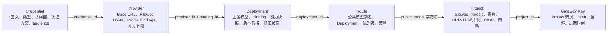
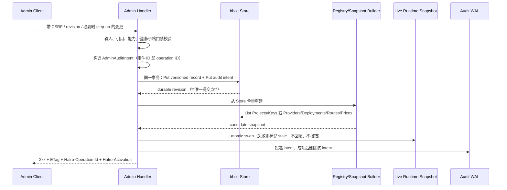
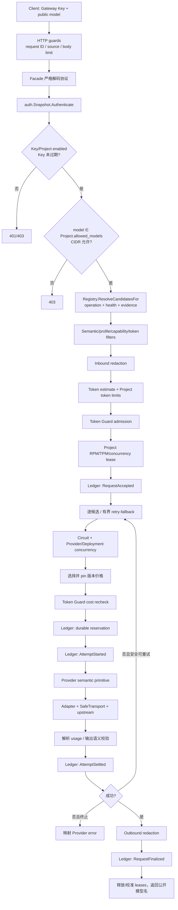
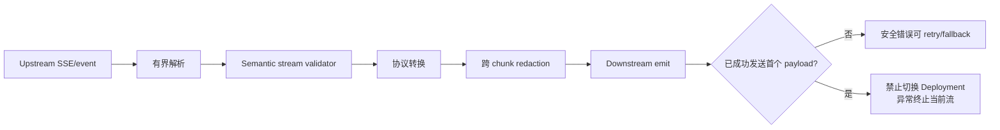

# Provider 到 Project API 全链路

> 目标：把 Halro 从管理面配置到数据面调用的真实代码路径放在同一张图里，作为设计、实现和发布前 review 的共同底稿。
>
> 基线：`main@b206285b920c`，并包含 2026-08-10 工作区中的未提交代码。本文是代码走查结果，不是期望态设计。
>
> 修订：2026-08-11 在 `main@4af0228` 复核，§3.1 重写。原文把 Registry 装载的全部条件统称为“筛选规则”，实际上其中大部分不满足时会让整次装载失败而非排除单条记录，这个区别正是 review 文档 F-05 的放大机制。§3.1 的行号以 `4af0228` 为准，其余各节仍是原基线的行号，可能已漂移。
>
> 修订：2026-08-11 晚，在 `95b5d47`（F-06/F-07 修复）与 `18f3939`、`a96cf4b`、`c051edc`（F-03 提交协议及其子项）之后再次重写 §3 与 §3.1。装载的失败语义和管理面的提交语义都变了：Provider 级问题现在排除该 Provider 而不再致命，管理面变更与其审计记录同事务落盘、激活失败改为让运行时进入 stale 并拒绝数据面流量。本轮不再给行号，只给文件与函数名——行号在过去两天里漂了三次。
>
> 范围：Credential、Provider、Deployment、Route、Project、Gateway Key，以及通过 `/v1/*` 发起的推理请求。Admin 登录、前端页面细节、异步资源的完整生命周期不在主图内。
>
> 位置：本文原在 `docs/todo/`，随对应 review 的全部条目关闭而迁到这里。它描述的是当前实现而不是待办，因此改动这条链路时应当同步更新本文——这是它留下的理由。对应的 review 报告见 [`review/260811/`](../review/260811/provider-to-project-api-chain.zh-CN.md)。

## 1. 一句话模型

管理面把上游秘密和调用能力逐层收窄为一个 Project 可见的公共模型别名；数据面只接受 Gateway Key 和公共模型别名，再从不可变运行时快照中解析实际 Provider 调用目标。

```text
Provider secret
  → Credential
  → Provider + Profile Binding
  → Deployment + Model/Capability/Price snapshot
  → Route(public model alias)
  → Project.allowed_models
  → Gateway Key
  → /v1/* request
  → Provider attempt(s)
```

## 2. 管理面资源关系



这里有一个容易误读的点：`Project.allowed_models` 保存的是 `Route.PublicModel`，不是 Route ID。因此多个 Route 可以共享同一个公共模型别名，并成为有序回退或轮询候选。

### 2.1 Credential

- Admin API：`POST/PUT/DELETE /admin/api/v1/credentials`。
- 保存 Provider 类型、访问面、认证方案和按 audience 加密的凭据。
- Provider 引用 Credential；Credential 删除时，存储层拒绝删除仍被非墓碑 Provider 引用的记录。
- 运行时解密只发生在构建 Provider adapter 时，明文随后清零。

关键代码：

- `internal/domain/models.go:96`：持久化模型和基础校验。
- `internal/app/admin_providers.go:57`：创建/轮换/删除入口。
- `internal/app/providers.go:185`：Registry 装载时重新校验类型、audience 和 profile。

### 2.2 Provider 与 Profile Binding

- Admin API：`POST/PUT/DELETE /admin/api/v1/providers`。
- Provider 固定 Base URL、允许主机、Credential、最大并发和一个或多个 Profile Binding。
- Binding 固定访问面、认证方案、能力及能力证据；运行时按 Binding 创建 adapter。
- 所有外呼 adapter 都使用 `safetransport`，执行 HTTPS、主机白名单、DNS/IP、固定拨号和禁止重定向等约束。

### 2.3 Deployment

- Admin API：`POST/PUT/DELETE /admin/api/v1/deployments`。
- 新建 Deployment 必须先保存为 disabled。
- Deployment 将一个 Provider Binding 固定到一个上游模型/调用目标，并保存能力快照、区域、并发限制、测试结果。
- 启用前必须有当前 revision 的健康测试和当前有效的版本价格。
- 调用目标身份不可在原 Deployment 上迁移；需要新建、验证再替换。

### 2.4 Route

- Admin API：`POST/PUT/DELETE /admin/api/v1/routes`。
- Route 只保存公共模型别名到 Deployment 的映射，不再直接保存 Provider 或上游模型。
- 同一公共模型下，所有 enabled Route 必须使用相同策略：`ordered` 或 `round_robin`。
- 实际候选排序读取 Route 的 `priority`，priority 相同再按 Route ID 排序。

### 2.5 Project 与 Gateway Key

- Project Admin API：`POST/PUT/DELETE /admin/api/v1/projects`。
- Key Admin API：`POST/PUT/DELETE /admin/api/v1/projects/{id}/keys`。
- Project 是数据面策略和计费边界，保存可用公共模型、预算、速率、并发、Token 上限、CIDR、Redaction Policy 和 Token Guard Policy。
- Gateway Key 明文只在创建响应中返回一次；持久化的是 hash，数据面用 hash 定位 Key 和 Project。
- Project/Key 变更后，会重建 `auth.Snapshot` 并原子替换当前认证快照。

## 3. 配置激活链

管理面不是直接修改正在服务的对象。Provider、Deployment、Route 的持久化记录会被重新编译成 `provider.Registry`；Project 和 Key 会被重新编译成 `auth.Snapshot`。



### 3.0 提交语义

变更曾经是三个各自独立的结果——store commit、runtime activation、audit append——而 HTTP 状态只能报告最后一个失败。**现在 store commit 是唯一提交点**：

- 审计记录在 mutation 之前构造，与 mutation 写进同一个 bbolt 事务。被拒的写会连同记录一起回滚；提交了的写不可能没有记录。
- 投递到 Audit WAL 在其后进行，失败不影响响应（那时变更已经发生），未投递的 intent 由启动时的 drain 重投。已投递的 intent 直接删除。
- 激活失败不再让请求失败，而是把运行时标记为 **stale**：数据面在限流与鉴权之前用 `configuration_stale` 拒绝，`/health/ready` 报 `not_ready`，后台每 5 秒重试直到追上。撤销类变更「已落盘但未生效」时继续放行旧快照，是这条协议要消除的 fail-open。
- 因此「已提交」和「已生效」是两个问题，响应上各有答案：`Halro-Operation-Id`（durable 的审计事件 ID）与 `Halro-Activation`。

代码：`internal/app/admin_audit_intent.go`、`internal/app/activation_state.go`、`internal/store/bolt/store_admin_audit.go`。

覆盖范围是全部管理面写入：Credential、Provider、Deployment、Route、Project、Gateway Key，以及告警 webhook 与 redaction / Token Guard 策略资源。

redaction 与 Token Guard 的激活失败同样标记 stale——它们决定的是活跃流量被如何脱敏、被不被放行。告警不标记：投递告警不决定任何一个请求的结果，为一个 webhook 重建失败而拒绝全部流量，比它报告的故障更大。

Provider / Deployment / Route / Project 的创建需要 `Idempotency-Key`，记录 ID 由它派生，因此响应丢失后的重试撞成 409 `<resource>_idempotency_replay` 而不是建出第二条记录。Gateway Key 与价格版本此前已是这个形状。

### 3.1 Provider Registry 的装载规则

`loadProviderRegistryWithCatalog` 决定哪些 Route 成为 Target。这里必须先分清一件容易读错的事：**它的条件不是同一种**。有的条件不满足时只是把这一条排除掉，有的会让整次装载失败。把它们统称为“筛选”会掩盖掉真实行为——一次装载失败意味着新 Registry 不会被激活，旧的原样继续服务（`internal/app/providers.go:110-114`），启动时则是进程起不来。

分界线是**问题的作用域**：只影响单条 Route 的问题排除那条 Route，影响整个 Provider 装载能力的问题让整次装载失败。

**一、静默排除（`continue`，不报错）**

| 条件不满足 | 效果 | 代码 |
|---|---|---|
| Provider `enabled` 且未删除 | 该 Provider 及其全部 binding 不产生 adapter | `providers.go:274-277` |
| Binding `enabled` | 该 binding 不产生 adapter | `providers.go:302-305` |
| Route `enabled` 且未删除 | 该 Route 不成为 Target | `providers.go:334-337` |

**二、记录后排除（withheld，不报错）**

两类，都记录在 `loadReport` 里，但**分开记**——一类要 review，一类要修：

- `Drifted`：Deployment 能力快照未通过当前 catalog review（`providers.go:380-385`）。审计为 `deployment.capability_drift.detected`，并计入漂移指标。
- `Dangling`：Route 引用的东西造不出 Target（`providers.go:352-357`、`414-419`、`423-428`），三种原因 `deployment_unavailable`、`binding_unavailable`、`provider_model_rejected`。审计为 `route.reference_withheld`，日志级别是 error 而不是 warn，**不计入漂移指标**——漂移是能力声明超出了当前构建支持的范围，悬空引用是存储的拓扑自相矛盾，把后者算成前者会让漂移指标同时表示两件事。

两类都是有意设计，理由相同：拒绝构建整个 Registry 会把一条坏记录升级成进程起不来，还带走所有正常的 Route，正是 fail-closed 想避免的结果。被排除的 Route 本身在两种情况下都是 fail-closed，变的只是影响半径。

`Dangling` 这一类原本是致命的，是 review F-05 的核心：一条仍然 enabled 的 Route 指向被关掉的 Binding，会让整次装载失败，于是变更已落盘、激活失败、此后每次拓扑变更都失败、进程再也起不来。已在 `e1d94be` 改为 withheld。

**三、容忍**

无当前版本价格时 Target 仍然装载，价格投影为零；请求期重新选择并 pin，按 unknown-price policy 决定是否允许。价格读取错误让该 Route 被 withheld（`price_unreadable`），不再让装载失败。

**四、Provider / Binding 级排除（`95b5d47` 起，不再致命）**

作用域是「这个 Provider（或它的某个 binding）根本装载不起来」的问题。它们现在排除受影响的对象并记进 `loadReport.Excluded`，审计为 `provider.excluded_from_routing`；落在被排除 Provider 上的 Route 会走既有的 `binding_unavailable` withhold，其余 Provider 照常服务：

| 情况 | 排除粒度 | 常量 |
|---|---|---|
| endpoint 不符合当前安全策略 | 该 Provider | `endpoint_rejected` |
| binding profile 不可用或与本次构建不兼容 | 该 binding | `binding_profile_incompatible` |
| adapter 或 bridge 构建失败 | 该 binding | `adapter_unavailable` |

这一类原本会让进程起不来（F-06）。它在 `95b5d47` 之前不可达——私网 Provider 根本建不出来——而修好 F-07（让 `allow_private_provider_endpoints` 真正生效）会立刻使 endpoint 那条变为可达，所以两条在同一个提交里一起处理。**运维收紧一个安全开关，不应该成为实例起不来的原因。**

**五、仍然致命（`return refuse(...)`）**

只剩下「存储状态被篡改」或「vault 不可信」这一类，这是 F-06 留下的那个问题的收敛答案：

- Credential 读取失败、类型不匹配、audience 不匹配（`providers.go` 的 `refuse` 三处）
- Binding 与 Credential 的 access surface / scheme 不一致
- 凭据在自己的 audience 下解密失败

这些不是运维可以被告知后继续运行的配置问题；已构建的 adapter 在拒绝前会被关闭而不是泄漏。

**六、`halro doctor` 的覆盖缺口**

装载层改成容忍之后，doctor 是这些排除唯一能被主动看见的地方。当前状态：

- 被关闭的 capability interface（binding `enabled=false`）导致的 Route withhold —— **已覆盖**（`checkDoctorTopology`，`a96cf4b`）
- endpoint 被安全策略拒绝导致的 Provider 排除 —— **已覆盖**（`c051edc`）：doctor 用当前 `providerEndpointPolicy` 校验每个启用 Provider 的 base URL 并点名被排除的那个
- 管理面审计积压 —— 已覆盖（`admin_audit_backlog`）

管理面的守卫分布：`validateProviderCanDeactivate` 要求先停掉 Provider 的活跃 Deployment，`validateDeploymentCanDeactivate` 要求先停掉 Deployment 的活跃 Route，`validateBindingsCanDeactivate`（`e1d94be` 新增）要求先停掉 binding 上的活跃 Deployment。三级同形，都在错误里点名挡路的那个资源。

Registry Target 最终包含 Route ID、Deployment ID、Provider ID、Binding、公共模型、上游模型、adapter、能力证据、价格投影，以及 Provider/Deployment 两级并发上限。

## 4. 数据面入口

Runtime 为 `/v1/*` 入口统一挂载请求 ID、源地址解析、源速率限制、请求体上限等 guard，再分派到 Gateway API facade：

- OpenAI 兼容：`/v1/chat/completions`、`/v1/responses`、`/v1/embeddings` 等；
- Anthropic 兼容：`/v1/messages`；
- Halro 扩展及资源类端点：moderations、images、audio、files、batches、rerank、async invocations。

Facade 负责严格 JSON/Multipart/SSE 协议处理；`gateway.Service` 负责认证、策略、路由、预算、Provider attempt 和结算。

## 5. 普通推理请求全链路

以下以 `POST /v1/chat/completions` 为代表。Responses portable path 会转成相同的 semantic generation 热路径；Embeddings、Messages 和资源类端点在协议及 Provider primitive 上分支，但共享认证、Project、Registry、预算和结算原则。



### 5.1 解析与授权

`gateway.Service.resolveRequest` 的顺序是：

1. hash Gateway Key 并在 `auth.Snapshot` 中认证；
2. 检查公共模型是否在 `Project.AllowedRoutes`；
3. 检查来源 CIDR；
4. 从 `provider.Registry` 解析满足 operation 的候选；
5. 区分“别名存在但能力不支持”和“别名不存在”。

随后各协议路径继续做 semantic requirement、profile、primitive、token capacity 筛选。所有候选都被筛掉时，不会调用 Provider。

### 5.2 Project admission

在第一次 Provider attempt 前依次执行：

- inbound redaction；
- Project input/output token 上限；
- Token Guard 第一次准入；
- Project RPM、TPM、并发租约；
- `BeginRequestDetailed`，把请求接受事件写入 Ledger。

这里的 RPM 和 Project 并发按客户端请求计一次；Provider/Deployment 并发、token 和 cost 按 attempt 计。

### 5.3 每次 Provider attempt

每个候选/重试都独立执行：

1. 熔断器准入；
2. Provider 并发和 Deployment 并发准入；
3. 按 Deployment 选择版本价格并准备 price pin；
4. Token Guard 用本次真实估价二次检查；
5. 在 Ledger 中创建独立、持久的预算 reservation；
6. 提交 price pin；
7. 写 `AttemptStarted`；
8. 调用 Provider primitive，经 adapter 和 SafeTransport 到上游；
9. 按权威 usage 或保守估算结算 attempt；
10. 更新熔断器并决定终止、重试或 fallback。

模糊结果（请求可能已到上游，但没有权威结果）不得重试或 fallback；这是避免重复生成、副作用和重复计费的核心边界。

### 5.4 流式差异



流式请求还必须满足 Project redaction policy 允许流式处理。首个安全 payload 成功写给客户端后即跨过 delivery boundary，此后禁止悄悄切换 Provider/Deployment。

## 6. 状态所有权与“有意的重复”

| 数据 | 权威来源 | 运行时副本 | 作用 |
|---|---|---|---|
| Credential/Provider/Deployment/Route/Project/Key | bbolt | Registry / Auth Snapshot | 无锁或低锁热路径读取 |
| 成本、reservation、attempt 结果 | Ledger WAL | 内存状态、bbolt checkpoint、usage aggregates | WAL 是唯一记账权威 |
| Deployment 价格 | 版本价格记录 | Registry 中仅有投影；请求时重新选择并 pin | 防止热加载投影成为计费权威 |
| 模型能力 | Deployment capability snapshot + catalog | Registry Target capability/evidence | 在激活期 fail-closed 筛选 |
| Provider secret | Vault ciphertext | adapter 内的 authorizer | 不进入 Project 或客户端 |

这些副本本身不是冗余缺陷；它们用于把持久化模型编译成请求热路径所需的只读快照。正确性要求是：持久化成功、快照激活、审计结果之间必须有明确的一致性语义。

## 7. Review 检查表

后续改动可以沿主图逐项检查：

- 每个下游引用是否在创建、更新、删除三个方向都校验？
- 一次 durable mutation 与运行时 snapshot swap 是否可能分离？失败后系统以哪一份为准？（答案见 §3.0：store commit 为准，未生效时数据面 fail-closed）
- 新增的管理面写入是否走了同事务的 audit intent，还是又回到「先落盘、后 append」？
- disable/revoke/delete 是否立即 fail-closed，是否错误地依赖客户端请求仍存活？
- Registry 筛选和请求期筛选是否存在两套不一致规则？
- 配置字段是否真正进入 Target 和候选算法，还是只存储/展示？
- 每个 Provider I/O 前是否已有 durable reservation 和 `AttemptStarted`？
- retry/fallback 是否只发生在安全错误且未越过 delivery boundary 时？
- 所有本地失败路径是否释放熔断 probe、并发、限流、Token Guard、预算和 request lifecycle？
- 结算失败是否优先暴露 accounting unavailable，而不是把未记账响应当成功返回？
- 日志、错误、metrics、audit 是否只记录 ID/类别而不记录秘密和内容？

## 8. 相关代码入口

- `internal/app/runtime.go:1224`：数据面路由注册。
- `internal/app/runtime.go:1307`：管理面链路 API 注册。
- `internal/app/providers.go:27`：Provider Registry 热加载。
- `internal/provider/provider.go:275`：Target 注册约束与候选算法。
- `internal/auth/snapshot.go:47`：Project/Key 认证快照刷新。
- `internal/gateway/service.go:173`：认证、Project 授权、候选解析。
- `internal/gateway/service.go:199`：Project admission 与 request lifecycle。
- `internal/gateway/service.go:307`：attempt、价格 pin、预算 reservation、并发和熔断。
- `internal/gateway/service.go:731`：非流式 Chat 主路径。
- `internal/gateway/service.go:1387`：流式 Chat 主路径。
- `docs/contracts/gateway-correctness.md`：请求、attempt、delivery boundary 和取消语义。
