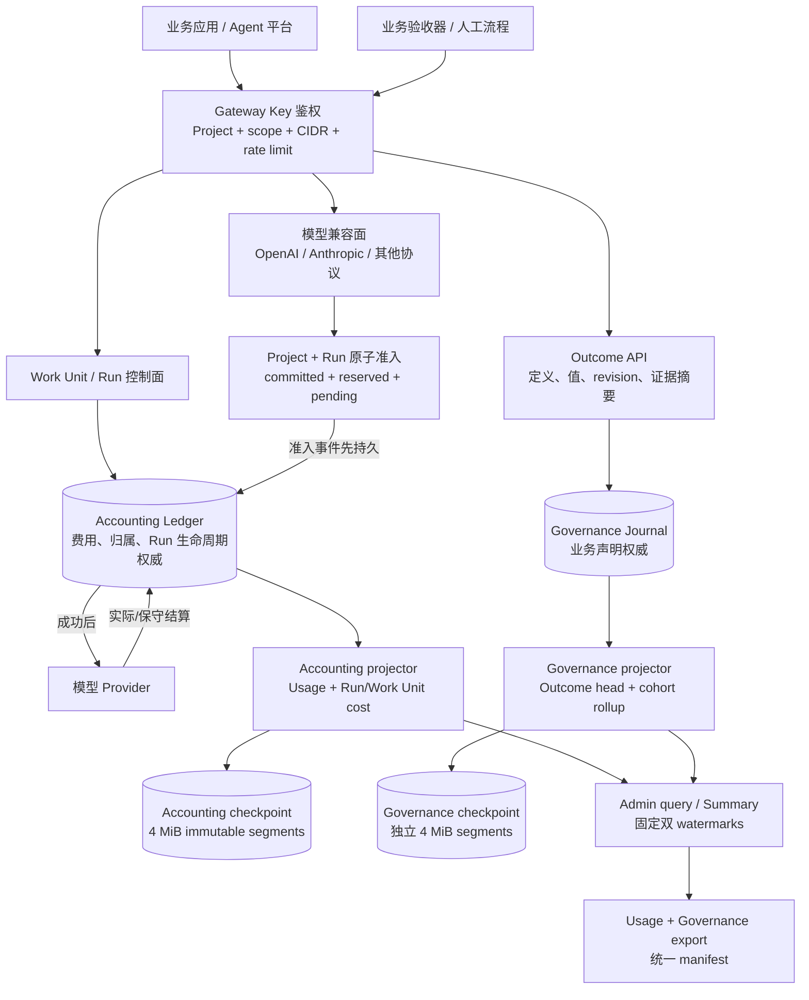

# Run Governance 数据流与权威边界

- 状态：S0 冻结，生产实现尚未开始
- 关联：[契约清单](../implementation/run-governance-s0-contracts.zh-CN.md)、
  [ADR 0025](../adr/0025-run-budget-authority-and-dual-admission.md)、
  [ADR 0026](../adr/0026-business-outcome-evidence-and-cohort-reporting.md)

## 写入与查询流



## 权威与失败传播

| 数据/动作 | 唯一权威 | 失败时行为 | 不允许的替代 |
| --- | --- | --- | --- |
| Project/Run 余额与 reservation | Accounting Ledger + replay state | 带 Run 调用 fail closed；Provider 不得收到请求 | 从 checkpoint、Summary 或 Governance 推算余额 |
| Work Unit/Run 生命周期和 Attempt 归属 | Accounting Ledger | 状态未知时拒绝新附带调用 | 丢掉 Run 维度后继续调用 |
| Outcome 当前声明和修订历史 | Governance Journal | Outcome 写/查询失败；普通推理继续 | 把 Outcome 塞入 Accounting writer/apply state |
| Usage/Run/Outcome 查询 | 可重建 projector | 显式 partial/not-ready，并返回各自水位 | 把缺失显示为零或失败 |
| 导出 | 两个投影在固定双水位下的派生物 | 文件或 manifest 校验失败则拒绝发布/恢复 | 复制一份可加总 Attempt 成本到 governance 数据集 |

Governance 不参与模型准入。Outcome 的到达、修订、损坏或积压不能改变 Provider
是否已被调用、Attempt 如何结算或无 Run 请求是否可用。Accounting 故障仍按现有
fail-closed 规则阻止需要预算权威的新 Provider 调用。

## 一次带 Run 的模型请求

1. 协议适配器把 `X-Halro-Run-ID` 放入统一 request envelope，不自行查余额。
2. 鉴权快照证明 Key 可 `inference` 和 `run:attach`，且 Project/CIDR 等现有限制通过。
3. 在 Project 临界区同时读取 Project、Run committed/reserved 和两个 pending；检查
   两个 cap 后同时增加 pending。
4. 释放 Project lock；把 reservation 与 Run/Work Unit 归属追加到 Accounting Ledger。
5. durable append 和按 sequence Apply 成功后移除 pending，才允许 Provider I/O。
6. Provider 返回、失败或结果不明时，按现有实际/估算/保守规则结算一次；同一金额
   同时投影到 Project 和 Run，不能形成第二份费用。
7. close/expiry 若先获得临界区，步骤 3 拒绝；若 reservation 先准入，Attempt 继续结算。

无 Run 请求不执行步骤 3 的 Run 查询，不写 Work Unit/Run 字段之外的新事件，也不
依赖 Governance readiness。

## 一次 Outcome 上报

1. 鉴权验证 `outcome:write`、Project、CIDR、Key/Project 写入限流和 16 KiB body。
2. 只接受 Work Unit 已声明的不可变 Definition version；值必须符合 BOOLEAN 或
   CATEGORICAL allowlist。
3. 验证 Idempotency-Key fingerprint 和 `supersedes_outcome_id == current head`。
4. 在该 Work Unit/Definition 的短临界区内向 Governance Journal 追加受认证事件。
5. Journal sequence 决定 revision 顺序；`observed_at` 只作为业务时间显示。
6. projector 更新 current head 与同 cohort 的低基数 rollup；索引可删除重建。Work Unit
   close 30 天后拒绝新上报和修订，但权威历史继续保留。

`evidence_ref` 只是不可执行的受限引用。Halro 不访问它，也不保存证据正文、Prompt、
Response、验收 reasoning 或自由文本评价。

## 双 watermark 查询

查询开始时分别捕获：

```text
accounting_watermark = Accounting projector 已应用的位置
governance_watermark = Governance projector 已应用的位置
```

查询只使用不超过这两个位置的读模型并把二者原样返回。跨日志不存在全局 sequence，
也不伪造原子快照。若其中一侧落后或不可用，响应必须标出 partial/not-ready；调用方可
用双 watermarks 判断两次报表是否使用了同一输入边界。

## Checkpoint、备份和恢复

Accounting 与 Governance 分别 checkpoint、校验和全量重放。两边都使用小 head +
不可变 4 MiB segments；每次只重写 head 与 open tail。它们不共享 bbolt transaction，
避免 Governance checkpoint 故障反向毒化 accounting。

Governance chain key 使用独立 derivation domain。Master/key slot 轮换时创建新 generation，
新 header 记录上代 terminal digest；任意 header、chain 或 revision 断裂都使 Governance
not ready。已确认本地写入目标 RPO 为 0，100 万事件冷恢复门槛为 30 秒。

备份 manifest 必须包含两份日志、两份 checkpoint 版本/head 和 export manifest。
恢复在 staging 目录分别验证、重放，再核对双 watermark 连接和 active resources；全部
成功后才原子切换数据目录。

## 有界性

- 每 Project：1,000 active Runs、1,000 open Work Units、64 active Definitions；
- 每 Work Unit：32 Runs、8 Definitions；
- 每 Outcome head：20 revisions；
- 每页最多 200 items；Summary 最大 60 RPM/Project；
- 内置 Summary 最多 90 天/100,000 Work Units，服务端门槛 2 秒；
- Prometheus 不使用任何 Project/Run/WorkUnit/Key/Definition ID 作为 label；
- 内置查询只做 Work Unit cohort 和低基数维度，任意多维分析交给 export。
