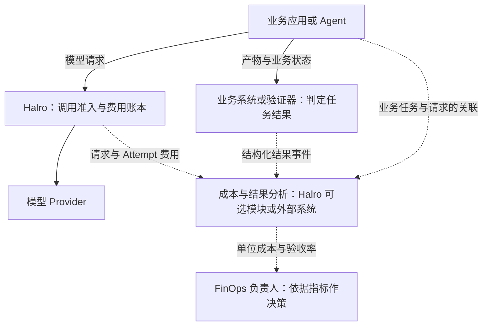

# AgentPlane、FinOps 与 TokenOps：资料收集与分析

调研日期：2026-09-04。状态：Research / Proposed；本文不代表 Halro 已实现新增能力。

本次核对官方文档、项目维护者发布的资料，以及 Halro 当前源码。外部项目未安装或运行，性能数据未复现；Halro 核对基线为 `381743f6613607dc256828f4776b52af8bdd232c`。

分析结论已经收敛为：[Run 治理、业务结果关联与单位结果成本 PRD](/Users/ziy/Code/ClayCosmos/Halro/docs/prd/prd-run-governance-and-business-outcomes.zh-CN.md)。

## 1. 三者分别解决什么问题

| 对象 | 性质 | 主要问题 | 核心单位 |
| --- | --- | --- | --- |
| FinOps | 跨工程、财务和业务的经营管理方法 | 技术投入由谁负责，产生多少价值，如何持续优化 | 产品、成本中心、业务结果 |
| AgentPlane | 本文特指 `theagentplane` 开源项目集合 | Agent 运行如何记录、回放、归因和治理 | 执行过程、决策边界、Run |
| TokenOps | AgentPlane 旗下的运行成本治理工具 | 多个 Agent 共用的任务预算如何在运行中生效 | Run、Agent、调用及成本分段 |

FinOps 的目标是提高技术投入的业务价值，结合成本、性能与可靠性作决策；只有账单展示或费用告警，还不构成完整的 FinOps 实践。[Microsoft Learn：What is FinOps?](https://learn.microsoft.com/en-us/cloud-computing/finops/overview)

AgentPlane 将 Chronicle 的执行记录与回放、TokenOps 的运行预算治理放在同一基础设施方向下。本文选择这个项目，是因为微软 TokenOps 文章直接链接到该组织。另有 `basilisk-labs/agentplane`，定位是面向编码 Agent 的 Git 工作流控制，两者应分开研究。[AgentPlane](https://github.com/theagentplane)、[同名项目说明](https://agentplane.org/docs/user/overview/)

这里的 TokenOps 是具体开源项目，不能把它的功能或接口直接当成行业标准；Tokenomics Foundation 则是另一个推动 AI 经济性标准与方法的组织。

## 2. FinOps：把消耗连接到业务结果

FinOps Framework 覆盖四类工作：理解用量和成本、量化业务价值、优化用量和成本、管理 FinOps 实践。这意味着预算控制只是其中一部分，归属、预测、采购、分摊与单位经济性也需要有人负责。[FinOps Framework](https://www.finops.org/framework/)

其推进方式是反复进行 Inform、Optimize、Operate：先掌握现状与成本归属，再选择优化措施，然后执行并测量效果。三个阶段可以由不同团队同时推进。[FinOps Phases](https://www.finops.org/framework/phases/)

AI 带来的额外问题包括成本构成复杂、实验频繁、消耗难预测、多层应用难归因。因此 FinOps for AI 同时关注模型消费、基础设施与采购方式，以及最终业务结果。[FinOps for AI](https://www.finops.org/framework/technology-categories/ai/)

结合 Agent 工作负载，建议用以下问题建立落地顺序；这是本文的应用分析：

| 阶段 | 应先回答的问题 | 可交付结果 |
| --- | --- | --- |
| Inform | 哪个产品、客户、任务和失败重试产生了费用？ | 可追溯的成本明细与归属率 |
| Optimize | 减少上下文、重试或模型成本后，验收率是否下降？ | 同类任务的成本—质量对照 |
| Operate | 谁批准预算，何时拒绝调用，账单差异如何修正？ | 可执行策略、负责人和对账流程 |

建议至少同时观察四个指标：

- **每次验收通过结果的成本**：同一统计口径内全部相关运行费用 ÷ 验收通过结果数；失败、重试和中止的成本也进入分子，分母为零时不显示为零成本。
- **预算内验收率**：同时满足预算约束和业务验收的任务占比。
- **成本归属率**：能归属到可信产品或任务的费用占比。
- **成本完整性**：未知费用、估算费用及与 Provider 账单的差异分别展示。

“HTTP 成功”“Agent 自称完成”“真正通过业务验收”需要分别记录。否则很容易通过提前中止任务降低平均花费，却误报为经济性改善。

## 3. AgentPlane：三个可分离的组件

| 组件 | 文档描述的责任 | 对 Halro 的参考意义 |
| --- | --- | --- |
| Chronicle | 记录模型、工具和路由边界的输入输出，导出故障回放用例 | 将真实故障转为回归资料的方法 |
| TokenOps | 在调用边界实施 Run 预算和行为策略 | Run 归因、共享预算及拒绝原因 |
| AgentPlane Control | 为两者提供 HTTP 接口、SQLite 存储和统一 UI | 控制数据与执行点的职责分离 |

Chronicle 的 Envelope 捕获边界 I/O；stub 回放直接返回记录结果，不重演该边界内部的文件或网络副作用。它也允许选择某个边界运行真实代码来验证修改。因此，离线结构回放能验证指定路径，不能据此证明新模型在真实环境中的回答质量。[Chronicle README](https://github.com/theagentplane/chronicle)

AgentPlane Control 的新说明强调 SQLite 由控制面进程独占，Agent 通过 HTTP 接入；运行中的拦截仍由 TokenOps SDK 执行。它使用 FastAPI，三个包分别是 `agentplane-control-plane`、`agent-chronicle`、`agent-tokenops`。[AgentPlane Control README](https://github.com/theagentplane/control-plane)

**判断：**这种可组合方向值得参考。Halro 可以提供调用边界上的计量和限制，上层系统提供任务语义和验收；完整执行图与回放不必进入网关核心。

## 4. TokenOps：从单次调用费用到整次任务预算

TokenOps 的核心机制是让入口和下游 Agent 共享 `run_id`，通过模型客户端包装器检查策略、发起调用并记录成本。HALT 状态用于拒绝后续受控调用；SDK 接入覆盖范围决定其实际控制范围。[TokenOps README](https://github.com/theagentplane/tokenops)

其架构将 spend、inflight 和 halt 作为可跨进程共享的状态，但步骤窗口和局部步骤计数仍属于进程内状态。因此“共享费用账本”不自动意味着所有限制都已跨 Agent 汇总。[TokenOps architecture](https://github.com/theagentplane/tokenops/blob/main/docs/architecture.md)

可以把其策略思路归纳为三类：限制累计费用与下一次调用的潜在费用；限制步骤、并发和重复行为；通过调整下一次调用减少消耗。微软文章将这些归纳为先引导、必要时停止，并明确表示业务价值判断层尚未建成。[微软 TokenOps 文章，2026-08-13](https://commandline.microsoft.com/tokenops-real-time-run-scoped-cost-control-ai-agents/)

### 4.1 阅读公开材料时需要保留的限制

- **文档存在部署口径差异。**TokenOps README 仍包含多个进程共享 SQLite 文件的说明，AgentPlane Control README 则要求 Agent 仅通过 HTTP 访问。应按具体发布版本核对接入路径，不能混用配置。[TokenOps README](https://github.com/theagentplane/tokenops)、[Control README](https://github.com/theagentplane/control-plane)
- **策略清单不等于所有执行器已完成。**状态页仍把流式 CANCEL/RETRY、跨进程步骤总数等列为待完成，并说明默认策略按 Run 生效，用户与标签分段仍有未完成项。[Control plane status](https://github.com/theagentplane/tokenops/blob/main/docs/control-plane-status.md)
- **效果数字属于作者实验。**文章报告 27 次评分试验中平均费用下降 78.9%、预算内成功率由 67% 升至 96%。本次未复现，不能外推成接入后普遍节省比例。[微软实验说明](https://commandline.microsoft.com/tokenops-real-time-run-scoped-cost-control-ai-agents/)

### 4.2 共享账本还需要原子预算准入

以下是工程分析，不是本次对 TokenOps 当前版本作出的漏洞结论。

假设预算为 $1.00，已花 $0.60。两个并行调用各可能花 $0.40；如果都只读取已花金额，就可能一起通过，最后累计 $1.40。调用后对共享账本做原子加法，只能准确记录这次超支。

严格的调用准入需要在同一原子决策中保证：

```text
已结算费用 + 全部在途预留 + 本次保守预留 <= 预算
```

还必须定义预留的释放、未知执行结果、幂等结算、服务重启和价格缺失如何处理。这个上界的有效性又依赖正确价格、可约束的输出上限及上游实际计费行为；它不是无条件的最终发票保证。

同样，拒绝下一次调用、尝试取消当前流、停止整条工作流是不同动作。SDK 或网关只能控制经过自身的边界，已经产生的费用也不会因取消而自动撤销。

## 5. 对“网关只能管请求”的说法需要修正

LiteLLM 当前官方文档已提供 `max_budget_per_session` 和 `max_iterations`，通过 trace/session 标识归集 Agent 调用，预算配置可跨该 Agent 的多个 Key 生效。所以 Run/Session 治理并非网关在架构上无法承载。[LiteLLM Agent Iteration Budgets](https://docs.litellm.ai/docs/a2a_iteration_budgets)

但同一页面描述的是调用前检查累计费用、调用后增加费用；其一般预算文档另外描述了预算预留。仅凭两个功能名称，不能推断所有 Session 路径都获得相同的原子预留保证。[LiteLLM 预算与预留说明](https://github.com/BerriAI/litellm-docs/blob/main/docs/proxy/users.md)

因此，比较这类产品应逐项确认：

| 比较维度 | 要确认的实际语义 |
| --- | --- |
| 归因 | 能否跨 Key、Agent、Provider 和进程保留同一个可信任务标识 |
| 准入 | 是否将并发在途费用计入预算，并原子地占用额度 |
| 完整性 | 未知价格、断流、重试、fallback 和付费工具如何计量 |
| 停止范围 | 拒绝后续调用、取消当前生成、停止上层任务各由谁执行 |
| 生命周期 | 暂停、恢复、TTL 到期及进程重启是否改变累计预算 |
| 价值 | 成本与何种可验证业务结果关联 |

## 6. 标准与相关资料的作用

| 资料 | 可用于什么 | 不能单凭它证明什么 |
| --- | --- | --- |
| FOCUS | 统一费用、用量、账期及归属等数据口径 | 实时预算准入与工作流停止 |
| OpenTelemetry GenAI | 模型与工具调用的 spans、metrics、events 语义 | 金额账本的原子性及财务对账完成 |
| Tokenomics Foundation | 跟踪 AI 总成本、价值与测量方法的发展 | 某个 TokenOps 实现已通过行业认证 |

截至调研日，FOCUS 官方已发布 1.4，定义通用账单数据结构；接入应明确映射版本，不能仅凭导出 CSV 就宣称兼容。[FOCUS 1.4](https://focus.finops.org/docs/specification/v1-4/)

OpenTelemetry 的旧 GenAI 页面已经标记迁移，当前入口是独立的 GenAI semantic conventions 仓库。后续字段设计应从新入口核对，而不是复制旧文章中的属性清单。[OTel 迁移说明](https://opentelemetry.io/docs/specs/semconv/gen-ai/)、[当前仓库](https://github.com/open-telemetry/semantic-conventions-genai)

Tokenomics Foundation 于 2026-08-04 正式宣布成立，关注 AI 生产、消费与业务价值，路线图包括更完整的成本模型及 FOCUS 的 Token 成本遥测。这些路线图不能表述为全部已经交付。[Linux Foundation 公告](https://www.linuxfoundation.org/press/linux-foundation-launches-the-tokenomics-foundation-to-define-the-economics-and-roi-of-ai-value)

费用建模也不能只比较每百万 Token 的标价。输入输出、缓存、多模态、反复发送的上下文和实际完成任务所需调用次数都会影响经济性。[FinOps Foundation：How Token Pricing Really Works](https://www.finops.org/wg/genai-finops-how-token-pricing-really-works/)

本文建议：对每次 Attempt 保留价格版本和原始用量语义，以互不重复的计费项计算费用；工具、检索、沙箱、基础设施和人工成本在上层汇总时另外纳入。缓存或 reasoning 是否已包含在总 Token 中必须按 Provider 定义处理，避免重复计费。

## 7. 与 Halro 当前实现的对应关系

以下结论来自本次源码与仓库文档核对，不代表重新运行了测试或完成线上验收。

| 能力 | 当前证据 | 结论 |
| --- | --- | --- |
| 自托管调用治理 | README 明确单 Go 二进制、凭据、预算、路由与记账边界 | 已有网关基础 |
| Project 日预算准入 | `Manager.admit` 在 Project 锁下累计已结算、已预留及待入账预留 | 已有调用前控制，不依赖月末账单 |
| Request / Attempt 归属 | Ledger Event 包含二者及 Project、Key、Provider、Deployment 等字段 | 重试和 fallback 可按 Attempt 追踪 |
| 历史价格与不确定费用 | Event 保留价格快照、估算标记及用量来源 | 具备进一步成本汇总的数据基础 |
| Token Guard | 输入为 Project、Key、Token、费用、并发及来源等 | 当前治理维度主要在调用与项目层 |
| 业务 Run 预算 | 所检查的 Ledger Event、BalanceKey、Token Guard 输入无业务 Run 字段；源码检索未发现 Run 预算接口 | 本次未发现现成 Run 预算契约 |

对应代码：[README](/Users/ziy/Code/ClayCosmos/Halro/README.md:7)、[预算准入](/Users/ziy/Code/ClayCosmos/Halro/internal/budget/manager.go:276)、[Ledger Event](/Users/ziy/Code/ClayCosmos/Halro/internal/ledger/event.go:45)、[余额维度](/Users/ziy/Code/ClayCosmos/Halro/internal/ledger/event.go:293)、[Token Guard 输入](/Users/ziy/Code/ClayCosmos/Halro/internal/tokenguard/manager.go:28)、[用户指南](/Users/ziy/Code/ClayCosmos/Halro/docs/guides/user-guide.zh-CN.md:314)。

注意源码中用于一次网关请求的局部变量 `run` 不等于这里跨多次请求的业务 Run。另一个现有边界是 Halro 单写者、单副本；当前预算机制不能直接宣称为跨多个 Halro 实例的全局预算。[部署约束](/Users/ziy/Code/ClayCosmos/Halro/README.md:149)

## 8. 对 Halro 的建议：先归因，再讨论预算扩展

以下是待评审方向，不是实施承诺。

**第一步：定义可信的成本关联契约。**研究业务 Run/Trace 如何关联到现有 Request 和 Attempt。客户端自报的归因标签与预算授权必须分开；服务端仍从凭据确定 Project，不能允许调用方换一个 Run ID 就绕过上级预算。Run 与 Trace 也不必强制一对一，一次长任务可能包含多个 trace。

**第二步：在已有账本上评估通用预算作用域。**如果用户确实需要一次任务共享限额，可以研究 Project 下的预算作用域或额度租约。先确认 Project 与任务限额能同时原子占用，重启与未知结果不会释放已经可能花掉的额度，再讨论产品 UI。无需因此让 Halro 理解 Agent 的计划、记忆或工具语义。

**第三步：向上层输出可解释的结果。**明确返回拒绝原因、成本状态及可关联标识。上层决定缩小任务、切换已授权模型、请求追加预算或结束工作；Halro 不自行注入“你应该结束任务”等语义指令。

**第四步：把费用与业务结果连接。**业务系统或外部验证器提供结果、人工接管及验收依据；关联与统计可以由 Halro 的可选模块或外部分析系统承载，不必固定部署在外部。判定结果、接收结果、据此执行实时策略是三项独立能力。工具费用、采购、分摊与账单对账按实际需求接入。同一模型调用被 SDK 与网关同时观察时，必须以稳定标识关联并选择金额来源，不能相加两遍。



上图是职责建议，不表示当前已存在这些集成。FinOps 是管理实践及承担责任的人，不是标准 API 接收端；箭头表示数据关联与决策支持。多进程 Agent 共用一个 Halro 时，任务预算可以在网关实施，不要求另建运行治理服务。语义策略按应用需要选择 SDK 或上层运行系统。更详细的事件示例与独立适配评估见[业务结果与扩展适配分析](/Users/ziy/Code/ClayCosmos/Halro/docs/reference-analysis/halro-outcomes-and-run-governance-assessment.zh-CN.md)。

## 9. 建议阅读顺序

1. [Microsoft Learn：FinOps 概览](https://learn.microsoft.com/en-us/cloud-computing/finops/overview)：先建立业务价值与跨团队责任的视角。
2. [FinOps Framework](https://www.finops.org/framework/) 和 [FinOps for AI](https://www.finops.org/framework/technology-categories/ai/)：梳理实践范围与指标。
3. [微软 TokenOps 文章](https://commandline.microsoft.com/tokenops-real-time-run-scoped-cost-control-ai-agents/)：理解运行中控制的动机，保留其实验与能力边界。
4. [TokenOps](https://github.com/theagentplane/tokenops)、[状态页](https://github.com/theagentplane/tokenops/blob/main/docs/control-plane-status.md)、[AgentPlane Control](https://github.com/theagentplane/control-plane)：核对功能、未完成项与部署口径。
5. [Chronicle](https://github.com/theagentplane/chronicle)：了解故障回放与回归测试的组合方式。
6. [LiteLLM 会话预算](https://docs.litellm.ai/docs/a2a_iteration_budgets)：校正竞品比较中的过时概括。
7. [FOCUS 1.4](https://focus.finops.org/docs/specification/v1-4/) 和 [OTel GenAI](https://github.com/open-telemetry/semantic-conventions-genai)：进一步定义数据交换契约。

若进入实现评审，下一份文档应先定义 Run 的归属、期限、预算授权、费用来源和停止语义，并固定外部依赖版本；本轮资料不足以认定某个外部组件已满足 Halro 的生产可靠性要求。
