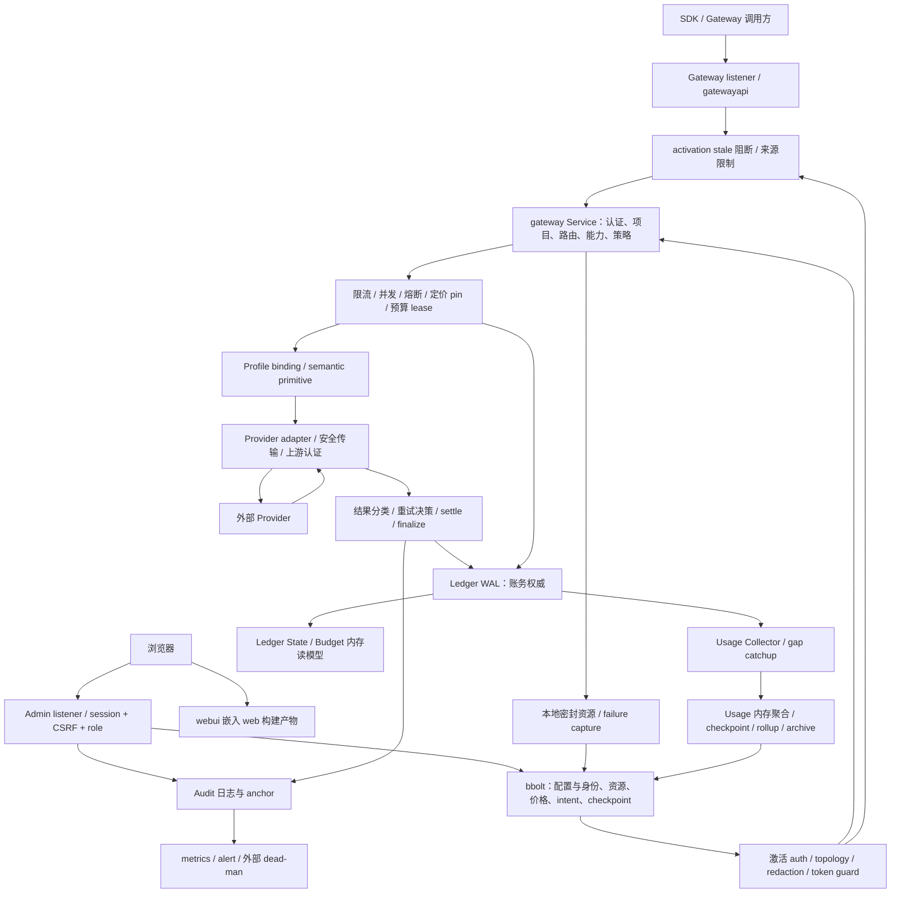

# 当前架构与关键不变量

状态：2026-09-05 S0–S4 带限制评审完成，按计划9.1结项；基线 `381743f6613607dc256828f4776b52af8bdd232c`。本文描述当前源码与已获得证据，不是目标架构或全部不变量已证明的声明。范围、运行环境与门禁见 [scope-and-baseline.md](scope-and-baseline.md)，逐项严重度以 [独立裁决](adversarial-verdicts.md) 为准。

官网版本边界：主持对 `Halro-website` HEAD `79c2b63dcbff505a21f1b217768bbf31b5171610` 的只读抽查确认，站点将 v0.7 预览与稳定 v0.6 分开，预览契约来源是 `codex/run-governance-prd-review` / `8f185de7674c52f4eab364a7e1a6c61039b0c418`，不是本轮源码。story 的 Standalone 单写者表述与这里的架构边界一致，未宣称 Realtime WS/WebRTC。网站预览的7个 Governance endpoint 不用于判定本基线缺功能，历史148/148也不作为当前代码可用性证据；读取范围与局限见 [官网只读一致性抽查](scope-and-baseline.md#官网只读一致性抽查)。

## 1. 实际组件与调用路径

图中边表示调用或数据流，不表示全部写入属于同一事务。`app` 负责组装 HTTP、存储、密钥和后台任务；`gateway` 承担治理与 attempt 生命周期；compatibility/semantic/Profile bridge 将北向协议与南向执行连接。当前 gateway、provider 和 ledger 仍依赖部分协议/Provider 类型，因此不能把“协议中立”写成完全无协议依赖的包结构。

健康检查在 stale 数据面组之外。Gateway 未注册 `GET /v1/models`，由 NotFound 返回404 / `endpoint_not_implemented`（`gatewayapi/handler.go:1039-1057`）；不要把它与 Admin `GET/POST /admin/api/v1/providers/{id}/invocation-targets` 的列表/刷新混淆，后两者分别受 `requireAdmin` / `requireAdminMutation` 保护（`runtime.go:1642,1647`）。南向 Provider models 枚举/描述不由北向路由是否存在决定；Admin、Gateway、metrics 是不同监听/认证域。外部 dead-man 是独立进程，不是 Runtime 的第十一个后台任务。图不表示所有成功请求必须保存原始正文；capture/deferred/local Files 各有显式留存条件。

核对入口：`internal/app/runtime.go:154,1505,1562,1718`；`internal/gateway/service.go:278,470,666,1104,2478,2874`；`internal/app/provider_adapters.go:82,247`；`internal/provider/profile_bindings.go:74`。静态包依赖原始清单为 `/private/tmp/halro-review-260905/dependency-edges.json`，不是运行时 tracing。

## 2. 所有生产对象族与权威归属

以下覆盖当前存储 bucket、文件与关键内存对象族，索引与原对象合并列出；不是逐个字段 schema 文档。bbolt 清单源为 `internal/store/bolt/store.go:57-91`，meta 还承载系统设置、密钥 envelope 和进度标记。

| 对象族 | 所在介质 / 权威 | 写入者、生命周期与失败边界 |
| --- | --- | --- |
| 实例 YAML、TLS 证书、listener/持久化参数、构建版本 | 文件与二进制 | CLI 载入/校验；部分设置只用于首次 seed，不能假定删除任意 YAML 项等于恢复默认。config 省略反例见 reliability |
| 数据目录锁、初始化/发布锁、owner 元数据 | 文件锁 | CLI/Open 与离线命令协调单写者；只读命令不得重写 owner/迁移；不能只依赖 bbolt 自身锁覆盖所有旁路文件 |
| 主密钥、KMS DEK envelope、KEK 引用、轮换恢复材料 | 文件/metadata/KMS | unlock 后派生用途密钥，Vault key-check 防错钥；KEK rewrap 与替换 DEK 不同。外部 KMS 不属于本地事务 |
| Provider credentials、系统 Audit/Ledger 密钥 envelope、MFA secrets | bbolt 内密封对象 | Vault 加密；授权管理面更新、轮换；不得把密文存在当作其所有消费者都能在换钥后读取 |
| Admin users、sessions、MFA authenticators/recovery codes/challenges | bbolt + session manager | 用户角色、会话 TTL/idle、挑战/恢复码状态；每请求重查角色，session touch/logout 仍有 SEC-02 竞态 |
| Projects、Gateway keys/hash 索引 | bbolt 权威 + auth snapshot | 管理提交后激活；禁用/撤销影响准入，snapshot 失败 stale 阻断；Admin cookie 不可替代 Gateway Key |
| Providers、Deployments、Routes | bbolt 权威 + provider registry/路由 snapshot | 绑定 Profile、target、部署资格与路由候选；禁用/删除与刷新后激活，不能仅凭 model ID 获得能力 |
| Capability detections、fingerprint/idempotency 索引、bundled/远端 catalog、声明证据 | metadata + catalog 文件/内存 | 枚举回答存在性，证据回答能力；来源、有效期、失效与刷新独立；检测任务可出站，本轮未调用真实收费服务 |
| Redaction/Token Guard policies、规则编译快照 | bbolt + 内存 | 管理修改与独立 activation domain；Token Guard 状态/冷却有 checkpoint，内容缓冲必须受边界约束 |
| 价格版本、timeline/next version/high-water、proposal 与幂等、price pin intent | bbolt 权威；attempt 内冻结 snapshot | 版本、时区/tier 选择后冻结；pin prepared/committed 与 WAL 关联；后来改价不得改已有 attempt 价格 |
| Accounting timezone/settings、Usage window/settings | bbolt meta 权威 | YAML 首次 seed；期间边界写入事件，结算沿用原 period；时间库和历史异常支持范围另列 |
| Request、Attempt、lease/reservation、started、settled、finalized、cost adjustment | **Ledger WAL 权威** | Budget 追加后按序 Apply；余额/预留/已结算集合是读模型；未知成本与已知零必须可区分，不能由 Usage 覆盖权威 |
| Cost adjustment / pricing audit / Admin audit intents、幂等状态 | bbolt | 跨 store、Ledger、Audit 的恢复桥梁；有 intent 不等于外部动作和所有日志已原子完成 |
| Ledger chain checkpoint、compatibility gate、migration history | bbolt meta/history + WAL | 防截断/认证与读取版本门槛；metadata 与日志的关联须验证，单独复制其一不构成可恢复备份 |
| Usage requests/attempts 内存聚合、watermark、pending rollup | 内存派生物 | Collector 从权威事件更新，溢出丢通知而非 WAL；CatchUp 从 watermark 补齐；不是账务真源 |
| Usage checkpoint segments/head、daily rollup、归档 manifest/Parquet | bbolt/文件派生物 | checkpoint 与 rollup 同事务，归档后才可裁剪窗口；offline 认证重放后才能发布派生物；在途 checkpoint 可暂时漏于 summary |
| Provider resources：Files、Batches、Async、deferred response 记录及幂等/版本状态 | bbolt 本地目录与上游 ID 映射 | Project 归属、Key/目标信息、TTL、状态转换；上游资源和本地登记不是分布式事务 |
| 密封输入/输出/本地文件对象 | 文件 + resource 记录 | 写对象再登记、失败清理与孤儿 sweep；deferred 执行前重验提交 Key，取消/删除分状态；换 DEK 遗漏这些文件是 SEC-01 |
| Failure capture 内容与定位元数据 | 密封文件 | 显式开启/限额/审计读取与 purge；SEC-04 说明读取缺失过期判定，不能把周期清扫当即时访问 TTL |
| Audit append log、checkpoint/anchor、anchor 本地文件 | 认证日志/bbolt/文件 | 管理/系统/交付事件，独立完整性与外部锚定；不是 Ledger 替代物；分页 limit 不限制当前扫描总工作 |
| Alert webhook 配置、队列/去重/重试、delivery audit | bbolt + 内存/日志 | Dispatcher 管理投递生命周期；局部队列有界，不等于无限项目 churn 的所有 map 都有老化 |
| Dead-man sequence/outbox/probe 状态、anchor、audit | 独立进程文件 | 持久化与接收端 ack/idempotency；REL-01 的发送前未保存窗口需整改 |
| metrics bearer/anchor bearer 文件、metric counters/gauges | 文件/内存，部分终止计数持久化 | 与 Admin/Gateway 凭据隔离；metrics 认证有配置条件；counter 与 gauge 不可统一做差 |
| 应用日志/轮转代、stderr、safelog 输出 | 文件/标准错误 | 脱敏与有限代数；不自动涵盖 dead-man audit 保留策略或外部日志系统 |
| 限流桶、source limiter、并发 permits、circuit、deferred queue/running map、HTTP/SSE 缓冲 | 内存运行状态 | 单进程所有权，context/关闭释放；状态有上限的局部证据与全负载公平性分开 |
| 备份包、manifest、备份密钥、恢复 staging | 离线文件 | 必须覆盖相互一致的 DB/WAL/Audit/对象及必要密钥材料；小型 fixture 的 create/verify/restore 已完成且认证账务保留；不代表全部已登记留存对象、密钥轮换与云恢复矩阵 |
| UI 产物、浏览器 session cookie、查询缓存/表单状态 | binary embed + 浏览器 | `web` 构建进入 `internal/webui/dist`；服务器授权仍权威，浏览器缓存可陈旧，不能作为权限或成功提交证明 |

## 3. 信任边界

| 跨越边界 | 现有防御 / 明确限制 |
| --- | --- |
| 匿名网络 → Gateway | 来源/请求体/超时限制、Key 身份与项目/路由/能力准入；health 可单独公开；stale 状态在旧 auth snapshot 前拒绝 |
| Gateway Key → 另一 Project 的资源 | 本地目录按 Project 校验 ID；同项目不同 Key 的共享语义须按端点契约判断，不能一概称跨租户。deferred 执行重新检查记录的提交 Key；见 security 的 C2 边界讨论 |
| 浏览器 → Admin | Secure/HttpOnly/SameSite Strict cookie、origin/CSRF、服务器角色、敏感动作 step-up；SEC-02 撤销竞态与 SEC-03 错 TOTP 失败预算缺口仍在 |
| Admin durable mutation → live snapshot | store commit 是持久提交点，四个激活域独立跟踪 stale，任一 stale 拒绝数据面并自动恢复；不能回报“store 未改”来解释 post-commit activation 失败 |
| HALRO → Provider HTTP/KMS/catalog/webhook | 安全 URL/DNS/dial/redirect/proxy 边界、凭据来源及用途限制；本地 fixture 只验证 Halro 行为，不认证真实上游业务事实 |
| 成功 HTTP → 执行/成本事实 | 200 后读取/解码失败不证明未执行；PROV-01 丢失 Ambiguous 后会重试及零结算。认证和尝试上限限制范围，不能修复不确定性语义 |
| 文件/metadata → 密钥与日志信任 | 权限、Vault key-check、AEAD、HMAC、checkpoint 与版本 gate；CRC/可解析 JSON 不等于认证；KEK rewrap 保持 DEK 的边界需保留 |
| Ledger → Usage/console/export | 只可认证重放后派生；offline 错钥/截断/不可信 checkpoint 拒绝写入。summary 是组合读模型，不能声称每个瞬间与余额线性一致 |
| 磁盘元数据 → 本地/上游资源 | Project/role、TTL、quota、密封、幂等和清理；上游副作用不与本地 bbolt 同事务，必须保留“可能已发生” |
| 本地事件 → 监控/外部接收端 | 专用 bearer、TLS、sequence/ack、outbox/审计；receiver 拒绝 replay 保护 freshness，但本地复用 sequence 会延迟有效通知 |
| 备份/旧二进制 → 当前目录 | 锁、schema/epoch、认证、staging 与明确升级入口；只读诊断不能静默升级，当前版不保证旧版能降级打开 |

管理员拥有合法管理权限不使其输入成为可信运行事实；合法安全维护同样可能触发 SEC-01。这里不以外部攻击模型解释已认证成功 HTTP 的畸形响应。

## 4. 启动、停机与所有权

`Open`（`runtime.go:154`）先取得数据锁，再 unlock/派生密钥、Vault、metadata、session manager、key-check、系统 HMAC 与 compatibility gate；随后打开 Ledger，重放 State，核对 chain checkpoint，恢复/补齐 Usage，再组装认证、预算、Provider、策略与服务。失败分支释放已取得资源；不能把“metadata 已打开”当作 ready。pending lease 与 intent 恢复属于启动/后台恢复链，具体账务处理受 frozen price 和 started 标记约束。

`runtime.go:820-873` 明确 `backgroundWait.Add(10)`，对应下列 **10 个 Runtime 管理的任务**：

| 任务 | 所有权/功能 |
| --- | --- |
| Usage Collector | 消费 durable 通知，溢出置 lagging，维护时 catchup |
| Audit anchor maintenance | 导出/维护完整性锚点 |
| Token Guard alert forwarding | 策略事件 → alert 与投递审计 |
| Usage maintenance | checkpoint、归档、窗口/留存维护 |
| Active deployment probes | 部署探测 |
| Capability detection maintenance | 能力检测任务维护 |
| Provider resource maintenance | 资源 TTL、清理、孤儿维护 |
| Deferred responses runner | 派发执行并持有子 worker/running context |
| Activation recovery | 每 5s 尝试恢复 stale 域及 pending Admin audit intents |
| Catalog manager | 存在 manager 时运行 catalog worker |

这不是总 goroutine 数：HTTP、Ledger writer、alert dispatcher、deferred 子 worker 还有各自生命周期。自动探测在实际部署可有出站副作用；本轮实验限定本地测试服务。

Run 的 HTTP drain 与 Close 分开：`runtime.go:1273-1302` 给 listener graceful shutdown 共用期限，超时记录 truncated attempts 后强制关闭；`Close:1324-1355` once 设置 draining、取消后台并等待 10 个任务、关闭 alerts、推进 chain checkpoint、写 shutdown Audit，随后关闭 providers、Ledger、Audit、sessions、store、Vault，最后释放数据锁。逐项等待有源码所有权证据，**未因此证明任意卡死 I/O 下全局关闭时间有界**；满队列慢投递/物理故障实验未覆盖，作为结项限制保留。

## 5. 关键中断与恢复时序

| 中断点 / 顺序 | 当前机制与恢复结果 | 证据状态/风险边界 |
| --- | --- | --- |
| 取得锁 → unlock/open 任一失败 | 失败清理，服务未 ready；锁覆盖 DB 外资源 | 主持源码审查；真实第二 writer 被拒绝。非所有失败分支都有实机注入 |
| 旧 schema 只读打开 | `OpenReadOnly` 不创建/迁移，版本不符退出 | `store.go:1383`；空库及含配置/sequence8的旧schema33均由新三个只读命令拒绝；非空演练所有数据文件hash不变已验 |
| 写模式迁移 → ready | schema 检查/迁移再组装；旧版拒绝新 schema | 空库及非空真实33→35成功；后者升级前后8条记录认证通过、sequence8不变、usage verify exit0，旧doctor拒绝。无真实上游成功费用/全部资源迁移或任意迁移点断电恢复证明 |
| Admin store commit → activation 失败/客户端断开 | Runtime 拥有 post-commit 激活；独立 stale 域阻断旧权限，5s retry 成功后解除 | `activation_state.go:145,194`；撤销/禁用/删除与自动恢复既有测试；Audit intent 独立重试 |
| 预算判定 → WAL reserve 追加 | 项目锁内计入 committed+reserved+pending；锁外 append，defer 释放 pending | `budget/manager.go:290,437`；并发 admission/race；允许短暂保守重复计入，不会因 fsync 等待让 pending 隐形 |
| WAL durable → State Apply/observer | 按 sequence 等待 Apply；失败置共享 accounting unavailable，后续拒绝 append | `manager.go:801`；失败 Apply 测试。重放无法合法消化的事件不是忽略后继续 |
| reserve durable → started 前崩溃 | pending lease 恢复区分未开始；确定未服务可释放 | `manager.go:543,699`；既有 recovery 测试；不把 reserve 等同上游已执行 |
| started durable → 上游发送/结果不明 → settle | started 恢复使用冻结价格/准备上界保守处理；正常错误路径依赖 Ambiguous | **PROV-01 反例**：200 后 malformed 标志丢失，有限重试并零结算；不是 Ledger 去重能挽救的分类错误 |
| settle durable → 重复恢复事件/重放 | EventID+digest 去重，同 ID 异内容拒绝；attempt 不能重复 settle/换 Project/period/snapshot | `ledger/event.go:346`；余额 checked add，已知零/unknown 区分；不等于 Provider exactly-once |
| Collector 通知丢失/排队 → catchup | bounded channel 满只丢派生通知；从 aggregate watermark replay，校验 dropped 变化循环 | `usage/collector.go:42,68`；饱和与准确 catchup 测试 |
| TakeCheckpoint drain → bbolt commit | head/segments/rollup 同事务；失败 return 增量，成功 commit | **已确认 P2** summary 在途读可见 `1→0→1`、cost `90→0→90`；持久权威未丢失，不能写成账务损坏 |
| offline replay → exporter/可写派生打开 | 先只读 metadata、解钥、认证全历史、拒绝 partial/checkpoint 不符，再创建 exporter | `app/usage.go:145-215`；篡改/缺失/错钥无写入测试；空 Ledger verify 差异见范围文件 |
| deferred input 密封写完 → 记录登记失败/取消 | 对象先于记录，Put 失败清理对象；无登记 orphan 由 sweep 回收 | `deferred_response.go:431-458`；cleanup 与提交 tests；物理断电和 sweep 年龄窗口需局限声明 |
| deferred queued → dequeue → revoke/取消/停机 | 钉住 target、重验 Key；队列取消确定，已发上游取消保留可能收费；停机与用户取消区分 | `:514,710,854`；queued 可重启回收，已执行中断不盲目恢复生成 |
| deferred 完成/输出写入 → 删除/过期 | 保存结果、清输入；运行中 delete 拒绝，终态删除对象和目录，读取执行 TTL | `:766,887,906`；独立于 failure capture 的过期缺口，不能混为同一路径 |
| Master Key/DEK 轮换 → 使用已有 sealed object | 凭据/envelope 被迁移，留存 capture/local/deferred blobs 未迁移 | **SEC-01 P1**；文件换钥与 KMS DEK 路径确认，KEK-only rewrap 不适用；旧钥/备份可能恢复，非必然永久损失 |
| Admin session refresh 读取 → logout 删除 → refresh 写回 | 角色/TTL 防御存在，但 touch 可重新插入已撤销记录 | **SEC-02 P1**，新受保护请求仍接受旧 cookie；非只允许已在途请求结束 |
| capture 过期 → 下一次 purge | 定期删除但 Get 不检 TTL | **SEC-04 P2**；有权限的读者在清扫前仍能取到过期内容 |
| dead-man enqueue/send → ack/audit/save 前崩溃 | 任一保存成功前磁盘 sequence 可能落后，重启复用 ID | **REL-01 P2 独立确认**；发送完成后的整个慢 probe 时间并非始终危险，delivery 自身保存会关闭窗口 |
| 备份取快照 → 还原/校验 | 需要 DB/WAL/Audit/对象/密钥一致的恢复材料 | **小型 fixture 已完成**：create/verify/restore exit0，错误 backup key/confirmation/截断/master key 均exit1且目的hash不变；恢复Ledger认证sequence5020与source一致、usage exit0、旧session401。见 [runtime-evidence.md](runtime-evidence.md) |
| 恢复成功调用 → SIGKILL → 重启再调用 | 以认证Ledger与Usage检查恢复后持续写入 | 调用200后kill -9，Ledger认证sequence5025；重启ready约0.333秒，再调用200，最终认证sequence5030、usage exit0。不是在途发送/settle逐中断点或物理断电矩阵 |

## 6. INV-01–10：当前证明、反例与缺口

测试名是当前仓内验证入口，已在共享全量门禁范围内；本次文档没有逐个重跑。角色 overlay 的 exit 0 可能断言的是缺陷存在。单项“有正向证据”不表示整个不变量关闭。

| INV / 命题 | 源码和测试映射 | 当前结论及补充验证 |
| --- | --- | --- |
| **01 单目录单写者** | `runtime.Open`、store/lock、只读 CLI；`TestExclusiveLock`、`TestInitializationLockBlocksWritersWithoutCreatingDataDirectory`、`TestReadOnlyLockDoesNotRewriteOwnerMetadata`；真实 second writer exit1 | 有正向证据。运行中 backup create 被锁拒绝，离线 backup/restore fixture 已完成；不宣称所有旁路/发布锁组合或所有平台锁语义均验收 |
| **02 Ledger 权威与认证再派生** | `app/usage.go:170-215`、ledger authenticated inspector/checkpoint；`TestOfflineUsageRejectsUntrustedHistoryWithoutWriting`、`TestOfflineUsageRebuildsSealedCompressedHistory`、`TestOfflineUsageAuthenticatesWithKMSAndRefusesUnavailableKey` | 认证/错误不写入路径有证据；非空升级前后8条记录认证、sequence8保留及usage verify exit0有实测；empty verify 的 P15 局部局限保留。summary 暂态不一致不推翻 Ledger 权威，但不能用于强一致展示承诺 |
| **03 attempt 预留/结算/恢复** | budget pending admission、frozen snapshot、ledger Apply；`TestConcurrentAdmissionNeverExceedsTheDailyBudget`、`TestAdmissionIsConservativeWhileASettlementIsInFlight`、`TestRecoverStartedLeaseUsesFrozenPriceAndPreparedBounds`、`TestStateDuplicateEventIsIdempotentAndAdvancesWatermark` | **存在 PROV-01 反例，未满足整体命题**。真实适配器 malformed200 两次调用/零结算，改 Ambiguous 反事实一次/保守50；不能用正常 settlement 单测关闭 |
| **04 授权与隔离** | auth/Admin session、Project resource owner、执行前 Key 复验；`TestRevokedKeyStopsAuthenticatingWhenTheAdminClientDisconnects`、`TestWorkStopsWhenTheSubmittingKeyIsRevoked`；安全角色角色矩阵/独立 session overlay | **SEC-02 P1、SEC-03 P2 未结**。同项目不同 Key 的合法共享和跨 Project 分开；主持浏览器+调用已验证专用 Key 禁用后200→401、未授权 alias403；MFA、权限降级浏览器旅程未执行，只有 router/组件测试，列为结项覆盖限制 |
| **05 存在性与能力证据分离** | app/providers、modelcatalog、profile bindings；Provider 报告的手填/枚举 provenance、unknown、探测/刷新测试矩阵 | 当前源码与定向 fixture 有正向证据；无新确认反例。主持浏览器刷新 mock 返回 review-chat 且 unknown 不获能力，手动声明后可创建停用 Deployment；没有新真实上游列表样本，不能宣布全部 vendor/profile decoder 真实兼容 |
| **06 不确定结果的重试/回退** | gateway retryable/start/finish、provider primitive/adapter；`TestAmbiguousProviderFailureIsEstimatedAndSettled` + [PROV-01 独立 reproduction](roles/provider-adjudication.md) | **PROV-01 P1 反例**，仅底层预标 Ambiguous 的测试不覆盖错误分类来源；Chat 实证，Responses/Embeddings 同类分支尚缺各自端到端证据。stream emitted-event 边界不可套到 unary |
| **07 留存访问/密封/配额/过期/删除** | resource store/deferred/failurecapture；`TestStoredRequestIsSealedAndErasedOnceTheUpstreamHasAnswered`、`TestDeleteRemovesTheRecordAndItsObjects`、`TestAnUncollectedAnswerStopsBeingReadableAtItsTTLNotAtTheNextSweep` | **SEC-01、SEC-04 未结**。deferred TTL 正向证据不能掩盖 capture Get TTL 缺口；小型 fixture 备份恢复已验；写对象/登记间崩溃、清扫失败及已登记留存对象跨轮换的完整实机矩阵未验 |
| **08 压力下有界与释放** | limiter/circuit/source、Collector、HTTP/SSE、alert/log；`TestCollectorQueueSaturationDoesNotBlockLedgerAndCatchesUpExactly`；可靠性队列/Close 测试、相关 race；主持确认 SSE no-panic 与 redaction stream 等价各15秒 fuzz 通过 | **SEC-05 Audit 全历史扫描、PROV-02 CR-only SSE 增量失败**；REL-02 gauge 影响观测。30分钟smoke_only exit0、899成功/0失败，61次采样队列0、goroutines21→21、FDs15→15；无长期 churn/慢读客户端/跨项目公平性全面保证 |
| **09 轮换、恢复与升级** | runtime recovery、Vault/key lifecycle、readonly schema guard；独立 rotation overlay、空库/非空失败请求Ledger的真实33→35和旧版拒绝新schema；ledger truncation/duplicate/recovery tests | **SEC-01 P1** 与 **REL-01 P2** 保留；KEK rewrap 排除于换 DEK 缺陷。小型 fixture 备份/四类错材料拒绝/恢复及成功调用后SIGKILL恢复已验；真实cloud、物理断电、已登记留存对象跨轮换完整实机矩阵未验，不承诺生产RTO/RPO |
| **10 UI/API/manifest/权限语义一致** | runtime routers、compatibility manifest、web/src/API client、webui embed；全前端门禁、官方3语言SDK本地、[frontend 五个定向复现](roles/frontend.md) | **FE-01–05 P2 未结**；路由注册≠Profile 可用，REL-03 发布文档为历史/目标混淆。FE-01 已真实浏览器复现；部分配置→调用→禁用链已实测，MFA/降权/异步与完整 UI setup/Key 创建尚未覆盖；embed drift 已由主持记录exit0、无漂移，见 runtime-evidence |

## 7. 真实浏览器证据与剩余旅程

以下按主持最新执行回报更新，文档作者未重新运行浏览器。浏览器、账号角色、请求/响应与持久结果见 [runtime-evidence.md](runtime-evidence.md)。明确区分 UI 与 API 操作；MFA、降权、异步浏览器旅程未做，只有 router/组件测试。

| 浏览器流程 | 关键断言 / 映射 |
| --- | --- |
| API 首次 setup → 浏览器登录 → UI 创建停用 Provider；刷新已有 mock | **已执行**：刷新返回 review-chat，unknown 不自动获能力；手动声明后 UI 成功创建停用 Deployment。不是通过 UI 启用新 Provider 并完成上游调用的整条验收。INV-05/10 |
| UI 创建 Project → API 生成 Key → 调用 | **已执行**：每日$0.01、正文1 KB、127.0.0.1/32 CIDR、review-chat alias；调用200，2 KB正文400/request_too_large，未授权alias403。预算耗尽/非允许来源拒绝未由此证明；Key UI创建仍未验。INV-04/08/10 |
| 另一专用 Key 调用 → UI 禁用 → 再调用 | **已执行**：200→禁用成功toast→401；服务端结果确认禁用生效。INV-04/10 |
| Usage 已打开时点击同 pathname 的项目/失败 drilldown，再后退/前进 | **已真实复现 FE-01**：summary failure link 未正确同步页面状态；主动点击 tab 后 mock500 失败详情可读。后退/前进组合未执行，保留覆盖限制；不是 drilldown 通过 |
| 建立超过50个 Project/credential/policy，再打开相关选择器并选择第51个 | 下一页对象可选，列表和管理页一致；复核 FE-02，不能只看第一页 |
| Developer debug Key 创建响应丢失后重试 | 同一逻辑提交是否创建额外凭据；检查服务端 ID，复核 FE-03 |
| 危险操作确认后让请求 pending，按 Escape/×，再观察请求结束 | 防止用户误认为取消；焦点返回、成功/失败提示与实际对象状态一致，复核 FE-04 |
| API 设置 Project 内容配额500 bytes，在 UI 不改该字段仅改名称保存 | 原值保留而非变0；复核 FE-05 与单位表达 |
| Admin 降权/退出/过期、MFA 管理错误码、deferred queued/running 取消与删除 | UI 清缓存/禁用动作且服务器真实拒绝；退出刷新竞态需定向调度，普通点击不能证明不存在 |
| 纯键盘、窄屏、200%缩放、各语言下对话框与错误/空/慢网状态 | 可达、标签、焦点、溢出、翻译与破坏性操作解释；暂不声称完整 WCAG/i18n 合规 |

## 8. 架构建议与证据限制

跨 bbolt、Ledger、Audit、对象文件和上游的 intent/恢复协议是实际一致性边界，应以中断点和证据映射维护。后续可逐步集中错误不确定性分类、将 summary 读模型纳入 coherent checkpoint 协议、给换钥建立全部活跃密文清单、为 session refresh 使用条件更新；这些是修复方向，本文未实现，也不额外扩大 finding。

源码防御、既有自动化、独立可控重现和真实二进制局部演练已分别标注。没有完整外部供应商响应样本、物理断电、云 KMS/部署或真实告警接收端验收；浏览器已完成上述局部旅程，MFA/降权/异步仍未实测；小型fixture backup/restore、错误材料拒绝、SIGKILL恢复与30分钟smoke_only已完成，详见 [runtime-evidence.md](runtime-evidence.md)，索引在 `evidence/runtime/`。两个15秒 fuzz 通过仅支持 SSE no-panic 与 redaction stream 等价的本次采样，不关闭 PROV-02 或证明长期有界。当前可下的结论是架构关键路径可解释、部分不变量有直接反例及明确防御，不能据门禁成功把十项全部打勾。

最终量测边界：30分钟运行 exit0、passed=true，共61个资源样本、899成功/0失败；RSS **32,948,224→71,794,688 bytes**，峰值 **128,188,416 bytes**，并未回到初值。goroutines/FD起终点不变与队列采样0不是连续上限或长期无泄漏证明。restore **0.255秒** + ready **0.249秒** = **0.504秒**仅为小型本地fixture结果，不是生产RTO/RPO；重启ready **0.333秒**来自另一次SIGKILL恢复。真实cloud、物理断电、已登记留存对象跨轮换完整实机矩阵及未执行的浏览器旅程保留为限制，不影响本轮按计划9.1完成带限制评审，也不意味着全部INV通过。
