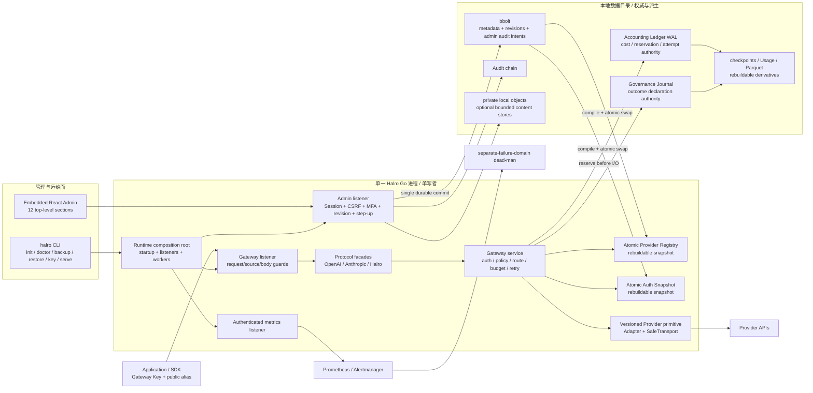

# 角色 A：产品边界、架构清晰度与操作/开发体验评估

> 评估维度：D1 产品边界与价值密度、D2 架构清晰度与复杂度预算、D9 Admin / CLI / 文档 / 开发体验
>
> 目标版本：`v0.8.0@1d48ecde216ef40e653738f8bdc9657f88a717cc`
>
> 评估方式：独立静态走查、可复现静态度量、目标 SHA 上的非计费轻量自动化检查
> 明确排除：产品代码修改、commit/push、真实 Provider、真实 KMS、生产环境、其他评审角色输出

## 1. 结论先行

Halro 的核心产品判断是清楚而且有辨识度的：它不是 Agent 工作流或模型平台，而是一个本地拥有控制边界、单二进制、单写者、对外提供受治理模型入口的网关。权限、路由、预算、脱敏、审计、用量、Provider 适配被放在一次调用必须经过的窄腰上；Run Governance 又明确拒绝执行 evaluator、抓取证据正文或让迟到的业务结果自动改变实时预算/路由。这些边界与“Redis 式小而可靠内核”“Google 式清晰所有权与可演进接口”“OpenAI 式能力分级、默认安全和用证据升级承诺”的方向一致。

当前主要问题不是缺少设计，而是设计和实现增长后，**“当前版本究竟提供什么”没有继续保持一个权威答案**。根 README 和代码已经 withheld 的 Bedrock Runtime/Agent Runtime Profiles，用户和运维指南仍列为可配置 Beta；Run Governance 已有公开路由、Admin 页面和完整运行时链路，但其架构文档首页仍写“生产实现尚未开始”，被 `docs/README.md` 指定为当前实现权威的状态文档又完全没有这项能力。这会直接降低产品边界的可信度，也会让维护者、操作者和后续评审在错误基线上工作。

第二类风险是可理解性成本已经集中到 `internal/app`：单进程边界本身仍合理，不应为了“解耦”改成微服务；但 `Runtime` 已持有 74 个字段和 10 把锁，生产代码有 342 个 `*Runtime` receiver 方法，`Open` 约 747 行，Admin 路由 137 条。当前预算测试能阻止无意识增加，却不能让这个组合根变小。Provider 扩展契约还公开记录了一个无法机械验证的语义绑定连接点：Profile 的 operation 绑定错 primitive 时，现有测试仍可全绿。

本角色成熟度为 **2/4（最高证据 E2）**。设计原则和局部自动化证据已经存在；但没有在本次评估中完成真实浏览器/进程的关键旅程（E3），更没有生产或故障注入证据（E4），因此不做更高评级。

## 2. 评分与证据上限

| 维度 | 权重 | 成熟度 | 本次最高证据 | 判断摘要 |
| --- | ---: | ---: | --- | --- |
| D1 产品边界与价值密度 | 10 | 2/4 | E2 | 一句话产品定义、非目标、GA/Experimental/Not implemented 分级较清楚；但“当前能力”跨权威文档分叉，且扩张后的能力缺少用户价值/删除检验。 |
| D2 架构清晰度与复杂度预算 | 13 | 2/4 | E2 | 单写者、状态权威、管理面提交、调用热路径都有明确图和不变量；结构预算测试可复现通过，但组合根继续集中，Provider 语义绑定仍有未守护连接点。 |
| D9 Admin / CLI / 文档 / 开发体验 | 4 | 2/4 | E2 | 首次配置、只读角色、可访问性、Developer Workbench、doctor/备份/轮换文档覆盖较好；但文档真相漂移、Go 示例不可直接运行、顶层 CLI 帮助不完整。 |
| **角色小计** | **27** | **13.5/27（归一化 2/4）** | **E2** | 尚不能以 E3/E4 证明真实操作者在完整实例上的端到端体验。 |

评分严格遵守证据封顶：本次通过的测试只把相关维度推到 E2；历史 v0.8.0 发布评估中的全门禁与模拟 Provider/KMS 结果仅作为既有防御阅读，没有冒充本次复现结果（`docs/verification/assessments/v0.8.0.md:1-21,67-81,127-134`）。

## 3. 评估基线与复现证据

### 3.1 版本与静态度量

以下度量均在报告顶部的目标 SHA 执行：

```text
git rev-parse HEAD
1d48ecde216ef40e653738f8bdc9657f88a717cc

git describe --tags --exact-match HEAD
v0.8.0
```

可复现度量及结果：

| 指标 | 命令口径 | 结果 |
| --- | --- | ---: |
| `internal/` Go package 目录 | `find internal -type f -name '*.go'` 后按目录去重 | 55 |
| 生产 Go 文件 / LOC | `cmd internal` 下排除 `*_test.go`，`wc -l` | 278 / 100,298 |
| Go 测试文件 / LOC | `cmd internal` 下 `*_test.go`，`wc -l` | 392 / 89,139 |
| `internal/app` 生产文件 / LOC | 同上，仅 `internal/app` | 74 / 28,803 |
| `internal/app` 测试文件 / LOC | 同上，仅 `internal/app` | 134 / 32,264 |
| 生产 `*Runtime` receiver 方法 | `rg '^func \(r \*Runtime\)' internal/app --glob '*.go' --glob '!**/*_test.go'` | 342 |
| `Runtime` 字段 / mutex 预算 | `internal/app/runtime_scale_test.go:75-76` | 74 / 10 |
| Gateway / Admin HTTP 路由调用 | 分别统计 `runtime.go:1652-1723`、`1725-1890` 的方法注册 | 33 / 137 |
| 生产接口声明 | `internal/` 生产 Go 中 `type ... interface {` | 56 |
| `go.mod` require | `go mod edit -json` | 12 direct + 18 indirect |
| 配置 `yaml` 字段 / 源文件 LOC / 完整示例 LOC | `config.go` tag 与行数、`config.example.yaml` 行数 | 150 / 1,604 / 630 |
| Admin 顶层导航 / lazy 页面 / 页面生产 TSX LOC | `Layout.tsx`、`App.tsx`、`web/src/pages` | 12 / 12 / 11,945 |
| 当前架构/ADR/契约/指南 LOC | `docs/{adr,architecture,contracts,guides}` | 12,341 |
| PRD/TODO LOC | `docs/{prd,todo}` | 24,700 |
| CLI 顶层 / 全部 case 标签 | `cmd/halro/main.go:133-870` 按缩进统计 | 18 / 38 |

这些数字不是“越小越好”的质量分数。它们用于说明：复杂度主要集中在哪里、现有预算覆盖什么、扩展一个能力可能触碰多少面。

### 3.2 本次实际运行的轻量检查

结构预算测试只依赖 Go 标准库，以单文件方式运行，避免为静态结构检查拉取未缓存 Provider SDK：

```text
cd internal/app
GOCACHE=/private/tmp/halro-architecture-go-cache GO111MODULE=off \
  go test -count=1 runtime_scale_test.go
ok command-line-arguments 1.453s
```

该测试解析 `runtime.go`，要求实际字段和 mutex 不得超过且不得低于声明预算，当前为 74/10（`internal/app/runtime_scale_test.go:79-123`）。

控制台关键路径的定向测试：

```text
cd web
npm exec vitest run \
  src/navigation.test.ts \
  src/accessibility.test.tsx \
  src/App.test.tsx \
  src/Layout.test.tsx \
  src/pages/DeveloperPage.test.tsx \
  src/pages/DashboardPage.test.tsx \
  src/pages/MasterKeyCustodyPage.test.tsx \
  src/pages/readOnlyRole.test.tsx

Test Files  8 passed (8)
Tests       69 passed (69)
Duration    16.75s
```

没有运行全量 Go 门禁：`go list ./...` / `go list -m all` 在受限环境中需要未缓存依赖并遇到 DNS/缓存写权限限制；这是本次工具环境限制，不是 Halro 产品失败。报告没有用该失败推导任何产品 finding。

## 4. 当前系统图



图中最值得保留的性质是：部署形态只有一个进程，但权威并没有混成一个模糊数据库。bbolt 管事务元数据，Accounting Ledger 管金额与 Attempt，Governance Journal 管外部结果声明，Usage/Parquet/checkpoint 是可重建派生；这与 `docs/architecture/distributed-state-ownership.md:6-26` 的矩阵以及其不变量 `:28-39` 一致。

## 5. 六条关键链草图

### 5.1 启动链

```text
config load/validate
  → exclusive data-dir lock
  → Master Key/KMS unlock + derived secrets
  → open bbolt / Ledger / Audit / Governance / object stores
  → verify/replay authoritative state
  → compile Provider Registry + Auth Snapshot
  → construct Gateway/Admin/Metrics listeners
  → start ten bounded background responsibilities
  → ready
```

`Runtime.Open` 从 `internal/app/runtime.go:162` 到 `:908`，后台任务集中在 `:855-907`。它保持“在 bind/Provider I/O 之前先建立权威与密钥边界”的正确方向，但也是当前组合根集中度的主要来源。

### 5.2 管理面写入与激活链

```text
Admin request
  → session/role/CSRF/revision/step-up
  → validate references and safety gates
  → same bbolt transaction: versioned record + audit intent   [唯一提交点]
  → rebuild candidate registry/auth snapshot
  → atomic swap
       └─ failure: mark stale, data plane fail closed, retry in background
  → append/drain Audit intent
  → 2xx + operation ID + activation status
```

这条链由 `docs/architecture/provider-to-project-api-call-chain.zh-CN.md:94-135` 明确记录，避免了“store 成功但 activation/audit 失败时 HTTP 到底算什么”的三答案问题。

### 5.3 普通非流式请求链

```text
Gateway Key + public model
  → request/source/body guards
  → strict protocol decode
  → Auth Snapshot: Key/Project/CIDR/allowed model
  → Registry: operation/profile/capability/health candidates
  → inbound redaction + token/cost guards + project leases
  → Ledger RequestAccepted
  → per attempt: circuit/concurrency/price pin
  → durable reservation + AttemptStarted
  → Provider primitive → Adapter → SafeTransport → upstream
  → validate output/usage
  → conservative settlement + RequestFinalized
  → outbound redaction + public alias response
```

实际路由入口见 `internal/app/runtime.go:1652-1723`，详细顺序见 `docs/architecture/provider-to-project-api-call-chain.zh-CN.md:200-287`。关键不变量是 reservation 在 Provider I/O 前完成，模糊结果不重试/不 fallback。

### 5.4 流式链

```text
upstream event
  → bounded parser
  → semantic stream validation
  → protocol conversion
  → cross-chunk redaction
  → downstream emit
  → first safe payload delivered?
       no: only explicitly safe failure may retry/fallback
       yes: pin execution owner; never switch deployment mid-stream
  → final/unknown settlement
```

该 delivery boundary 在 `docs/architecture/provider-to-project-api-call-chain.zh-CN.md:289-303` 被明确表达，是“外部副作用一旦不可撤销就不伪装 exactly-once”的良好实例。

### 5.5 Run / Outcome 治理链

```text
Work Unit / Run lifecycle
  → Accounting Ledger owns lifecycle, reservation attribution and cost
  → attached inference uses dual Project+Run admission
  → Provider I/O and settlement remain the ordinary accounting path

external Outcome declaration
  → bounded schema + idempotency + current-head check
  → authenticated Governance Journal append
  → rebuildable projector / cohort summary / export
  ↛ no evaluator, no evidence fetch, no automatic routing/budget change
```

实现入口已经注册于 `internal/app/runtime.go:1700-1713`，业务边界由 `docs/adr/0025-run-budget-authority-and-dual-admission.md:17-47` 与 `docs/adr/0026-business-outcome-evidence-and-cohort-reporting.md:18-49,65-94` 定义。这里的架构边界优于把业务评价塞进网关热路径。

### 5.6 诊断、备份、恢复与轮换链

```text
stop single writer
  → doctor: read-only verification of config/lock/schema/key/WAL/manifests/topology
  → encrypted backup: fixed metadata + WAL/checkpoint/audit/governance watermarks
  → restore into staging
  → authenticate + replay + cross-watermark/active-resource checks
  → atomic data-dir switch; preserve pre-restore directory
  → start + readiness + doctor

Master Key rotation
  → verified backup + offline lock
  → versioned keyring + copy-on-write bbolt rewrite
  → authenticated recovery bridge across interruption states
  → verify with new key → compact publication → new backup
```

操作指南明确要求单一目录 owner、offline 命令和 fail-closed 初始化（`docs/guides/operator-guide.md:1-19,25-75`）；doctor 不修复/不联网且前后不改目录（`:824-842`）；轮换使用 COW 与恢复桥（`:959-1008`）。Run Governance 的恢复也要求 staging 验证和双 watermark 后才原子切换（`docs/architecture/run-governance-data-flow.zh-CN.md:118-129`）。

## 6. 肯定项

### D1 产品边界与价值密度

1. **一句话定义可检验。** `README.md:7-10` 把产品收敛为 single-binary、security-first LLM gateway，并点名本地控制的 credentials、budgets、routing、redaction、audit、accounting；`README.md:12-19` 没有把它包装成 Agent 平台或通用数据平台。
2. **能力承诺有分级。** `README.md:21-25,255-273` 将 Compatible、Compatible subset、Experimental、Not served、Not implemented 分开，并把机器可读 manifest 作为接口权威，而不是用一个“OpenAI compatible”营销标签覆盖所有差异。
3. **不可达能力确实被 withheld。** `README.md:292-302` 和 `internal/domain/provider_table.go:277-299` 不是仅在 UI 隐藏 Bedrock Runtime；profile 被 served matrix 和写入面共同拒绝，旧数据仍可启动和删除，恢复路径没有被牺牲。
4. **Run Governance 没有侵入网关本体。** Outcome 不保存证据正文/Prompt/Response、不访问 `evidence_ref`、不运行 evaluator、不自动修改预算或路由，外部系统继续拥有评价与 TCO（`docs/adr/0026-business-outcome-evidence-and-cohort-reporting.md:10-28,75-94`）。这是高价值边界，不应删除。
5. **未来能力被显式延期。** 单节点事实与未来 HA/Cluster/Reatime 被分开（`README.md:352-355`；`docs/adr/0004-distributed-evolution.md:13-41`）；Realtime 主架构也在页首和 Phase 5 明示 deferred（`docs/architecture/api-provider-realtime-architecture.zh-CN.md:3-5,1776-1788`）。

### D2 架构清晰度与复杂度预算

1. **单进程不是单一模糊状态。** ADR 0001 规定 bbolt、Ledger WAL、派生状态和嵌入式 UI 的边界（`docs/adr/0001-single-process-architecture.md:6-24`），状态所有权矩阵再按 authority/rebuildable/node-local 分类（`docs/architecture/distributed-state-ownership.md:6-26`）。
2. **控制面和数据面有稳定窄腰。** `Credential → Provider/Profile → Deployment → Route → Project → Key` 将上游秘密逐层收窄为公共模型别名（`README.md:40-50`；`docs/architecture/provider-to-project-api-call-chain.zh-CN.md:15-49`）。
3. **管理面只有一个 durable commit point。** versioned record 与 audit intent 同事务，snapshot activation 失败转 stale 并让数据面 fail closed（`docs/architecture/provider-to-project-api-call-chain.zh-CN.md:94-135`）。这避免了“已提交但旧配置继续放行”的撤销风险。
4. **Provider 真相开始被收敛。** `profileTable` 明确是 profile authority，取代散布的六组 switch/list；Defaults、Ceiling、Withheld、RoutePartitioned 有不同语义（`internal/domain/provider_table.go:5-60,155-158`）。
5. **复杂度至少被看见。** `runtime_scale_test.go` 不把 74/10 美化成目标值，而是直说 `internal/app` 缺少其他可执行架构约束，并强制每次增长显式修改预算、缩小时同步下调（`internal/app/runtime_scale_test.go:12-28,75-123`）。本次 E2 检查通过。
6. **新 Provider 的改动面被文档化。** `docs/contracts/adding-a-platform.md` 把平台身份、凭据、Profile、adapter、primitive、capability、console/golden 与测试逐层列出，并诚实标注哪些步骤没有机械 guard，而不是伪装成插件一行注册。

### D9 Admin / CLI / 文档 / 开发体验

1. **首次价值链由后端事实驱动。** `FirstRunChecklist` 每 15 秒读取 readiness，明确 loading/error/current/read-only，并从后端返回的 `action_href` 引导下一步；失败显示 Request ID 并能下钻 Usage（`web/src/pages/FirstRunChecklist.tsx:9-49,52-110`）。
2. **Admin 的技术选择没有扩张运行面。** React/Vite 只在构建时存在；生产是 Go binary 内的静态资源，没有 Node server、CDN、service worker 或浏览器 secret persistence（`docs/adr/0003-react-static-admin.md:6-14`）。
3. **导航和可访问性有自动化保护。** 12 个页面 lazy-load，chunk 加载保持导航并落在 error boundary 内（`web/src/App.tsx:18-34,145-176`）；布局有 skip link、`nav` label、`aria-current`、可聚焦 main 和只读全局提示（`web/src/Layout.tsx:58-109`）。本次 8 个聚焦文件 69 个测试全部通过。
4. **Developer Workbench 没有另造鉴权。** 调试 Key 是真实、可计费、24 小时到期、只显示一次的 Gateway Key，需要与普通 mint 相同的证明（`web/src/pages/DeveloperPage.tsx:210-237`）；真实调用仍走 Project 预算/限流/脱敏/Token Guard，并记录审计（`docs/guides/operator-guide.md:887-910`）。
5. **响应读取是有界和可诊断的。** Workbench 使用 AbortController，最多保留 1 MiB，区分 HTTP error、取消、网络失败和截断，并用 Request ID 探测关联 Usage（`web/src/pages/DeveloperPage.tsx:278-346`）。
6. **运维关键动作有恢复语义。** `doctor` 只读且不自动“修复”权威，Master Key rotation 使用 COW 和可恢复中间态；指南还明确 secret 不进 shell history/browser storage、默认 listener loopback、Admin/Metrics 公开明文被配置校验拒绝（`docs/guides/operator-guide.md:25-75,824-842,959-1008`）。
7. **贡献者原则明确。** 安全、记账正确性、兼容性优先于 feature count；保持单二进制、无外部服务、受影响行为要有测试、真实 Provider smoke 不进入普通 CI（`CONTRIBUTING.md:3-14,37-66`）。

## 7. 候选 findings

### PHIL-A01 — “当前能力”在 README、架构/里程碑和操作指南之间分叉

- 类型：DEFECT
- 维度与原则：D1、D9；单一能力真相、文档即接口、不要把实现状态留给读者推断
- 严重度：P2
- 置信度：HIGH
- 状态：CANDIDATE
- 入口与可达条件：操作者从 `docs/README.md` 进入“当前实现状态”或用户/Operator Guide 配置 Provider；维护者进入 Run Governance 架构文档判断是否已实现。
- 代码与文档证据：`README.md:255-273,292-302`；`internal/domain/provider_table.go:277-299`；`docs/guides/operator-guide.md:1018-1027`；`docs/guides/user-guide.zh-CN.md:176-186`；`docs/architecture/run-governance-data-flow.zh-CN.md:1-6`；`internal/app/runtime.go:1700-1713`；`web/src/App.tsx:23-34,155-166`；`web/src/pages/RunGovernancePage.tsx:25-90`；`docs/README.md:30-48,67-74`；`docs/milestones/implementation-status.md:1-6,91-110`；`docs/milestones/release-notes-v1.0.0.md:1-7`。
- 最小复现与原始证据：对照根 README 的“Bedrock is offered through Mantle alone”和 `profileTable.Withheld=true`，Operator Guide 仍把 Bedrock Runtime/Agent Runtime 列为 Beta profile；对照 Gateway 的七条 Governance 路由与 Admin 页面，Governance 数据流文档首页仍写“S0 冻结，生产实现尚未开始”。`docs/README.md` 称 implementation status 是当前实现依据，但该文件无 Run Governance，仍要求 `v1.0.0-rc`/`v1.0.0`，而 release notes 已说明版本线重置；同一索引还把已有 26 份 ADR 写成“0001–0016”。
- 违反的不变量或用户承诺：同一目标版本对“可创建、可调用、已实现”的回答必须唯一；操作指南不能向用户承诺代码主动 withheld 的能力。
- 用户影响、爆炸半径和可恢复性：会导致无效的 Bedrock 配置准备、错误的产品/发布范围判断、遗漏已上线 Governance 的运维和升级审查。写路径的 withheld 防御阻止错误资源真正启用，因此主要是 P2 的时间损失和信任损伤，可通过文档修订恢复。
- 已有防御与反证：根 README 的 API/Profile 状态和机器 manifest 较准确；代码在 served matrix/write path 上 fail closed；精确版本发布评估存在。没有证据表明 withheld profile 能被实际创建。
- 建议处置：SIMPLIFY
- 建议回归或验收：生成一个“当前能力摘要”作为 README、指南和文档首页的共同数据源或 golden；测试所有 `Withheld` profile 不得出现在 current setup guides；测试已注册公开路由/顶层 Admin 能力必须在 implementation status 有状态；删除旧 S0/v1 critical-path 文字或明确加版本/历史横幅。
- 成本、owner、期限：Docs + Product + 对应 subsystem owner；1–2 天；下一个版本候选前完成，不能等到 1.0。

### PHIL-A02 — 扩张后的能力有工程门禁，但没有逐项“价值/删除”证据

- 类型：EVIDENCE_GAP
- 维度与原则：D1；每个能力要解释目标用户、可衡量价值与删除条件，实验功能不能只因已实现而永久保留
- 严重度：P3
- 置信度：MEDIUM
- 状态：CANDIDATE
- 入口与可达条件：规划下一轮 Provider/API/Run Governance 功能或决定 Experimental 能力是否晋级时。
- 代码与文档证据：`README.md:21-25,255-273`；`internal/app/runtime.go:1652-1713`；`web/src/Layout.tsx:10-23`；`docs/architecture/api-provider-realtime-architecture.zh-CN.md:3-23,1776-1788`；`docs/adr/0026-business-outcome-evidence-and-cohort-reporting.md:75-94`。
- 最小复现与原始证据：当前构建有 33 条 Gateway 路由注册、12 个 Admin 顶层导航、24,700 行 PRD/TODO。仓库能证明安全/兼容/实现状态，也能标记 Experimental/Deferred，但本角色未找到按能力记录的目标用户、采用/节省指标、维护成本和删除阈值；本次也没有用户访谈、匿名遥测或参考部署使用数据。
- 违反的不变量或用户承诺：新增能力应“付租金”；没有用户价值证据的实验面不能仅靠代码存在获得永久兼容成本。
- 用户影响、爆炸半径和可恢复性：短期不是运行缺陷；长期会稀释“小型可靠网关”的注意力，让每个 Provider/endpoint 同时增加契约、适配、Admin、文档和测试成本。删除已公开能力又会产生兼容风险，因此越晚处理越难恢复。
- 已有防御与反证：README 已有 maturity 状态；Withheld 与 Deferred 证明团队愿意不发布未证实能力；Run Governance 清楚拒绝 evaluator/自动决策，Realtime 有需求门控。隐私定位也不应被“价值证明”误解为必须上传遥测。
- 建议处置：PROVE
- 建议回归或验收：为每个 Experimental/Preview 面建立一页轻量 ledger：目标用户、必须解决的 job、采用/成功代理指标、支持成本、晋级门槛、删除/withhold 日期；优先覆盖 Phase 2、Developer Workbench、Run Governance。可以用 opt-in reference deployment、支持请求和定期用户访谈，不要求默认遥测。
- 成本、owner、期限：Product owner + subsystem owner；首次 2–3 天，之后每个发布周期 0.5 天；下一个大功能立项前建立。

### PHIL-A03 — `Runtime` 复杂度预算能记录增长，但不能形成收缩边界

- 类型：DESIGN_DEBT
- 维度与原则：D2；组合根应只负责装配，模块保持单一变化原因，复杂度预算必须能迫使删除/下沉而非只改数字
- 严重度：P2
- 置信度：HIGH
- 状态：CANDIDATE
- 入口与可达条件：新增任何需要启动、后台任务、Admin handler、运行时状态或 listener 的 subsystem；修改激活、关闭、重载、治理、capability detection 等交叉生命周期。
- 代码与文档证据：`internal/app/runtime.go:150-162,162-215,855-908,1652-1890`；`internal/app/runtime_scale_test.go:12-28,29-76,79-123`。
- 最小复现与原始证据：静态度量得到 `internal/app` 74 个生产文件/28,803 LOC、134 个测试文件/32,264 LOC、342 个生产 `*Runtime` receiver 方法；`Runtime.Open` 约 747 行并启动 10 个后台 responsibility；`Runtime` 当前预算恰为 74 fields/10 mutexes；Admin router 注册 137 条路由。本次 `GO111MODULE=off go test -count=1 runtime_scale_test.go` 通过，证明预算执行有效，也证明它接受了当前集中度。
- 违反的不变量或用户承诺：组合根的变化原因应是装配拓扑而不是每个业务子系统的内部生命周期；新增子系统不应默认把字段、锁、handler 和 worker 同时加入同一类型。
- 用户影响、爆炸半径和可恢复性：主要影响变更放大、并发审查和故障定位；涉及 Admin 写入/activation/reload 时回归面大。当前没有证据表明它已造成生产故障，且单二进制/单进程无需改变；通过内部子组合对象和路由模块可渐进恢复。
- 已有防御与反证：预算测试要求增长显式、缩小时下调；多个相关字段已被组合为 `governanceRuntime`、`reloadRuntime` 等子对象；大量 package-local 测试存在。历史评审曾合理拒绝为了形式拆 `adminapi`，因为跨界面大且没有安全/功能收益。
- 建议处置：SIMPLIFY
- 建议回归或验收：不引入微服务或通用 DI 框架。先为 `Open` 记录 subsystem dependency table；选择一个高内聚、低跨界生命周期（例如 capability maintenance 或 Admin route registration）下沉为窄接口组件；为 `Open` LOC、Runtime receiver/field share 设置下降目标；以后提高 74/10 预算必须同时给出为何不能复用/下沉以及删除了什么复杂度。保持现有 startup、stale activation、shutdown、race 不变量。
- 成本、owner、期限：Architecture + `internal/app` owner；首个切片 1–2 周，完整收缩 2–4 周；在再加入一个后台 subsystem 前启动。

### PHIL-A04 — Provider Profile 的 operation→primitive 语义绑定仍缺机械证明

- 类型：EVIDENCE_GAP
- 维度与原则：D2；扩展点需要证明“声明的能力”与“实际执行的 primitive”是同一事实，避免平行真相和偶然全绿
- 严重度：P2
- 置信度：HIGH
- 状态：CANDIDATE
- 入口与可达条件：新增/修改 Provider Profile、operation 或 `profileOperationTable`；尤其是两个已绑定 primitive 被交换时。
- 代码与文档证据：`internal/domain/provider_table.go:5-60,155-158`；`docs/contracts/adding-a-platform.md:220-275`。
- 最小复现与原始证据：扩展契约明确记录：缺失 `semanticGenerationPrimitives` 会静默回退到更有损的 Chat 中间表示；两个 profile 的 primitive 对调而常量仍全部被使用时，manifest validation 是从同一表构造后的自证，adapter wiring test 又只观察 builder/route，历史破坏实验中整个 `internal/` 仍全绿。`adding-a-platform.md:254-275` 还点明错误会进入 attempt records 和 `filterPrimitiveTargets`。本次为遵守“只评估不改产品代码”没有重做破坏实验，因此当前证据等级为 E1，finding 仍是候选。
- 违反的不变量或用户承诺：`(profile, operation)` 声明的 primitive 必须等于该 profile adapter 对该 operation 实际执行的 primitive；能力/计费/审计不得从一个表声明、由另一路径执行。
- 用户影响、爆炸半径和可恢复性：可能产生有损请求映射、错误的 capability 过滤和错误 attempt primitive 记录；如果请求到达 Provider，还可能变成可计费的语义错误。影响限定于被错误绑定的 Profile/operation，但测试全绿会延迟发现。修正表和重新验证 profile 可恢复，历史 attempt 记录不会自动纠正。
- 已有防御与反证：`profileTable` 已收敛 profile 身份/上限；常量孤儿、ceiling 超出 manifest、adapter construction、具体 wiring 均有 guard；文档没有掩盖未覆盖点。没有证据表明 v0.8.0 当前存在一条已知错绑。
- 建议处置：PROVE
- 建议回归或验收：让 adapter/primitive 暴露不可伪造的 operation identity，生成每个 `(profile, operation)` 的 executable contract test；至少加入 mutation/sabotage test，交换两个同类型 primitive 时必须失败。验收必须同时断言 resolved primitive、实际 adapter entry point、attempt record primitive，而不是从同一表导出 expected。
- 成本、owner、期限：Provider architecture owner；2–4 天；下一个 Provider/Profile 合入前。

### PHIL-A05 — Developer Workbench 的非流式 Go 示例不能作为可运行请求使用

- 类型：DEFECT
- 维度与原则：D9；开发者示例应可复制、可编译、能展示响应/错误，示例代码属于产品接口
- 严重度：P2
- 置信度：HIGH
- 状态：CANDIDATE
- 入口与可达条件：Admin → Developer Workbench → 展开代码 → Go；请求处于非流式模式（默认标准响应）。
- 代码与文档证据：`web/src/pages/DeveloperPage.tsx:820-833`；`web/src/pages/DeveloperPage.test.tsx:227-245,477-514`；`web/src/pages/DeveloperPage.tsx:349-355`。
- 最小复现与原始证据：`codeExample("go", ..., bodyWithoutStream)` 只生成请求和 `resp, err := http.DefaultClient.Do(req)`，随后结束。作为 Go 函数体粘贴时 `resp`、`err` 未使用会编译失败；即使忽略编译约束，也没有处理 error、关闭 body、检查 HTTP status 或打印 response。流式 Go 分支已有 `if err`、`defer resp.Body.Close()` 和 scanner。现有测试验证 curl shell quoting、Python 和 Java（含 Java streaming），没有断言 Go 输出。
- 违反的不变量或用户承诺：代码样例必须至少是语言级可编译片段，并完成它声称演示的一次调用；不能让“Send 成功”与“复制代码失败”来自同一工作台。
- 用户影响、爆炸半径和可恢复性：所有选择 Go 的非流式新用户会得到立即失败或无输出的示例；不影响 Gateway 运行，修复只涉及生成器与测试，恢复成本低。页面标为 Preview 降低承诺等级但不消除基本可用性要求。
- 已有防御与反证：流式 Go 示例相对完整；curl/Python/Java 有部分测试；Workbench 的真实执行路径本次测试通过，缺陷只在生成文本。
- 建议处置：PROVE
- 建议回归或验收：补齐 `NewRequest`/`Do` 错误处理、`defer Body.Close`、非 2xx 处理和有界 body 输出；对每种语言 × streaming 状态做 golden，并在 CI 中把 Go snippet 包进最小 `package main` 后 `go test`/`go vet` 或至少 `go test` 编译。敏感 Key 继续只从环境变量读取。
- 成本、owner、期限：Frontend/Developer Experience owner；0.5–1 天；下一个 patch release。

### PHIL-A06 — 安装后的二进制没有标准顶层 help 入口，命令发现依赖 README/Makefile

- 类型：DESIGN_DEBT
- 维度与原则：D9；CLI 应在离线现场自描述，帮助真相不应重复维护
- 严重度：P3
- 置信度：HIGH
- 状态：CANDIDATE
- 入口与可达条件：操作者直接使用发布二进制并执行 `halro --help`、`halro help`，或忘记某个子命令名称；不在源码 checkout/Makefile 中。
- 代码与文档证据：`cmd/halro/main.go:129-138,865-870,1072-1089`；`Makefile:13,34-71`；`docs/guides/operator-guide.md:25-53`。
- 最小复现与原始证据：`run` 在无参数时返回一行 18 个顶层命令的 usage；switch 没有 `help`/`--help` case，未知值走 `unknown command`。各子命令各自有 `flag.FlagSet`，但用户必须先知道命令。源码 checkout 的 `make` 默认有良好帮助，却不随发布二进制成为通用入口。这里基于控制流静态复现，本次未为此构建完整 binary。
- 违反的不变量或用户承诺：离线运维工具必须能从自身枚举受支持命令和子命令；帮助文本应从与 dispatch 相同的结构生成，避免列表漂移。
- 用户影响、爆炸半径和可恢复性：主要增加事故现场和首次 headless setup 的认知成本；命令实现和 Operator Guide 完整，知道准确命令的用户不受影响。局部可逆。
- 已有防御与反证：无参数会列出顶层命令；具体子命令的 `--help` 由 `flag` 支持；Makefile 默认 help，Operator Guide 给出完整 headless flow；`registeredProviderTypeList` 已从 profile table 生成而非重复手写，说明项目认可单一帮助真相（`cmd/halro/main.go:1072-1089`）。
- 建议处置：SIMPLIFY
- 建议回归或验收：不必引入 Cobra 等新依赖；用小型 command descriptor table 生成顶层 dispatch/help 和 synopsis，支持 `halro help`、`halro --help`、`halro help <command>`，并加 golden test 保证所有 dispatch command 都出现一次且文档链接有效。
- 成本、owner、期限：CLI owner；1–2 天；可排在 P2 之后、1.0 前。

## 8. 处置清单

### KEEP

- 保持 single-binary、single-process、single-writer 的当前产品/一致性边界；不要把内部模块化误做成微服务。
- 保持 bbolt / Accounting Ledger / Governance Journal / Audit / derivative 的权威拆分。
- 保持管理面“一个 durable commit point + activation stale fail-closed”协议。
- 保持 Protocol → Semantic Operation → Provider Primitive 的三层思路和 SafeTransport 强制边界。
- 保持 GA / Experimental / Withheld / Deferred 的显式词汇，但让它们由一个 current-capability authority 生成。
- 保持 Run Governance 不执行 evaluator、不抓 evidence、不保存自由文本/Prompt/Response、不让 Outcome 自动影响实时路由或预算。
- 保持嵌入式静态 Admin、server-backed onboarding、只读说明、一次性 Key 和 Request ID 下钻。

### SIMPLIFY

- 把 `docs/README.md` 的“当前实现”入口、根 README、Operator/User Guide 和 implementation status 绑定到同一能力摘要；当前文档与历史计划在目录/标题上分开。
- 将 1,899 行的多协议/Realtime 总设计拆成“current architecture”短文和带版本的 future design；保留现有门控，不删除设计知识。
- 渐进缩小 `Runtime.Open` 和 `*Runtime` receiver 面；先下沉高内聚生命周期/路由组，不引入通用框架。
- 用同一 command descriptor 生成 CLI dispatch 和 help，减少 18 个顶层命令的发现成本。

### DELETE

- 删除/改写 `run-governance-data-flow` 的“生产实现尚未开始”当前态断言。
- 删除/改写 implementation status 中已经失效的 v1.0.0 RC critical path，或将整份文档明确冻结为历史快照。
- 从 current Operator/User Guide 删除 withheld 的 Bedrock Runtime/Agent Runtime 可配置表项；如需保留实现说明，移入“implemented but withheld”章节。
- 修正 `docs/README.md` 的 ADR 范围“0001–0016”；目标 SHA 实际有 26 份、到 0026。

### PROVE

- 让每个 `(profile, operation)` 的声明 primitive 与实际 adapter entry point 形成独立可执行契约。
- 对 Developer Workbench 所有语言和 streaming 组合做 snippet golden/compile 检查。
- 为 Experimental/Preview 能力建立目标用户、成功指标、维护成本、晋级与删除阈值；不用默认上传遥测。
- 在可运行实例上完成首次设置 → Provider → Deployment → Route → Project → Key → Workbench call → Usage 下钻 → disable/revoke 的真实浏览器旅程，再把 D1/D9 推到 E3。
- 对 doctor → backup → staged restore → readiness → doctor 与 Master Key interruption matrix 使用目标 SHA 做非生产演练；真实 KMS/Provider 仍需单独授权。

### DEFER

- Realtime、HA、Cluster 继续按真实需求、owner、容量和故障证据门控；当前架构文档已正确说明它们不是现有能力。
- 不因 `internal/app` 集中就提前引入微服务、共享数据库、消息队列、动态插件 ABI 或大型 CLI/framework 依赖。
- 不在这次设计哲学评估中扩大到真实 Provider/KMS、生产变更或公开兼容承诺。

## 9. D9 旅程覆盖矩阵

| 旅程 | 本次证据 | 结论 |
| --- | --- | --- |
| 首次初始化与 Admin setup | E1 源码/指南；E2 App/Dashboard/Layout 测试 | 路径明确，默认 loopback、只写空目录、setup token 边界清楚；未做真实浏览器 E3。 |
| Provider→Deployment→Route→Project→Key | E1 README、用户指南、全链路文档、Admin 路由 | 资源心智模型清楚；current Provider 表存在文档漂移。 |
| 发起调用与诊断 | E2 Developer/Dashboard 测试；E1 代码 | Workbench 真实调用、取消、截断、Request ID→Usage 较好；Go 非流式示例缺陷。 |
| disable / revoke / destructive action | E1 handler/指南；E2 read-only/Master Key UI 测试 | 一次性 Key、step-up、只读模式和 offline 要求存在；本次未做运行时撤销时延验证。 |
| doctor | E1 指南/代码入口 | 只读、完整性优先、不自动修复；未对真实 data dir 执行。 |
| backup / restore | E1 指南/架构 | staging verify、atomic switch、旧目录保留；未做本次恢复演练。 |
| Master Key rotation | E1 指南/代码入口；E2 UI 测试 | COW 与 recovery bridge 设计成熟；未运行真实 file/KMS rotation。 |
| upgrade / rollback | E1 Operator Guide 与 v0.8 assessment | 有精确 release/rollback 记录；implementation status 的 v1 文本漂移。 |
| CLI 自发现 | E1 控制流/Makefile | 已知子命令可用，发布 binary 顶层 help 不完整。 |
| 可访问性/只读角色 | E2，69 个聚焦测试的一部分 | 语义和焦点基础良好；没有真实 screen reader/browser matrix。 |

## 10. 覆盖限制与未下结论事项

- 没有运行真实 Provider、真实 AWS KMS/CloudTrail、生产 Alert receiver 或 billable smoke；对真实供应商行为、计费和密钥托管不给 E3/E4 结论。
- 没有启动完整 Halro 实例，也没有用真实浏览器或辅助技术完成 Admin 全旅程；组件测试通过不等于产品验收。
- 没有运行全量 Go、race、vet、frontend build 或 embedded bundle drift gate；本角色没有改产品代码，这些也不是本次角色报告的必要重复门禁。
- 结构预算用单文件标准库测试在目标 SHA 复现；Provider semantic binding finding 依赖当前源码/契约与已记录的历史 sabotage 结果，本次没有修改代码重做破坏实验，证据保持 E1。
- `go list ./...` / `go list -m all` 受工具环境的网络/缓存权限阻断；package/dependency 数量改用源码与 `go mod edit -json` 静态口径，不把工具限制算成产品缺陷。
- 没有用户访谈、支持工单、采用率、参考部署运维时长或 opt-in telemetry，因此 D1 的“价值密度”只能评估承诺结构与边界，不能证明真实市场价值。
- 没有评估 D3–D8、D10–D12 的完整实现正确性；本报告提到安全、记账、恢复只用于判断 D1/D2/D9 的边界和体验，不替代对应角色。
- 没有读取其他角色报告；finding 尚未经过主评审的去重、反方复核或最终 CONFIRMED/REFUTED 裁决。

## 11. 主评审提炼建议

若主报告只能保留三个结论，建议按以下顺序：

1. **先修“当前能力真相”**：它同时破坏 D1 产品边界和 D9 操作可信度，而且修复成本低、收益立即可见。
2. **把复杂度治理从“允许涨但要改数字”升级为“每个新 subsystem 先证明归属”**：保留单二进制，不进行架构表演式拆分。
3. **把扩展与示例变成可执行契约**：Provider operation→primitive 绑定和多语言 snippet 都应由独立来源验证，而不是从被测表自身生成 expected。

本角色没有发现需要删除 Halro 核心产品方向的证据。应删除的是失效的当前态陈述、无权威来源的重复列表和不能工作的示例尾部，而不是治理窄腰、单写者边界或 Run Governance 的外部证据隔离。
