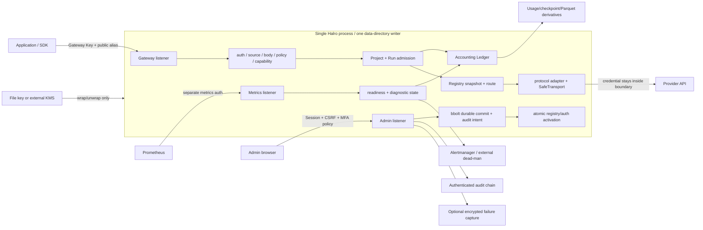

# Halro 系统图、权威与关键状态边界

目标版本：`v0.8.0@1d48ecde216ef40e653738f8bdc9657f88a717cc`

本图由产品/架构、正确性/Provider、安全/SRE 三个角色的独立源码追踪汇总而成。它描述当前
实现，不把 HA、Realtime、真实 KMS/Provider 或生产部署写成已具备能力。

## 1. 产品边界

Halro 是一个**自托管、单进程、单写者的 LLM 访问安全与治理边界**：应用只持有 Gateway Key 和
公共模型别名；Provider credential、路由、能力、预算、脱敏、审计和账务由本地 Halro 控制。

它不拥有 Agent 工作流、业务 evaluator、业务证据正文、训练、模型托管或通用可观测平台。Run
Governance 只把 Work Unit / Run 归因接入原有账务链，并保存外部声明的结构化 outcome；不会主动
抓取证据、运行 evaluator 或反向修改实时预算和路由。

## 2. 组件与信任边界



关键安全解释：SafeTransport 只能约束 Halro 自己到 Provider/远程目录的连接；Provider 在其平台内
执行 tool、MCP 或 web search 形成的二次出网是一次显式信任转移，不属于 Halro socket policy。

## 3. 数据权威矩阵

| 状态 | 权威 | 可重建 | 写入/恢复语义 |
| --- | --- | --- | --- |
| Provider、Deployment、Route、Project、Key metadata 与 revision | bbolt | 否 | 单 writer；管理 mutation 与 audit intent 同事务；activation 失败转 stale 并 fail closed |
| reservation、Attempt、settlement、Request/Run lifecycle 与成本 | Accounting Ledger WAL | 否 | Provider I/O 前 fsync reservation/started；append+fsync 后推进 watermark；损坏/未来 epoch 拒绝 |
| business outcome declaration | Governance Journal | 否 | 有界 schema、idempotency、current-head；不能改变历史账务或触发 Provider I/O |
| Admin audit | Audit chain / durable intent | 否 | 敏感读取先审计，审计失败则 withholding；mutation intent 可恢复 drain |
| Usage、checkpoint、Parquet、cohort summary | Ledger/Governance 的派生投影 | 是 | queue 通知可丢，按 watermark replay 追赶；不得反写权威 |
| Provider Registry / Auth Snapshot | bbolt + profile table 编译结果 | 是 | candidate build 后 atomic swap；stale 时数据面拒绝 |
| failure capture | 可选加密 object store | 否，但仅诊断 | 默认关闭；按 Project/request envelope 加密、保留期/日限额；当前 enqueue 前存在字节预算缺口 |
| backup archive | 上述权威的离线一致副本 | 否 | 认证 archive；staging 验证后同 filesystem 原子切换；保留旧目录回滚 |

## 4. 调用与账务状态机

```text
authenticate + authorize + capability + budget
  └─ reject before Provider I/O                 -> no Attempt execution

RequestAccepted
  -> reservation durable
  -> AttemptStarted durable
  -> Provider I/O
       ├─ definitely not accepted and retry-safe -> bounded retry/fallback
       ├─ ambiguous / any safe stream byte sent  -> no fallback
       └─ completed                              -> validate usage/result
  -> AttemptSettled (release reserved + commit known/conservative cost)
  -> RequestFinalized (caller-visible request outcome)
```

不能跨越的边界：

- `AttemptStarted` 之前不得发生 Provider I/O；
- 无法证明上游未执行时，不得自动调用第二个 Provider；
- 首个安全 streaming payload 发出后，execution owner 不得切换；
- cost settlement 与 caller outcome 是两个语义：调用方交付失败不能退款已发生的 Provider 成本，
  但 RequestFinalized 也不能伪记为 success；
- `AttemptStarted` 与真实 socket I/O 无法形成跨系统原子提交，crash 后按 unknown-result 保守结算是
  明确接受的单机约束，不应引入分布式事务伪装 exactly-once。

当前确认的时序缺口：Responses / portable Messages 的核心 stream 会先写
`RequestFinalized(success)`，随后 facade 才发送合成的最终事件；最终事件写失败时，caller 与历史终态
分叉。成本仍应保留，且不得 fallback。

## 5. 管理面提交与激活

```text
Admin mutation
  -> session / role / CSRF / revision / step-up
  -> validate references and safety rules
  -> one bbolt transaction: versioned record + audit intent
  -> compile candidate Registry/Auth snapshot
       ├─ success: atomic swap, response includes operation/activation state
       └─ failure: durable state remains committed, activation marked stale,
                   data plane fails closed, background retry continues
  -> drain audit intent
```

这一设计避免“持久层已撤销，但旧内存配置继续放行”。代价是 `internal/app.Runtime` 同时拥有启动、
listener、handler、worker、activation 和 shutdown 等大量组合责任；当前约 74 个字段、10 把锁、342 个
receiver 方法，预算测试能看见增长，但尚未形成持续收缩机制。

## 6. 恢复与外部证据边界

```text
stop writer + acquire data-dir lock
  -> authenticate backup and schema/epoch/key fingerprints
  -> restore to staging
  -> replay Ledger/Governance/Audit and verify cross-watermarks
  -> quarantine unsafe scheduled prices / invalidate restored sessions
  -> atomic directory switch; preserve previous directory
  -> start -> readiness -> doctor -> controlled smoke
```

代码和 fixture 对未来 schema、WAL downgrade、CRC/MAC/chain、损坏尾部和原子切换有强拒绝语义。
本轮已直接取得 schema 36→37 与旧读者拒绝的局部双二进制 E3；包含真实 Ledger/Usage 历史的
backup/restore、旧 binary 恢复复核和 migration kill-point 仍为 `UNVERIFIED`。

## 7. 资源上界与观测链

已见显式上界：请求 body/header/timeout、retry、source tracking、Project/deployment concurrency、SSE
parser、remote catalog 下载/解压/条数、dead-man outbox、Usage window、Admin pagination、capture 持久
字段/日/retention。

需补强的上界与闭环：

- failure capture channel 只有 64 条上限，`max_bytes` 到 store 才生效；大请求可在队列保留两份完整 JSON；
- provider/deployment metric label 数量缺目标 topology 容量曲线；
- 缺慢读者、慢 Provider、RSS/FD/goroutine、WAL/Journal 日增长、Admin 大表和 24h soak；
- `shutdown_truncated_attempts` 与异常 aged pending lease 缺随仓库交付的 actionable rule/runbook；
- target PKI/KMS、真实 Contact Point、独立 dead-man、RPO/RTO 均由 Production Admission 明确保持 No-Go。

## 8. 应保留与不应扩张

应保留：single binary/process/writer、权威日志与可重建派生分离、显式 unknown/ambiguous、Provider
能力证据分级、生成前端嵌入、无默认真实 Provider smoke、恢复 fail-closed。

不应为本轮 finding 引入：微服务、共享数据库、消息队列、分布式事务、通用 DI 框架、动态插件 ABI、
全局细粒度 RBAC 矩阵。先修时序和字节上界，收敛文档真相，并用目标环境证据决定是否需要更大结构。
